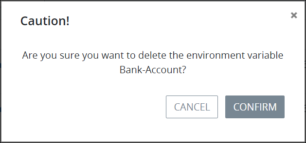

# Delete an Environment Variable

## Delete a ProcessMaker Environment Variable


Your ProcessMaker user account or group membership must have the following permissions to delete a ProcessMaker Environment Variable unless your user account has the **Make this user a Super Admin** setting selected:

* Environment Variables: View Environment Variables
* Environment Variables: Delete Environment Variables

See the ProcessMaker [Environment Variable](../../../processmaker-administration/permission-descriptions-for-users-and-groups.md#environment-variables) permissions or ask your ProcessMaker Administrator for assistance.



The data that a ProcessMaker Environment Variable maintains secure remains so for completed Requests associated with Processes that reference a deleted Environment Variable. However, in-progress and future Requests that reference a deleted ProcessMaker Environment Variable no longer have a secure environment for that data. Be extremely cautious when considering deleting a ProcessMaker Environment Variable.

Deleting a ProcessMaker Environment Variable from the **Environment Variables** page cannot be undone.


Follow these steps to delete a ProcessMaker Environment Variable:

1. [View your ProcessMaker Environment Variables.](view-all-environment-variables.md) The **Environment Variables** page displays.
2. Click the **Delete** iconfor the ProcessMaker Environment Variable to delete. The **Caution** screen displays to confirm the deletion of the ProcessMaker Environment Variable.

   

3. Click **Confirm**.

## Related Topics











