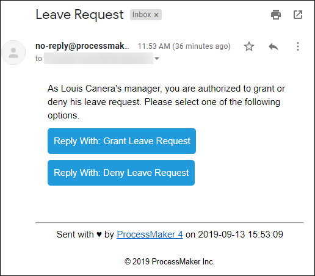
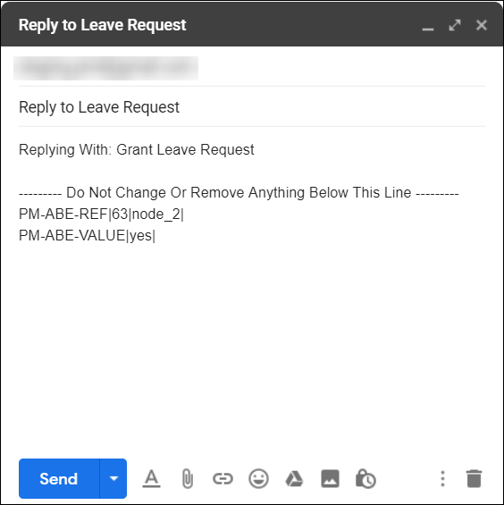
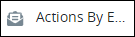
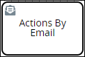
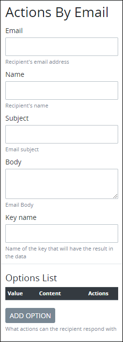
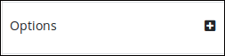
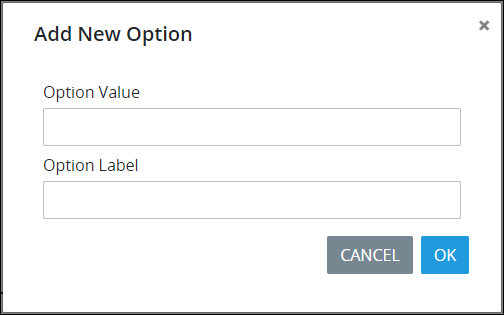

# Actions By Email Connector

## Overview

The Actions By Email connector is part of the [Actions By Email package](../../../../package-development-distribution/package-a-connector/actions-by-email-package.md). Use the Actions By Email connector in your Process models to automate emails to [Request](../../../../using-processmaker/requests/what-is-a-request.md) participants that allow them make decisions via email.


### ProcessMaker Package Required

The Actions By Email connector requires that the [Actions By Email Email package](../../../../package-development-distribution/package-a-connector/actions-by-email-package.md) be installed in your ProcessMaker instance. The Actions By Email connector and the Actions By Email [package](../../../../package-development-distribution/first-topic.md) are not available in the ProcessMaker open-source edition. Contact [ProcessMaker Sales](https://www.processmaker.com/contact/) or ask your ProcessMaker sales representative how the Actions By Email connector can be installed in your ProcessMaker instance.


When the Actions By Email connector triggers during an in-progress Request, ProcessMaker sends an email from the "no-reply@processmaker.net" email address to one email recipient so that this Request participant can make a decision as part of the Request. For example, this Request participant must make a decision to approve or deny a vacation request or for a purchase. The email recipient receives an email with buttons in the email to easily indicate the decision.

While the Actions by Email connector can send the email to multiple email recipients, ProcessMaker registers only the first response.

After the email recipient clicks a button to indicate the decision, the email client creates an email reply to be delivered to the ProcessMaker instance that used the Actions By Email connector. As indicated in the email reply, do not change anything below the automatically generated response because this response notifies the ProcessMaker instance of the email recipient's decision for Request routing.

After the email recipient sends the reply email, ProcessMaker receives the response and uses the indicated decision as part of the Request routing. For example, if you grant a leave request, the Request routes differently than if you deny that leave request.


The comment in the email reply above the indicated line is not preserved when the email reply is sent. This comment displays only for the benefit of the email recipient prior to sending the email reply.


The Actions By Email connector adds the **Actions By Email** control below the BPMN 2.0 elements in the panel to the left of the Process Modeler canvas. See the following sections in this topic:

* [Add an Actions By Email Control to the Process Model](actions-by-email-connector.md#add-an-actions-by-email-control-to-the-process-model)
* [Configure an Actions By Email Control](actions-by-email-connector.md#configure-an-actions-by-email-control)

The email recipient's name, email address, subject, and/or email body can be specified in one of the following ways when configuring the Actions By Email connector:

* Plain text
* A **Variable Name** setting value using [mustache syntax](https://mustache.github.io/mustache.5.html), for example `{{ email_recipient }}` and `{{ email_address }}`, respectively
* A [ProcessMaker Magic Variable](../../../reference-global-variables-in-your-processmaker-assets.md) value, specifically `{{ _user.fullname }}` and `{{ _user.email }}`, respectively

The Actions By Email connector can send the email to multiple email recipients. These email recipients and their email addresses may be referenced from Request data or entered into connector settings.

When an Actions By Email connector triggers during an in-progress Request, ProcessMaker automatically creates an asynchronous child Process: the Actions By Email connector sends the email \(the child Process\) while simultaneously the in-progress Request continues \(the parent Process\). In doing so, one of the following occurs:

* **An error occurs in the email delivery:** While attempting to send the email, the Actions By Email connector receives an error. For example, your organization's email server or the email recipient's email server may be down. The child Process receives and sends the error to the parent Process. The child Process ends. Reference the child Process's error from the in-progress Request.
* **The Actions by Email connector sends the email:** The email recipient receives the email while the in-progress Request continues \(the parent Process\). The child Process ends, but the email recipient may not have responded to the email. If the in-progress Request routes to an [Exclusive Gateway](../../model-your-process/process-modeling-element-descriptions.md#exclusive-gateway) element that requires the email recipient's response to evaluate routing, then the in-progress Request remains indefinitely active on the Exclusive Gateway element.


To ensure that Requests do not remain indefinitely active on an Exclusive Gateway element while the Request waits for the email recipient's response, design your Process model to use an [Event-Based Gateway](../../model-your-process/process-modeling-element-descriptions.md#event-based-gateway) element preceding the Exclusive Gateway element that checks the following:

* If an [Intermediate Timer Event](../../model-your-process/process-modeling-element-descriptions.md#intermediate-timer-event) element triggers \(after 72 hours, for example\), the email recipient has not responded to the email. Thereafter, design in the Process model how to address this, such as sending a subsequent email using the [Send Email connector](email-connector.md).
* If an [Intermediate Message Catch Event](../../model-your-process/process-modeling-element-descriptions.md#intermediate-message-catch-event) element triggers instead of the Intermediate Timer Event element, the email recipient sent the response within the allotted time period.


## Add an Actions by Email Control to the Process Model


### ProcessMaker Package Required

The [Actions By Email](../../../../package-development-distribution/package-a-connector/actions-by-email-package.md) package is required. The Actions By Email package installs the Actions By Email connector, which is not available in the ProcessMaker open-source edition. Contact [ProcessMaker Sales](https://www.processmaker.com/contact/) or ask your ProcessMaker sales representative how the Actions By Email connector can be installed in your ProcessMaker instance.

### Permissions Required

Your ProcessMaker user account or group membership must have the following permissions to add an Actions By Email control to the Process model unless your user account has the **Make this user a Super Admin** setting selected:

* Processes: View Processes
* Processes: Edit Processes

See the [Process](../../../../processmaker-administration/permission-descriptions-for-users-and-groups.md#processes) permissions or ask your ProcessMaker Administrator for assistance.


Follow these steps to add an Actions By Email control to the Process model:

1. [View your Processes](../../../viewing-processes/view-the-list-of-processes/view-your-processes.md#view-all-active-processes). The **Processes** page displays.
2. [Create a new Process](../../../viewing-processes/view-the-list-of-processes/create-a-process.md) or click the **Open Modeler** iconto edit the selected Process model. Process Modeler displays.
3. Locate the **Send Email** control in the **Controls** palette that is to the left of the Process Modeler canvas. If the [**Hide Menus** button](../../navigate-around-your-process-model.md#maximize-the-process-modeler-canvas-view)is enabled, the **Controls** palette displays the **Actions By Email** control's icon.

    

4. Drag the control into the Process model canvas where you want to place it. If a Pool element is in your Process model, the Actions By Email control do not allow be placed outside of the Pool element.

After the Actions By Email control is placed into the Process model, you may move it by dragging it to the new location.


Moving an Actions By Email control has the following limitations in regards to the following Process model elements:

* **Pool element:** If the Actions By Email control is inside of a [Pool](../../model-your-process/process-modeling-element-descriptions.md#pool) element, it cannot be moved outside of the Pool element. If you attempt to do so, Process Modeler places the Actions By Email control inside the Pool element closest to where you attempted to move it.
* **Lane element:** If the Actions By Email control is inside of a Lane element, it can be moved to another Lane element in the same Pool element. However, the Process Modeler do not allow the Actions By Email control move outside of the Pool element.


## Settings


### ProcessMaker Package Required

The Actions By Email package is required. The Actions By Email package installs the Actions By Email connector, which is not available in the ProcessMaker open-source edition. Contact [ProcessMaker Sales](https://www.processmaker.com/contact/) or ask your ProcessMaker sales representative how the Actions By Email connector can be installed in your ProcessMaker instance.

### Permissions Required

Your ProcessMaker user account or group membership must have the following permissions to configure an Actions By Email control unless your user account has the **Make this user a Super Admin** setting selected:

* Processes: View Processes
* Processes: Edit Processes

See the [Process](../../../../processmaker-administration/permission-descriptions-for-users-and-groups.md#processes) permissions or ask your ProcessMaker Administrator for assistance.


Follow these steps to configure an Actions By Email control:

1. Ensure that the **Hide Menus** buttonis not enabled. See [Maximize the Process Modeler Canvas View](../../navigate-around-your-process-model.md#maximize-the-process-modeler-canvas-view).
2. Select the Actions By Email control from the Process model in which to configure its settings. The **Actions By Email** configuration settings display.   
3. In the **Email** setting, enter the email address to which the Actions By Email control sends an email when this Actions By Email control triggers. You may use the value from a [ProcessMaker Screen](../../../design-forms/what-is-a-form.md)'s **Variable Name** setting as a variable in this setting. For example, if your Process model references a ProcessMaker Screen that contains a [Lines Inputs control](../../../design-forms/screens-builder/control-descriptions/line-input-control-settings.md) with the **Variable Name** setting value of `EmailAddress` that the Request participant enters an email address, use mustache syntax `{{EmailAddress}}` to use that Line Inputs control's value in the **Email** setting. Email addresses may be referenced from Request data or entered into the **Email** setting by using commas \(`,`\) between email addresses. You may also use mustache syntax to reference [Magic Variables](../../../reference-global-variables-in-your-processmaker-assets.md).
4. In the **Name** setting, enter the name of the email recipient. You may use the value from a ProcessMaker Screen's **Variable Name** setting as a variable in this setting. For example, if your Process model references a ProcessMaker Screen that contains a Lines Inputs control with the **Variable Name** setting value of `FullName` that the Request participant enters an name, use mustache syntax `{{FullName}}` to use that Line Inputs control's value in the **Name** setting. Email recipients may be referenced from Request data or entered into the **Name** setting by using commas \(`,`\) between email addresses. If entering multiple email recipients, ensure to list them in the corresponding order as you have listed them in the **Email** setting, so that each email recipient views her or his name in the received email.
5. In the **Subject** setting, enter the subject of the email the Actions By Email control sends. For example, enter the decision that the email recipient must make in this email.
6. From the **Body** setting, select one of the following options: **Text** or **Screen**.
   * **Text:** From the **Body** drop-down menu, select the **Text** option to enter the email body text. The **Email body** setting displays. In the **Email body** setting, enter the email body text.
   * **Screen:** From the **Body** drop-down menu, select the **Screen** option to use a ProcessMaker Screen to display the email body. The **Email body** setting displays. From the **Email body** drop-down menu, select the [Display](../../../design-forms/screens-builder/types-for-screens.md#display)-type ProcessMaker Screen to display the email body.
7. In the **Key name** setting, enter the name of the key that stores the Actions By Email control response within the JSON data model of the Request.
8. In the **Options** setting, enter the list of options available to the email recipient when making the decision. The options configured here display below the body of the email. Add options in the order they are to display from top to bottom in the email.  
    

   Follow these steps to add an option:

   1. Click the plus buttonfrom the same line where is the **Options** label. The **Add Option** screen displays.   
   2. In the **Button Text** setting, enter the button label displayed to the email.
   3. In the **Value** setting, enter the internal data name for the option that only the Process Owner views at design time.
   4. In the **Button Style** setting, select a button style:
      * **Primary:** Displays a button with a blue-colored background and white-colored text.
      * **Secondary:** Displays a button with a gray-colored background and white-colored text.
      * **Success:** Displays a button with a green-colored background and white-colored text.
      * **Info:** Displays a button with a teal-colored background and white-colored text.
      * **Warning:** Displays a button with a yellow-colored background and black-colored text.
      * **Danger:** Displays a button with a red-colored background with white-colored text.
      * **Dark:** Displays a button with a black-colored background with white-colored text.
      * **Light:** Displays a button with a white-colored background with black-colored text.
   5. Click **Add**.

## Related Topics







