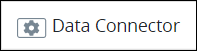
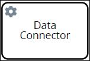
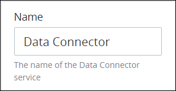
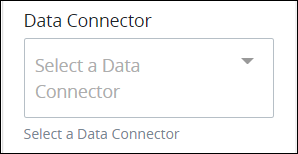
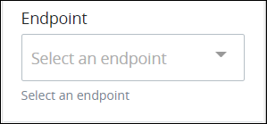

# Data Connector Connector

## Overview

The [Data Connector](../../../data-connector-management/what-is-a-data-connector.md) connector is part of the [Data Connector package](../../../../package-development-distribution/package-a-connector/data-connector-package.md). From the Data Connector connector, select a [ProcessMaker Data Connector](../../../data-connector-management/what-is-a-data-connector.md) from which to interact with a data source.

Use the Data Connector connector in your Process models in the following ways:

* **Access ProcessMaker Collections:** From your [Process model](../../what-is-process-modeling.md), interact with any [ProcessMaker Collection](../../../../collections/what-is-a-collection.md) in your ProcessMaker instance, including viewing, creating, updating, and/or delete records in a selected Collection. By default, each ProcessMaker Collection has a corresponding Data Connector when it is created. Incorporate ProcessMaker Collection record data into your Process model so you can make business decisions using it. Likewise, automatically change records in a ProcessMaker Collection during a [Request](../../../../using-processmaker/requests/what-is-a-request.md) when workflow routing conditions are met.
* **Access third-party data sources:** Similarly to ProcessMaker Collections, interact with third-party data sources such as Application Program Interfaces \(APIs\). Reference data from that API, then incorporate it into your Process's Request data. Incorporating data from external data sources helps you make business decisions from information outside of your ProcessMaker instance.


### ProcessMaker Package Required

The Data Connector connector requires that the [Data Connector package](../../../../package-development-distribution/package-a-connector/data-connector-package.md) be installed in your ProcessMaker instance. The Data Connector connector and the Data Connector [package](../../../../package-development-distribution/first-topic.md) are not available in the ProcessMaker open-source edition. Contact [ProcessMaker Sales](https://www.processmaker.com/contact/) or ask your ProcessMaker sales representative how the Data Connector connector can be installed in your ProcessMaker instance.


## Add a Data Connector Control to the Process Model


### ProcessMaker Package Required

The [Data Connector package](../../../../package-development-distribution/package-a-connector/data-connector-package.md) is required. The Data Connector [package](../../../../package-development-distribution/first-topic.md) installs the Data Connector connector, which is not available in the ProcessMaker open-source edition. Contact [ProcessMaker Sales](https://www.processmaker.com/contact/) or ask your ProcessMaker sales representative how the Data Connector connector can be installed in your ProcessMaker instance.

### Permissions Required

Your ProcessMaker user account or group membership must have the following permissions to add a Data Connector control to the Process model unless your user account has the **Make this user a Super Admin** setting selected:

* Processes: Edit Processes
* Processes: View Processes

See the [Process](../../../../processmaker-administration/permission-descriptions-for-users-and-groups.md#processes) permissions or ask your ProcessMaker Administrator for assistance.


Follow these steps to add a Data Connector control to the Process model:

1. [View your Processes](../../../viewing-processes/view-the-list-of-processes/view-your-processes.md#view-all-active-processes). The **Processes** page displays.
2. [Create a new Process](../../../viewing-processes/view-the-list-of-processes/create-a-process.md) or click the **Open Modeler** iconto edit the selected Process model. Process Modeler displays.
3. Locate the **Data Connector** control in the **Controls** palette that is to the left of the Process Modeler canvas. If the [**Hide Menus** button](../../navigate-around-your-process-model.md#maximize-the-process-modeler-canvas-view)is enabled, the **Controls** palette displays the **Data Connector** control's icon.  
4. Drag the control into the Process model canvas where you want to place it. If a Pool element is in your Process model, the Data Connector control cannot be placed outside of the Pool element.

After the Data Connector control is placed into the Process model, you may move it by dragging it to the new location.


Moving a Data Connector control has the following limitations in regards to the following Process model elements:

* **Pool element:** If the Data Connector control is inside of a [Pool](../../model-your-process/process-modeling-element-descriptions.md#pool) element, it cannot be moved outside of the Pool element. If you attempt to do so, Process Modeler places the Data Connector control inside the Pool element closest to where you attempted to move it.
* **Lane element:** If the Data Connector control is inside of a Lane element, it can be moved to another Lane element in the same Pool element. However, the Data Connector control cannot be moved outside of the Pool element.


## Settings


### ProcessMaker Package Required

The [Data Connector package](../../../../package-development-distribution/package-a-connector/data-connector-package.md) is required. The Actions By Email [package](../../../../package-development-distribution/first-topic.md) installs the Actions By Email connector, which is not available in the ProcessMaker open-source edition. Contact [ProcessMaker Sales](https://www.processmaker.com/contact/) or ask your ProcessMaker sales representative how the Actions By Email connector can be installed in your ProcessMaker instance.

### Permissions Required

Your ProcessMaker user account or group membership must have the following permissions to configure a Data Connector control unless your user account has the **Make this user a Super Admin** setting selected:

* Processes: Edit Processes
* Processes: View Processes

See the [Process](../../../../processmaker-administration/permission-descriptions-for-users-and-groups.md#processes) permissions or ask your ProcessMaker Administrator for assistance.


The Data Connector control has the following panels that contain settings:

* **Configuration** panel
  * [Edit the control name](data-connector-connector.md#edit-the-control-name)
  * [Select the ProcessMaker Data Connector](data-connector-connector.md#select-the-processmaker-data-connector)
  * [Select the EndPoint to call from the ProcessMaker Data Connector](data-connector-connector.md#select-the-endpoint-to-call-from-the-processmaker-data-connector)
* **Data Mapping** panel
  * [Map data from the data source to the Request's JSON data Model](data-connector-connector.md#map-data-from-the-data-source-to-the-requests-json-data-model)

### Configuration Panel Settings

The Data Connector control has multiple settings in the **Configuration** panel:

* [Edit the control name](data-connector-connector.md#edit-the-control-name)
* [Select the ProcessMaker Data Connector](data-connector-connector.md#select-the-processmaker-data-connector)
* [Select the EndPoint the Data Connector control uses to interact with the data source](data-connector-connector.md#select-the-endpoint-the-data-connector-control-uses-to-interact-with-the-data-source)

#### Edit the Control Name

A control name is a human-readable reference for a Process model control. Process Modeler automatically assigns the name of a Process model control with its control type. However, a control's name can be changed.

Follow these steps to edit the name for a Data Connector control:

1. Ensure that the **Hide Menus** buttonis not enabled. See [Maximize the Process Modeler Canvas View](../../navigate-around-your-process-model.md#maximize-the-process-modeler-canvas-view).
2. Select the Data Connector control from the Process model in which to edit its name. Panels to configure this element display.
3. Expand the **Configuration** panel if it is not presently expanded. The **Name** setting displays.  
4. In the **Name** setting, edit the selected control's name and then press **Enter**.

#### Select the ProcessMaker Data Connector

The Data Connector control uses a [ProcessMaker Data Connector](../../../data-connector-management/what-is-a-data-connector.md) that is configured to interact with a data source, such as a [ProcessMaker Collection](../../../../collections/what-is-a-collection.md) or a third-party Application Program Interface \(API\). A ProcessMaker Data Connector must already exist before it can be selected for use in a Data Connector control. Each ProcessMaker Data Connector is already configured with which data source it interacts.

ProcessMaker Collections automatically create a Data Connector when the Collection is created. ProcessMaker Data Connectors created from a Collection by default have the same name as the Collection that it references.

Follow these steps to select the ProcessMaker Data Connector the Data Connector control uses:

1. Ensure that the **Hide Menus** buttonis not enabled. See [Maximize the Process Modeler Canvas View](../../navigate-around-your-process-model.md#maximize-the-process-modeler-canvas-view).
2. Select the Data Connector control from the Process model in which to specify the ProcessMaker Data Connector to reference. Panels to configure this control display.
3. Expand the **Configuration** panel if it is not presently expanded, and then locate the **Data Connector** setting.  
4. From the **Data Connector** drop-down menu, select which ProcessMaker Data Connector the Data Connector control uses.
5. [Select which Endpoint the ProcessMaker Data Connector uses to interact with the data source](data-connector-connector.md#select-the-endpoint-to-call-from-the-processmaker-data-connector).


Ensure to [select which Endpoint to call from the selected ProcessMaker Data Connector](data-connector-connector.md#select-the-endpoint-to-call-from-the-processmaker-data-connector) to properly configure the Data Connector control.


#### Select the EndPoint the Data Connector Control Uses to Interact with the Data Source

Each [ProcessMaker Data Connector](../../../data-connector-management/what-is-a-data-connector.md) contains at least one [Endpoint](../../../data-connector-management/what-is-an-endpoint.md). These Endpoints are configured from the ProcessMaker Data Connector itself. An Endpoint is an action the ProcessMaker Data Connector uses to interact with the data source. The Data Connector control uses an Endpoint to interact with the data source. These Endpoints may interact with [ProcessMaker Collection](../../../../collections/what-is-a-collection.md) records, Application Program Interfaces \(APIs\), or other data source types. After a ProcessMaker Data Connector has been selected from the [**Data Connector** setting](data-connector-connector.md#select-the-processmaker-data-connector), select the Endpoint from that ProcessMaker Data Connector the Data Connector uses to interact with the data source.

ProcessMaker Data Connectors created from Collections use a default set of Endpoints. See [Endpoints for ProcessMaker Collections](../../../data-connector-management/what-is-an-endpoint.md#endpoints-for-processmaker-collections).

Follow these steps to select which Endpoint the Data Connector control uses:

1. Ensure that the **Hide Menus** buttonis not enabled. See [Maximize the Process Modeler Canvas View](../../navigate-around-your-process-model.md#maximize-the-process-modeler-canvas-view).
2. Select the Data Connector control from the Process model in which to select the Endpoint the ProcessMaker Data Connector uses. Panels to configure this control display.
3. Expand the **Configuration** panel if it is not presently expanded then locate the **Data Connector** setting. Ensure that a ProcessMaker Data Connector is selected from the **Data Connector** setting. If not, see [Select the ProcessMaker Data Connector](data-connector-connector.md#select-the-processmaker-data-connector).
4. Locate the **Endpoint** setting.  
5. From the **Endpoint** drop-down menu, select which Endpoint the Data Connector control uses to interact with the data source.

### Data Mapping Panel Settings

The Data Connector control has the following setting in the **Data Mapping** panel:

* [Map data from the data source to the Request's JSON data Model](data-connector-connector.md#map-data-from-the-data-source-to-the-requests-json-data-model)

#### Map Data from the Data Source to the Request's JSON Data Model

## Related Topics

