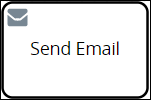

# Send Email Connector

## Overview

The Send Email [connector](../what-is-a-connector.md) is part of the [Email package](../../../../package-development-distribution/package-a-connector/email.md) that allows ProcessMaker to send emails during [Requests](../../../../using-processmaker/requests/what-is-a-request.md) that use a Send Email control in a Process model. When you add a Send Email control to a Process model and then reference a [ProcessMaker Screen](../../../design-forms/screens-builder/types-for-screens.md#email) for email body content, the Send Email control can email a specified email address when that Send Email control triggers in a Request's workflow. The Send Email connector supports sending an email to only one email recipient.


### ProcessMaker Package Required

The Send Email connector requires that the [Send Email package](../../../../package-development-distribution/package-a-connector/email.md) be installed in your ProcessMaker instance. The Send Email connector and the Send Email [package](../../../../package-development-distribution/first-topic.md) are not available in the ProcessMaker open-source edition. Contact [ProcessMaker Sales](mailto:sales@processmaker.com) or ask your ProcessMaker sales representative how the Send Email connector can be installed in your ProcessMaker instance.


The Send Email connector adds the following components to the ProcessMaker open-source edition:

* **Process Modeler:** The Send Email connector adds the **Send Email** control below the BPMN 2.0 elements in the panel to the left of the Process Modeler canvas. See the following sections in this topic:
  * [Add a Send Email Control to the Process Model](email-connector.md#add-a-send-email-control-to-the-process-model)
  * [Configure a Send Email Control](email-connector.md#configure-a-send-email-control)
* **Screens Builder:** The Send Email connector adds a new ProcessMaker Screen type called Email. Select the **Email** Screen type when [creating a new ProcessMaker Screen](../../../scripts/manage-scripts/create-a-new-script.md#create-a-new-processmaker-script). See [Email Screen type](../../../design-forms/screens-builder/types-for-screens.md#email).

The email recipient's name and email address can be specified in one of the following ways when configuring the Send Email connector:

* Plain text
* A **Variable Name** setting value using mustache syntax, for example `{{ email_recipient }}` and `{{ email_address }}`, respectively
* A [ProcessMaker Magic Variable](../../../reference-global-variables-in-your-processmaker-assets.md) value, specifically `{{ _user.fullname }}` and `{{ _user.email }}`, respectively

## Add a Send Email Control to the Process Model


### ProcessMaker Package Required

The [Send Email package](../../../../package-development-distribution/package-a-connector/email.md) is required. The Send Email package installs the Send Email connector, which is not available in the ProcessMaker open-source edition. Contact [ProcessMaker Sales](mailto:sales@processmaker.com) or ask your ProcessMaker sales representative how the Send Email connector can be installed in your ProcessMaker instance.

### Permissions Required

Your ProcessMaker user account or group membership must have the following permissions to add a Send Email control to the Process model unless your user account has the **Make this user a Super Admin** setting selected:

* Processes: Edit Processes
* Processes: View Processes

See the [Process](../../../../processmaker-administration/permission-descriptions-for-users-and-groups.md#processes) permissions or ask your ProcessMaker Administrator for assistance.


Follow these steps to add a Send Email control to the Process model:

1. [View your Processes](../../../viewing-processes/view-the-list-of-processes/view-your-processes.md#view-all-active-processes). The **Processes** page displays.
2. [Create a new Process](../../../viewing-processes/view-the-list-of-processes/create-a-process.md) or click the **Open Modeler** iconto edit the selected Process model. Process Modeler displays.
3. Locate the **Send Email** control in the **Controls** palette that is to the left of the Process Modeler canvas. If the [**Hide Menus** button](../../navigate-around-your-process-model.md#maximize-the-process-modeler-canvas-view)is enabled, the **Controls** palette displays the **Send Email** control's icon.  
4. Drag the control into the Process model canvas where you want to place it. If a Pool element is in your Process model, the Send Email control cannot be placed outside of the Pool element.

After the Send Email control is placed into the Process model, you may move it by dragging it to the new location.


Moving a Send Email control has the following limitations in regards to the following Process model elements:

* **Pool element:** If the Send Email control is inside of a [Pool](../../model-your-process/process-modeling-element-descriptions.md#pool) element, it cannot be moved outside of the Pool element. If you attempt to do so, Process Modeler places the Send Email control inside the Pool element closest to where you attempted to move it.
* **Lane element:** If the Send Email control is inside of a Lane element, it can be moved to another Lane element in the same Pool element. However, the Send Email control cannot be moved outside of the Pool element.


## Settings


### ProcessMaker Package Required

The [Send Email package](../../../../package-development-distribution/package-a-connector/email.md) is required. The Send Email package installs the Send Email connector, which is not available in the ProcessMaker open-source edition. Contact [ProcessMaker Sales](mailto:sales@processmaker.com) or ask your ProcessMaker sales representative how the Send Email connector can be installed in your ProcessMaker instance.

### Permissions Required

Your ProcessMaker user account or group membership must have the following permissions to configure a Send Email control unless your user account has the **Make this user a Super Admin** setting selected:

* Processes: Edit Processes
* Processes: View Processes

See the [Process](../../../../processmaker-administration/permission-descriptions-for-users-and-groups.md#processes) permissions or ask your ProcessMaker Administrator for assistance.


Follow these steps to configure a Send Email control:

1. Ensure that the **Hide Menus** buttonis not enabled. See [Maximize the Process Modeler Canvas View](../../navigate-around-your-process-model.md#maximize-the-process-modeler-canvas-view).
2. Select the Send Email control from the Process model in which to configure its settings. The **Send Email** configuration settings display. 
3. In the **Email** setting, enter the email address to which the Send Email control sends an email when this Send Email control triggers. The Send Email connector only supports sending an email to one email recipient. You may use the value from a [ProcessMaker Screen](../../../design-forms/what-is-a-form.md)'s **Variable Name** setting as a variable in this setting. For example, if your Process model references a ProcessMaker Screen that contains a [Line Input control](../../../design-forms/screens-builder/control-descriptions/line-input-control-settings.md) with the **Variable Name** setting value of `EmailAddress` that the Request participant enters an email address, use mustache syntax `{{EmailAddress}}` to use that Line Input control's value in the **Email** setting.
4. In the **Name** setting, enter the name of the email recipient. You may use the value from a ProcessMaker Screen's **Variable Name** setting as a variable in this setting. For example, if your Process model references a ProcessMaker Screen that contains a Line Input control with the **Variable Name** setting value of `FullName` that the Request participant enters an name, use mustache syntax `{{FullName}}` to use that Line Inputs control's value in the **Name** setting.
5. In the **Subject** setting, enter the subject of the email the Send Email control sends.
6. From the **Email body** drop-down menu, select which ProcessMaker Screen that Send Email control references. This drop-down menu displays only [Email](../../../design-forms/screens-builder/types-for-screens.md#email)-type ProcessMaker Screens so the email recipient can read the body of the email. Note that another Send Email control located elsewhere in the Process model may reference a different ProcessMaker Screen to display a different email body when it triggers.

## Related Topics









