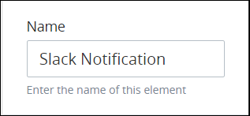
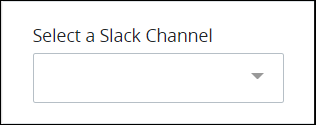
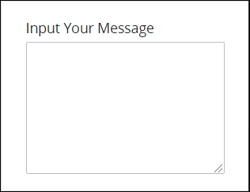

# Slack Notification Connector

## Overview

The [Slack](https://slack.com/) Notification [connector](../what-is-a-connector.md) is part of the [Slack Notification package](../../../../package-development-distribution/package-a-connector/slack-notification-package.md). When you add the Slack Notification connector to your Process model and then select to which Slack channel to send a notification, ProcessMaker can automatically send the notification during [Requests](../../../../using-processmaker/requests/what-is-a-request.md).


### ProcessMaker Package Required

The Slack Notification connector requires that the [Slack Notification package](../../../../package-development-distribution/package-a-connector/slack-notification-package.md) be installed in your ProcessMaker instance. The Slack Notification connector and the Slack Notification [package](../../../../package-development-distribution/first-topic.md) are not available in the ProcessMaker open-source edition. Contact [ProcessMaker Sales](mailto:sales@processmaker.com) or ask your ProcessMaker sales representative how the Slack Notification connector can be installed in your ProcessMaker instance.

### Grant ProcessMaker Access to Your Slack Workspace

Before using the Slack Notification connector in your Process models, your ProcessMaker instance must be granted access to your Slack workspace by building a [Slack App](https://api.slack.com/start/overview). Ask your Slack administrator to help you with the following:

* [Build a Slack app](https://api.slack.com/apps).
* [Install the Slack app to your Slack workspace](https://api.slack.com/authentication).
* [Verify requests from Slack](https://api.slack.com/authentication/verifying-requests-from-slack).


## Add a Slack Notification Connector to the Process Model


### ProcessMaker Package Required

The [Slack Notification package](../../../../package-development-distribution/package-a-connector/slack-notification-package.md) is required. The Slack Notification [package](../../../../package-development-distribution/first-topic.md) installs the Slack Notification connector, which is not available in the ProcessMaker open-source edition. Contact [ProcessMaker Sales](https://www.processmaker.com/contact/) or ask your ProcessMaker sales representative how the Slack Notification connector can be installed in your ProcessMaker instance.

### Permissions Required

Your ProcessMaker user account or group membership must have the following permissions to add a Slack Notification connector to the Process model unless your user account has the **Make this user a Super Admin** setting selected:

* Processes: Edit Processes
* Processes: View Processes

See the [Process](../../../../processmaker-administration/permission-descriptions-for-users-and-groups.md#processes) permissions or ask your ProcessMaker Administrator for assistance.


Follow these steps to add a Slack Notification connector to the Process model:

1. [View your Processes](../../../viewing-processes/view-the-list-of-processes/view-your-processes.md#view-all-active-processes). The **Processes** page displays.
2. [Create a new Process](../../../viewing-processes/view-the-list-of-processes/create-a-process.md) or click the **Open Modeler** iconto edit the selected Process model. Process Modeler displays.
3. Locate the **Slack Notification** connector in the **Elements and Connectors** palette that is to the left of the Process Modeler canvas. If the [**Hide Menus** button](../../navigate-around-your-process-model.md#maximize-the-process-modeler-canvas-view)is enabled, the **Elements and Connectors** palette displays the **Slack Notification** connector's icon.  
4. Drag the connector into the Process model canvas where you want to place it. If a Pool element is in your Process model, the Slack Notification connector cannot be placed outside of the Pool element.


After adding the Slack Notification connector, consider adding either of the following Boundary-type Process model elements to design business solutions when your best-case scenarios don't happen:

* [Boundary Timer Event](../../model-your-process/add-and-configure-boundary-timer-event-elements.md#add-a-boundary-timer-event-element) element \([Don't know what that is?](../../model-your-process/process-modeling-element-descriptions.md#boundary-timer-event)\)
* [Boundary Error Event](../../model-your-process/add-and-configure-boundary-error-event-elements.md#add-a-boundary-error-event-element) element \([Don't know what that is?](../../model-your-process/process-modeling-element-descriptions.md#boundary-error-event)\)


After the Slack Notification connector is placed into the Process model, you may move it by dragging it to the new location.


Moving a Slack Notification connector has the following limitations in regards to the following Process model elements:

* **Pool element:** If the Slack Notification connector is inside of a [Pool](../../model-your-process/process-modeling-element-descriptions.md#pool) element, it cannot be moved outside of the Pool element. If you attempt to do so, Process Modeler places the Slack Notification connector inside the Pool element closest to where you attempt to move it.
* **Lane element:** If the Slack Notification connector is inside of a Lane element, it can be moved to another Lane element in the same Pool element. However, the Slack Notification connector cannot be moved outside of the Pool element.


## Settings


### ProcessMaker Package Required

The [Slack Notification package](../../../../package-development-distribution/package-a-connector/slack-notification-package.md) is required. The Slack Notification [package](../../../../package-development-distribution/first-topic.md) installs the Slack Notification connector, which is not available in the ProcessMaker open-source edition. Contact [ProcessMaker Sales](https://www.processmaker.com/contact/) or ask your ProcessMaker sales representative how the Slack Notification connector can be installed in your ProcessMaker instance.

### Permissions Required

Your ProcessMaker user account or group membership must have the following permissions to configure a Slack Notification connector unless your user account has the **Make this user a Super Admin** setting selected:

* Processes: Edit Processes
* Processes: View Processes

See the [Process](../../../../processmaker-administration/permission-descriptions-for-users-and-groups.md#processes) permissions or ask your ProcessMaker Administrator for assistance.

### ProcessMaker Must Access Your Slack Workspace

Before configuring settings for the Slack Notification connector in your Process models, your ProcessMaker instance must access to your Slack workspace to select to which Slack channel to send a notification during [Requests](../../../../using-processmaker/requests/what-is-a-request.md). Otherwise, when configuring the Slack Notification connector, the following ProcessMaker error displays: **Request failed with status code 404**.

If your ProcessMaker instance does not have access to your Slack workspace, then ask your Slack administrator to help you with the following:

* [Build a Slack app](https://api.slack.com/apps).
* [Install the Slack app to your Slack workspace](https://api.slack.com/authentication).
* [Verify requests from Slack](https://api.slack.com/authentication/verifying-requests-from-slack).


The Slack Notification connector has the following panels that contain settings:

* **Configuration** panel
  * [Edit the connector name](slack-notification-connector.md#edit-the-connector-name)
  * [Select the Slack channel to send the notification](slack-notification-connector.md#select-the-slack-channel-to-send-the-notification)
  * [Enter the Slack notification message to send](slack-notification-connector.md#enter-the-slack-notification-message-to-send)

### Configuration Panel Settings

The Slack Notification connector has the following settings in the **Configuration** panel:

* [Edit the connector name](slack-notification-connector.md#edit-the-connector-name)
* [Select the Slack channel to send the notification](slack-notification-connector.md#select-the-slack-channel-to-send-the-notification)
* [Enter the Slack notification message to send](slack-notification-connector.md#enter-the-slack-notification-message-to-send)

#### Edit the Connector Name

A connector name is a human-readable reference for a Process model control. Process Modeler automatically assigns the name of a Process model connector with its connector type. However, a connector's name can be changed.

Follow these steps to edit the name for a Data Connector connector:

1. Ensure that the **Hide Menus** buttonis not enabled. See [Maximize the Process Modeler Canvas View](../../navigate-around-your-process-model.md#maximize-the-process-modeler-canvas-view).
2. Select the Slack Notification connector from the Process model in which to edit its name. Panels to configure this connector display.
3. Expand the **Configuration** panel if it is not presently expanded. The **Name** setting displays.  
4. In the **Name** setting, edit the selected connector's name and then press **Enter**.

#### Select the Slack Channel to Send the Notification

Select to which Slack channel to send the notification. Slack channels are only available for the Slack workspace that your ProcessMaker instance is granted access. If ProcessMaker is not a Slack app to which it is authorized to access a Slack workspace, the following ProcessMaker error displays when selecting this setting: **Request failed with status code 404**. See notes in [Settings](slack-notification-connector.md#settings) if this occurs.

Follow these steps to select to which Slack channel to send the notification:

1. Ensure that the **Hide Menus** buttonis not enabled. See [Maximize the Process Modeler Canvas View](../../navigate-around-your-process-model.md#maximize-the-process-modeler-canvas-view).
2. Select the Slack Notification connector from the Process model in which to edit its name. Panels to configure this connector display.
3. Expand the **Configuration** panel if it is not presently expanded, and then locate the **Select a Slack Channel** setting.  
4. From the **Select a Slack Channel** drop-down menu, select the Slack channel to send the notification.

#### Enter the Slack Notification Message to Send

Follow these steps to enter the Slack notification message to send:

1. Ensure that the **Hide Menus** buttonis not enabled. See [Maximize the Process Modeler Canvas View](../../navigate-around-your-process-model.md#maximize-the-process-modeler-canvas-view).
2. Select the Slack Notification connector from the Process model in which to edit its name. Panels to configure this connector display.
3. Expand the **Configuration** panel if it is not presently expanded, and then locate the **Input Your Message** setting.  
4. In the **Input Your Message** setting, enter the notification message and then press **Enter**.

## Related Topics







