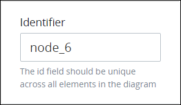
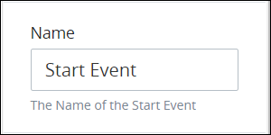
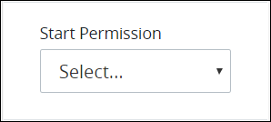
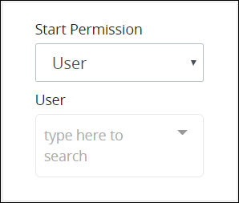
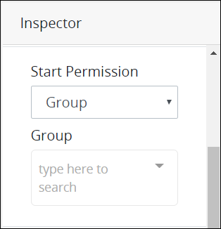
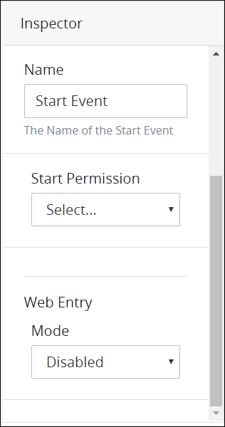
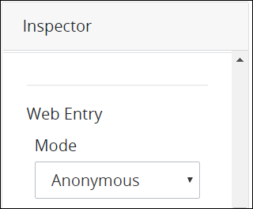
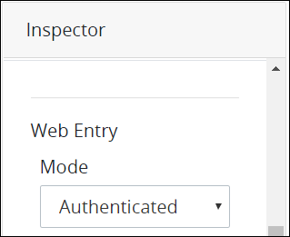
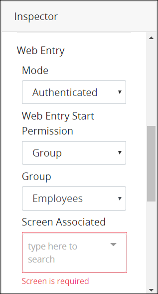

# Add and Configure Start Event Elements

## Add a Start Event Element


### Don't Know What a Start Event Element Is?

See [Process Modeling Element Descriptions](process-modeling-element-descriptions.md) for a description of the [Start Event](process-modeling-element-descriptions.md#start-event) element.

### Permissions Required

Your ProcessMaker user account or group membership must have the following permissions to add a Start Event element to the Process model unless your user account has the **Make this user a Super Admin** setting selected:

* Processes: View Processes
* Processes: Edit Processes

See the [Process](../../../processmaker-administration/permission-descriptions-for-users-and-groups.md#processes) permissions or ask your ProcessMaker Administrator for assistance.


Follow these steps to add a Start Event element to the Process model:

1. [View your Processes](https://processmaker.gitbook.io/processmaker-4-community/-LPblkrcFWowWJ6HZdhC/~/drafts/-LRhVZm0ddxDcGGdN5ZN/primary/designing-processes/viewing-processes/view-the-list-of-processes/view-your-processes#view-all-processes). The **Processes** page displays.
2. [Create a new Process](../../viewing-processes/view-the-list-of-processes/create-a-process.md) or click the **Open Modeler** iconto edit the selected Process model. Process Modeler displays.
3. Locate the **Start Event** element in the panel to the left of the Process Modeler canvas.  

   

4. Drag the element into the Process model canvas where you want to place it. If a Pool element is in your Process model, the Start Event element cannot be placed outside of the Pool element.

After the element is placed into the Process model, you may move it by dragging it to the new location.


Moving a Start Event element has the following limitations in regards to the following Process model elements:

* **Pool element:** If the Start Event element is inside of a [Pool](process-modeling-element-descriptions.md#pool) element, it cannot be moved outside of the Pool element. If you attempt to do so, Process Modeler places the Start Event element inside the Pool element closest to where you attempted to move it.
* **Lane element:** If the Start Event element is inside of a Lane element, it can be moved to another Lane element in the same Pool element. However, the Start Event element cannot be moved outside of the Pool element.


## Configure a Start Event Element


Your ProcessMaker user account or group membership must have the following permissions to configure a Start Event element unless your user account has the **Make this user a Super Admin** setting selected:

* Processes: View Processes
* Processes: Edit Processes

See the [Process](../../../processmaker-administration/permission-descriptions-for-users-and-groups.md#processes) permissions or ask your ProcessMaker Administrator for assistance.


### Edit the Identifier Value

Process Modeler automatically assigns a unique value to each Process element added to a Process model. However, an element's identifier value can be changed if it is unique to all other elements in the Process model, including the Process model's identifier value.


All identifier values for all elements in the Process model must be unique.


Follow these steps to edit the identifier value for a Start Event element:

1. Select the Start Event element from the Process model in which to edit its identifier value. The **Configuration** setting section displays.
2. Expand the **Configuration** setting section if it is not presently expanded. The **Identifier** field displays. This is a required field.  

   

3. In the **Identifier** field, edit the Start Event element's identifier to a unique value from all elements in the Process model and then press **Enter**. The element's identifier value is changed.

### Edit the Element Name

An element name is a human-readable reference for a Process element. Process Modeler automatically assigns the name of a Process element with its element type. However, an element's name can be changed.

Follow these steps to edit the name for a Start Event element:

1. Select the Start Event element from the Process model in which to edit its name. The **Configuration** setting section displays.
2. Expand the **Configuration** setting section if it is not presently expanded. The **Name** field displays.  

   

3. In the **Name** field, edit the selected element's name and then press **Enter**. The element's name is changed.

## Select the ProcessMaker User or Group That Can Start Requests


Your ProcessMaker user account or group membership must have the following permissions to set which ProcessMaker user or group can start a Request for a Process unless your user account has the **Make this user a Super Admin** setting selected:

* Processes: View Processes
* Processes: Edit Processes

See the [Process](../../../processmaker-administration/permission-descriptions-for-users-and-groups.md#processes) permissions or ask your ProcessMaker Administrator for assistance.


### Select the ProcessMaker User That Can Start a Request

When a Start Event element is placed into a Process model, it is not configured to indicate how a Request can start via that Start Event element. Therefore, it must be configured.

Follow these steps to select which ProcessMaker [user](../../../processmaker-administration/add-users/what-is-a-user.md) can start a Request via this Start Event element:

1. Select the Start Event element from the Process model in which to select the ProcessMaker user that may start a Request. The **Configuration** setting section displays.
2. Expand the **Configuration** setting section if it is not presently expanded, and then scroll to the **Start Permission** drop-down menu.  

   

3. From the **Start Permission** drop-down menu, select the **User** option. The **User** drop-down menu displays below the **Start Permission** drop-down menu.  

   

4. From the **User** drop-down menu, select which ProcessMaker user can start a Request via the Start Event element. That ProcessMaker user may start a Request.

### Select the ProcessMaker Group That Can Start a Request

When a Start Event element is placed into a Process model, it is not configured to indicate how a Request can start via that Start Event element. Therefore, it must be configured.

Follow these steps to select which ProcessMaker [group](../../../processmaker-administration/assign-groups-to-users/what-is-a-group.md) members can start a Request via this Start Event element:

1. Select the Start Event element from the Process model in which to select the ProcessMaker group that may start a Request. The **Configuration** setting section displays.
2. Expand the **Configuration** setting section if it is not presently expanded, and then scroll to the **Start Permission** drop-down menu.

   

3. From the **Start Permission** drop-down menu, select the **Group** option. The **Group** drop-down menu displays below the **Start Permission** drop-down menu.  

   

4. From the **Group** drop-down menu, select which ProcessMaker group can start a Request via the Start Event element. All members of that ProcessMaker group may start a Request.

## Select Who Can Start a Request via a Web Entry


### ProcessMaker Package Required

Your ProcessMaker instance must have the [Web Entry package](../../../package-development-distribution/package-a-connector/web-entry.md) installed to select who can start a Request via a Web entry. The Web Entry package allows anonymous or authenticated ProcessMaker users to start or participate in Requests via a published URL.

The Web Entry package is not available in the ProcessMaker open-source edition. Contact [ProcessMaker Sales](mailto:sales@processmaker.com) or ask your ProcessMaker sales representative how the Web Entry package can be installed in your ProcessMaker instance.

### Permissions Required

Your ProcessMaker user account or group membership must have the following permissions to set which ProcessMaker user or group can start a Request for a Process unless your user account has the **Make this user a Super Admin** setting selected:

* Processes: View Processes
* Processes: Edit Processes

See the [Process](../../../processmaker-administration/permission-descriptions-for-users-and-groups.md#processes) permissions or ask your ProcessMaker Administrator for assistance.


When a Start Event element is placed into a Process model, Web Entry settings for that element are disabled. Therefore, even if the [Web Entry](../../../package-development-distribution/package-a-connector/web-entry.md) package is installed in your ProcessMaker instance, it must be configured for use.

Follow these steps to select who can start a Request via a Web Entry URL via this Start Event element:

1. Select the Start Event element from the Process model in which to select who may start a Request via a Web Entry URL. The **Configuration** setting section displays.
2. Expand the **Configuration** setting section if it is not presently expanded, and then scroll to the **Start Permission** drop-down menu displays.  

   

3. From the **Mode** drop-down menu, select one of the following options:
   * **Anonymous:** Select the **Anonymous** option to allow any person who has access to the Web Entry's URL to start a Request. This person is not authenticated as a ProcessMaker user. Note that if an anonymous person starts a Request and a later Task element or [Manual Task](process-modeling-element-descriptions.md#manual-task) element is assigned to the requester, then the following Request error occurs: **This process was started by an anonymous user so this task can not be assigned to the requester**. Therefore, use this option cautiously.  

     

   * **Authenticated:** Select the **Authenticated** option to require an authenticated ProcessMaker user or group member to start a Request via the Web Entry's URL.  

     

     Select whether a ProcessMaker user or group member may start a Request via the Web Entry's URL. To do so, follow these guidelines:

     **ProcessMaker User**

     1. From the **Web Entry Start Permission** drop-down menu, select the **User** option. The **User** drop-down menu displays below the **Web Entry Start Permission** drop-down menu.  

        

     2. From the **User** drop-down menu, select which ProcessMaker user may start a Request via the Web Entry's URL.

     **ProcessMaker Group**

     1. From the **Web Entry Start Permission** drop-down menu, select the **Group** option. The **Group** drop-down menu displays below the **Web Entry Start Permission** drop-down menu.  

        

     2. From the **Group** drop-down menu, select which ProcessMaker group may start a Request via the Web Entry's URL. Any member of that ProcessMaker group may start a Request via the Web Entry's URL.
4. From the **Screen Associated** drop-down menu, select the [ProcessMaker Screen](../../design-forms/what-is-a-form.md) that displays when the Web Entry URL is accessed. This drop-down menu displays only [Form](../../design-forms/screens-builder/types-for-screens.md#form) types so the Requester can interact with information in the ProcessMaker Screen. This is a required field.  

   

5. From the **Completed Action** drop-down menu, select one of the following options:
   * **Screen:** Select the **Screen** option to indicate that a ProcessMaker Screen displays after the Requester submits the ProcessMaker Screen selected from the **Screen Associated** drop-down menu. **Screen** is the default setting.  

     

     After the **Screen** option is selected, the **Screen For Completed** drop-down menu displays below the **Completed Action** drop-down menu. From the **Screen For Completed** drop-down menu, select the ProcessMaker Screen that displays after the Requester submits the ProcessMaker Screen selected from the **Screen Associated** drop-down menu. This drop-down menu displays only [Display](../../design-forms/screens-builder/types-for-screens.md#display) types to display a message to the Requester. This is a required field.  

     

   * **Url:** Select the **Url** option to indicate that the Requester is redirected to a URL after the Requester submits the ProcessMaker Screen selected from the **Screen Associated** drop-down menu.  

     

     After the **Url** option is selected, the **Url to redirect to** field displays below the **Completed Action** drop-down menu. In the **Url to redirect to** field, enter the URL to redirect the Requester after the Requester submits the ProcessMaker Screen selected from the **Screen Associated** drop-down menu, and then press **Enter**. This is a required field.  

     
6. The **Web Entry URL** displays the Web Entry URL from which the Requester accesses the ProcessMaker Screen selected from the **Screen Associated** drop-down menu. The **Web Entry URL** value cannot be changed. The Web Entry package generates this URL using the following structure: _`ProcessMaker instance domain`_`/webentry/`_`Web Entry numerical instance`_`/`_`Identifier Value of this Start Event element`_. If necessary, click the **Copy to clipboard** link to copy the **Web Entry URL** value so that it is available in your clipboard.  

   

## Select ProcessMaker Vocabularies That Apply to This Element


### ProcessMaker Package Required

Your ProcessMaker instance must have the [Vocabularies package](../../../package-development-distribution/package-a-connector/vocabularies.md) installed to select which ProcessMaker Vocabulary applies to a Start Event element. Use the Vocabularies package to maintain uniform JSON schemas across all assets in your organization. These assets include [Processes](../../viewing-processes/what-is-a-process.md), [ProcessMaker Screens](../../design-forms/what-is-a-form.md), and [ProcessMaker Scripts](../../scripts/what-is-a-script.md).

A ProcessMaker Vocabulary is a JSON schema designed to annotate and validate ProcessMaker assets to which that Vocabulary is applied. The JSON schema describes your existing data format\(s\) in both a machine and human readable structure. Any ProcessMaker asset to which that ProcessMaker Vocabulary applies must conform to that JSON schema.

The Vocabularies package is not available in the ProcessMaker open-source edition. Contact [ProcessMaker Sales](mailto:sales@processmaker.com) or ask your ProcessMaker sales representative how the Vocabularies package can be installed in your ProcessMaker instance.

### Permissions Required

Your ProcessMaker user account or group membership must have the following permissions to set which ProcessMaker user or group can start a Request for a Process unless your user account has the **Make this user a Super Admin** setting selected:

* Processes: View Processes
* Processes: Edit Processes

See the [Process](../../../processmaker-administration/permission-descriptions-for-users-and-groups.md#processes) permissions or ask your ProcessMaker Administrator for assistance.


One or more [ProcessMaker Vocabularies](../../vocabularies-management/what-is-a-vocabulary.md) must be created to your ProcessMaker instance before selecting a [Vocabulary](../../vocabularies-management/what-is-a-vocabulary.md) to ensure a BPMN element's JSON schema conforms to that Vocabulary. See [Create a New Vocabulary](../../vocabularies-management/manage-your-vocabularies/create-a-new-vocabulary.md#create-a-new-processmaker-vocabulary).

Multiple ProcessMaker Vocabularies can apply to one Start Event element. Understand which ProcessMaker Vocabularies apply to this Start Event element.

Follow these steps to select which ProcessMaker Vocabularies apply this Start Event element:

## Related Topics





















