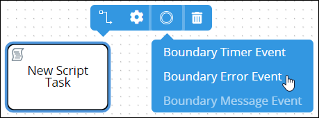
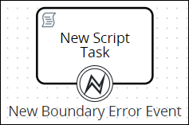
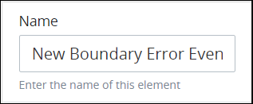
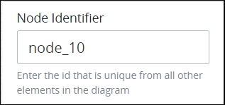

# Add and Configure Boundary Error Event Elements

## Add a Boundary Error Event Element


### Don't Know What a Boundary Error Event Element Is?

See [Process Modeling Element Descriptions](process-modeling-element-descriptions.md) for a description of the [Boundary Error Event](process-modeling-element-descriptions.md#boundary-error-event) element.

### Permissions Required

Your ProcessMaker user account or group membership must have the following permissions to add a Boundary Error Event element to the Process model unless your user account has the **Make this user a Super Admin** setting selected:

* Processes: Edit Processes
* Processes: View Processes

See the [Process](../../../processmaker-administration/permission-descriptions-for-users-and-groups.md#processes) permissions or ask your ProcessMaker Administrator for assistance.


Follow these steps to add a Boundary Error Event element to the Process model:

1. [View your Processes](../../viewing-processes/view-the-list-of-processes/view-your-processes.md#view-all-active-processes). The **Processes** page displays.
2. [Create a new Process](../../viewing-processes/view-the-list-of-processes/create-a-process.md) or click the **Open Modeler** iconto edit the selected Process model. Process Modeler displays.
3. Add one of the following Process model elements or [connectors](../model-processes-using-connectors/what-is-a-connector.md) to your Process model in which to associate with the Boundary Error Event element:
   * [Task](add-and-configure-task-elements.md#add-a-task-element) element
   * [Script Task](add-and-configure-script-task-elements.md#add-a-script-task-element) element
   * [Manual Task](add-and-configure-manual-task-elements.md#add-a-manual-task-element) element
   * [Sub Process](add-and-configure-sub-process-elements.md#add-a-sub-process-element) element
   * [Actions By Email](../model-processes-using-connectors/available-connectors-from-processmaker/actions-by-email-connector.md) connector \(requires the [Actions By Email package](../../../package-development-distribution/package-a-connector/actions-by-email-package.md)\)
   * [Data Connector](../model-processes-using-connectors/available-connectors-from-processmaker/data-connector-connector.md) connector \(requires the [Data Connector package](../../../package-development-distribution/package-a-connector/data-connector-package.md)\)
   * [PDF Generator](../model-processes-using-connectors/available-connectors-from-processmaker/pdf-generator-connector.md) connector \(requires the [PDF Generator package](../../../package-development-distribution/package-a-connector/pdf-generator-package.md)\)
   * [Send Email](../model-processes-using-connectors/available-connectors-from-processmaker/email-connector.md) connector \(requires the [Send Email package](../../../package-development-distribution/package-a-connector/email.md)\)
4. From the **Boundary Events** drop-down menu, select the **Boundary Error Event** option. The Boundary Error Event element displays on the top of its associating element.  
5. Optionally, add the following Boundary Event element types in which to associate with the Task-type element:
   * [Boundary Timer Event](add-and-configure-boundary-timer-event-elements.md#add-a-boundary-timer-event-element) element
   * [Boundary Message Event](add-and-configure-boundary-message-event-elements.md#add-a-boundary-message-event-element) element

After placing the Boundary Error Event element, you may drag it to an adjacent side of its associating element. Since Process Modeler displays element names at the bottom of elements, the Boundary Error Event element displays best at the bottom of its associating element.

## Settings


Your ProcessMaker user account or group membership must have the following permissions to configure a Boundary Error Event element unless your user account has the **Make this user a Super Admin** setting selected:

* Processes: Edit Processes
* Processes: View Processes

See the [Process](../../../processmaker-administration/permission-descriptions-for-users-and-groups.md#processes) permissions or ask your ProcessMaker Administrator for assistance.


The Boundary Error Event element has the following panels that contain settings:

* **Configuration** panel
  * [Edit the element name](add-and-configure-boundary-error-event-elements.md#edit-the-element-name)
* **Advanced** panel
  * [Edit the element's identifier value](add-and-configure-boundary-error-event-elements.md#edit-the-elements-identifier-value)

### Configuration Panel Settings

#### Edit the Element Name

An element name is a human-readable reference for a Process element. Process Modeler automatically assigns the name of a Process element with its element type. However, an element's name can be changed.

Follow these steps to edit the name for a Boundary Timer Event element:

1. Ensure that the **Hide Menus** buttonis not enabled. See [Maximize the Process Modeler Canvas View](../navigate-around-your-process-model.md#maximize-the-process-modeler-canvas-view).
2. Select the Boundary Error Event element from the Process model in which to edit its name. Panels to configure this element display.
3. Expand the **Configuration** panel if it is not presently expanded. The **Name** setting displays.  
4. In the **Name** setting, edit the selected element's name and then press **Enter**.

### Advanced Panel Settings

#### Edit the Element's Identifier Value

Process Modeler automatically assigns a unique value to each Process element added to a Process model. However, an element's identifier value can be changed if it is unique to all other elements in the Process model, including the Process model's identifier value.


All identifier values for all elements in the Process model must be unique.


Follow these steps to edit the identifier value for a Boundary Error Event element:

1. Ensure that the **Hide Menus** buttonis not enabled. See [Maximize the Process Modeler Canvas View](../navigate-around-your-process-model.md#maximize-the-process-modeler-canvas-view).
2. Select the Boundary Error Event element from the Process model in which to edit its identifier value. Panels to configure this element display.
3. Expand the **Advanced** panel if it is not presently expanded. The **Node Identifier** setting displays. This is a required setting.  
4. In the **Node Identifier** setting, edit the Boundary Error Event element's identifier to a unique value from all elements in the Process model and then press **Enter**.

## Related Topics









