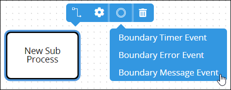
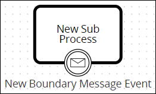
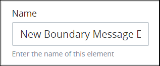
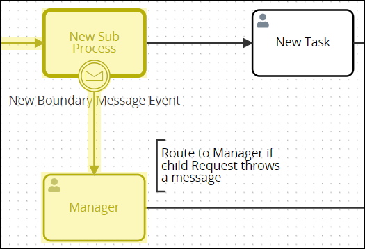
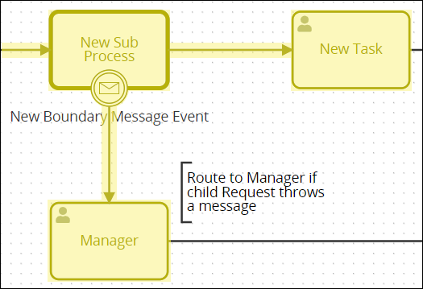

# Add and Configure Boundary Message Event Elements

## Add a Boundary Message Event Element


### Don't Know What a Boundary Message Event Element Is?

See [Process Modeling Element Descriptions](process-modeling-element-descriptions.md) for a description of the [Boundary Message Event](process-modeling-element-descriptions.md#boundary-message-event) element.

### Permissions Required

Your ProcessMaker user account or group membership must have the following permissions to add a Boundary Message Event element to the Process model unless your user account has the **Make this user a Super Admin** setting selected:

* Processes: Edit Processes
* Processes: View Processes

See the [Process](../../../processmaker-administration/permission-descriptions-for-users-and-groups.md#processes) permissions or ask your ProcessMaker Administrator for assistance.


Follow these steps to add a Boundary Message Event element to the Process model:

1. [View your Processes](../../viewing-processes/view-the-list-of-processes/view-your-processes.md#view-all-active-processes). The **Processes** page displays.
2. [Create a new Process](../../viewing-processes/view-the-list-of-processes/create-a-process.md) or click the **Open Modeler** iconto edit the selected Process model. Process Modeler displays.
3. Add a [Sub Process](process-modeling-element-descriptions.md#sub-process) element to your Process model in which to associate with the Boundary Message Event element.
4. From the **Boundary Events** drop-down menu, select the **Boundary Message Event** option. The Boundary Message Event element displays on the top of its associating element.  
5. Optionally, add the following Boundary Event element types in which to associate with the Sub Process element:
   * [Boundary Timer Event](add-and-configure-boundary-error-event-elements.md#add-a-boundary-error-event-element) element
   * [Boundary Error Event](add-and-configure-boundary-error-event-elements.md#add-a-boundary-error-event-element) element

After the element is placed into the Task-type element, you may drag the Boundary Message Event to an adjacent side of its associating element. Since Process Modeler displays element names at the bottom of elements, the Boundary Message Event element displays best at the bottom of its associating element.

## Settings


Your ProcessMaker user account or group membership must have the following permissions to configure a Boundary Message Event element unless your user account has the **Make this user a Super Admin** setting selected:

* Processes: Edit Processes
* Processes: View Processes

See the [Process](../../../processmaker-administration/permission-descriptions-for-users-and-groups.md#processes) permissions or ask your ProcessMaker Administrator for assistance.


The Boundary Message Event element has the following panels that contain settings:

* **Configuration** panel
  * [Edit the element name](add-and-configure-boundary-message-event-elements.md#edit-the-element-name)
  * [Indicate to interrupt the best-case scenario workflow](add-and-configure-boundary-message-event-elements.md#indicate-to-interrupt-the-best-case-scenario-workflow)
* **Advanced** panel
  * [Edit the element's identifier value](add-and-configure-boundary-message-event-elements.md#edit-the-elements-identifier-value)

### Configuration Panel Settings

#### Edit the Element Name

An element name is a human-readable reference for a Process element. Process Modeler automatically assigns the name of a Process element with its element type. However, an element's name can be changed.

Follow these steps to edit the name for a Boundary Message Event element:

1. Ensure that the **Hide Menus** buttonis not enabled. See [Maximize the Process Modeler Canvas View](../navigate-around-your-process-model.md#maximize-the-process-modeler-canvas-view).
2. Select the Boundary Message Event element from the Process model in which to edit its name. Panels to configure this element display.
3. Expand the **Configuration** panel if it is not presently expanded. The **Name** setting displays.  
4. In the **Name** setting, edit the selected element's name and then press **Enter**.

#### Indicate to Interrupt the Best-Case Scenario Workflow

Indicate whether the Boundary Message Event element interrupts the best-case scenario workflow:

* **Interrupting workflow:** When workflow routes through the Boundary Message Event element, workflow is interrupted and does not route through the best-case scenario. As highlighted in the example below, workflow routes through the Boundary Message Event element if that element receives a message from the child Request.  
* **Non-interrupting workflow:** Workflow routes both through the Boundary Message Event element and the best-case scenario, thereby creating parallel workflow in that Request. As highlighted in the example below, workflow routes through the Boundary Message Event element if that element receives a message from the child Request; however, after the child Request completes and workflow resumes in the parent Request, the Sub Process element completes and routes through the best-case scenario. 

Follow these steps to indicate if this Boundary Message Event element interrupts the best-case scenario workflow when it triggers:

1. Ensure that the **Hide Menus** buttonis not enabled. See [Maximize the Process Modeler Canvas View](../navigate-around-your-process-model.md#maximize-the-process-modeler-canvas-view).
2. Select the Boundary Message Event element from the Process model in which to indicate if it interrupts the best-case scenario workflow. Panels to configure this element display.
3. Expand the **Configuration** panel if it is not presently expanded, and then locate the **Interrupting** setting.  
4. From the **Interrupting** checkbox, indicate whether this Boundary Message Event element interrupts the best-case scenario workflow when it triggers. When the **Interrupting** checkbox is selected, which is the default setting, this element interrupts the best-case scenario workflow.

### Advanced Panel Settings

#### Edit the Element's Identifier Value

Process Modeler automatically assigns a unique value to each Process element added to a Process model. However, an element's identifier value can be changed if it is unique to all other elements in the Process model, including the Process model's identifier value.


All identifier values for all elements in the Process model must be unique.


Follow these steps to edit the identifier value for a Boundary Message Event element:

1. Ensure that the **Hide Menus** buttonis not enabled. See [Maximize the Process Modeler Canvas View](../navigate-around-your-process-model.md#maximize-the-process-modeler-canvas-view).
2. Select the Boundary Message Event element from the Process model in which to edit its identifier value. Panels to configure this element display.
3. Expand the **Advanced** panel if it is not presently expanded. The **Node Identifier** setting displays. This is a required setting.  
4. In the **Node Identifier** setting, edit the Boundary Message Event element's identifier to a unique value from all elements in the Process model and then press **Enter**.

## Related Topics









