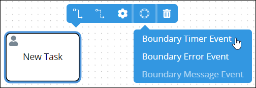
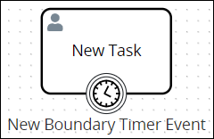
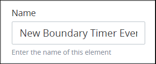
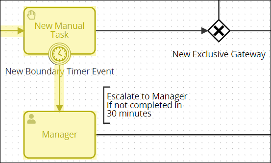
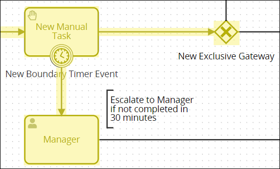
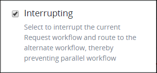
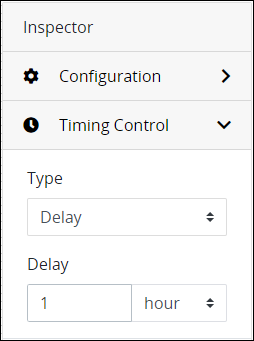
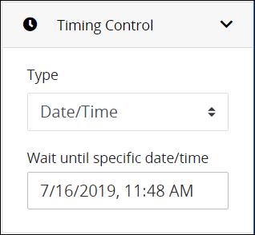
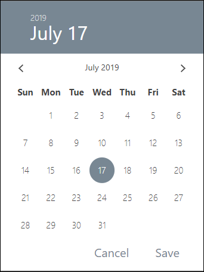

# Add and Configure Boundary Timer Event Elements

## Add a Boundary Timer Event Element


### Don't Know What a Boundary Timer Event Element Is?

See [Process Modeling Element Descriptions](process-modeling-element-descriptions.md) for a description of the [Boundary Timer Event](process-modeling-element-descriptions.md#boundary-timer-event) element.

### Permissions Required

Your ProcessMaker user account or group membership must have the following permissions to add a Boundary Timer Event element to the Process model unless your user account has the **Make this user a Super Admin** setting selected:

* Processes: View Processes
* Processes: Edit Processes

See the [Process](../../../processmaker-administration/permission-descriptions-for-users-and-groups.md#processes) permissions or ask your ProcessMaker Administrator for assistance.


Follow these steps to add a Boundary Timer Event element to the Process model:

1. [View your Processes](../../viewing-processes/view-the-list-of-processes/view-your-processes.md#view-all-active-processes). The **Processes** page displays.
2. [Create a new Process](../../viewing-processes/view-the-list-of-processes/create-a-process.md) or click the **Open Modeler** iconto edit the selected Process model. Process Modeler displays.
3. Add one of the following Process model elements to your Process model in which to associate with the Boundary Timer Event element:
   * [Task](add-and-configure-task-elements.md#add-a-task-element) element
   * [Script Task](add-and-configure-script-task-elements.md#add-a-script-task-element) element
   * [Manual Task](add-and-configure-manual-task-elements.md#add-a-manual-task-element) element
   * [Sub Process](add-and-configure-sub-process-elements.md#add-a-sub-process-element) element
4. From the **Boundary Events** drop-down menu, select the **Boundary Timer Event** option. The Boundary Timer Event element displays on the top of its associating element.  
5. Optionally, add the following Boundary Event element types in which to associate with the Task-type element:
   * [Boundary Error Event](add-and-configure-boundary-error-event-elements.md#add-a-boundary-error-event-element) element
   * [Boundary Message Event](add-and-configure-boundary-message-event-elements.md#add-a-boundary-message-event-element) element

After the element is placed into the Task-type element, you may drag the Boundary Timer Event to an adjacent side of its associating element. Since Process Modeler displays element names at the bottom of elements, the Boundary Timer Event element displays best at the bottom of its associating element.

## Settings


Your ProcessMaker user account or group membership must have the following permissions to configure a Boundary Timer Event element unless your user account has the **Make this user a Super Admin** setting selected:

* Processes: View Processes
* Processes: Edit Processes

See the [Process](../../../processmaker-administration/permission-descriptions-for-users-and-groups.md#processes) permissions or ask your ProcessMaker Administrator for assistance.


The Boundary Timer Event element has the following panels that contain settings:

* **Configuration** panel
  * [Edit the element name](add-and-configure-boundary-timer-event-elements.md#edit-the-element-name)
  * [Indicate to interrupt the best-case scenario workflow](add-and-configure-boundary-timer-event-elements.md#indicate-to-interrupt-the-best-case-scenario-workflow)
* **Timing Control** panel
  * [Set the timing controls](add-and-configure-boundary-timer-event-elements.md#set-the-timing-controls)
* **Advanced** panel
  * [Edit the element's identifier value](add-and-configure-boundary-timer-event-elements.md#edit-the-elements-identifier-value)

### Configuration Panel Settings

#### Edit the Element Name

An element name is a human-readable reference for a Process element. Process Modeler automatically assigns the name of a Process element with its element type. However, an element's name can be changed.

Follow these steps to edit the name for a Boundary Timer Event element:

1. Ensure that the **Hide Menus** buttonis not enabled. See [Maximize the Process Modeler Canvas View](../navigate-around-your-process-model.md#maximize-the-process-modeler-canvas-view).
2. Select the Boundary Timer Event element from the Process model in which to edit its name. Panels to configure this element display.
3. Expand the **Configuration** panel if it is not presently expanded. The **Name** setting displays.  
4. In the **Name** setting, edit the selected element's name and then press **Enter**.

#### Indicate to Interrupt the Best-Case Scenario Workflow

Indicate whether the Boundary Timer Event element interrupts the best-case scenario workflow:

* **Interrupting workflow:** When workflow routes through the Boundary Timer Event element, workflow is interrupted and does not route through the best-case scenario. As highlighted in the example below, workflow routes through the Boundary Timer Event element if the Manual Task element does not complete within 30 minutes.  
* **Non-interrupting workflow:** Workflow routes both through the Boundary Timer Event element and the best-case scenario, thereby creating parallel workflow in that Request. As highlighted in the example below, workflow routes through the Boundary Timer Event element if the Manual Task element does not complete within 30 minutes; however, workflow also routes through the best-case scenario when that element completes.  

Follow these steps to indicate if this Boundary Timer Event element interrupts the best-case scenario workflow when it triggers:

1. Ensure that the **Hide Menus** buttonis not enabled. See [Maximize the Process Modeler Canvas View](../navigate-around-your-process-model.md#maximize-the-process-modeler-canvas-view).
2. Select the Boundary Timer Event element from the Process model in which to indicate if it interrupts the best-case scenario workflow. Panels to configure this element display.
3. Expand the **Configuration** panel if it is not presently expanded, and then locate the **Interrupting** setting.  
4. From the **Interrupting** checkbox, indicate whether this Boundary Timer Event element interrupts the best-case scenario workflow when it triggers. When the **Interrupting** checkbox is selected, which is the default setting, this element interrupts the best-case scenario workflow.

### Timing Control Panel Settings

#### Set the Timing Controls

When a Boundary Timer Event element is placed into a Process model, it is set to trigger in one \(1\) hour before workflow routes through it unless its associative element completes before then. If this is not the timing control setting you want, the Boundary Timer Event element must be configured. Set the timer controls for a Boundary Timer Event element using one of the following methods:

* Set an interval in which to delay routing workflow through the Boundary Timer Event element in a specified number of days, weeks, months, or years \(unless its associative element completes before the delay expires\).
* Set the date and hour when the Boundary Timer Event element routes workflow through it \(unless its associative element completes before that date and hour arrives\).

Follow these steps to set the timer controls for a Boundary Timer Event element:

1. Ensure that the **Hide Menus** buttonis not enabled. See [Maximize the Process Modeler Canvas View](../navigate-around-your-process-model.md#maximize-the-process-modeler-canvas-view).
2. Select the Boundary Timer Event element from the Process model in which to set its timer controls. Panels to configure this element display.
3. Expand the **Timing Control** panel if it is not presently expanded. The **Type** setting displays.

   

4. Do one of the following to set the timer control:
   * **Set the timer when workflow routes through the Boundary Timer Event element:** From the **Type** drop-down menu, select the **Delay** option. **Delay** is the default setting. From the **Delay** setting, select the delay to route workflow through the Boundary Timer Event element unless its associative element completes. **1** **hour** is the default setting. Then select one of the following time periods for that element to trigger:
     * Minute
     * Hour \(default setting\)
     * Day
     * Month
   * **Set date and time when workflow routes through the Boundary Timer Event element:** From the **Type** drop-down menu, select the **Date/Time** option. The **Wait until specific date/time** setting displays.  

     

     From the **Wait until specific date/time** field, use the date control to select the date and time to route workflow through the Boundary Timer Event element unless its associative element completes. If this field has not been previously set, the current date is the default.  

     

### Advanced Panel Settings

#### Edit the Element's Identifier Value

Process Modeler automatically assigns a unique value to each Process element added to a Process model. However, an element's identifier value can be changed if it is unique to all other elements in the Process model, including the Process model's identifier value.


All identifier values for all elements in the Process model must be unique.


Follow these steps to edit the identifier value for a Boundary Timer Event element:

1. Ensure that the **Hide Menus** buttonis not enabled. See [Maximize the Process Modeler Canvas View](../navigate-around-your-process-model.md#maximize-the-process-modeler-canvas-view).
2. Select the Boundary Timer Event element from the Process model in which to edit its identifier value. Panels to configure this element display.
3. Expand the **Advanced** panel if it is not presently expanded. The **Node Identifier** setting displays. This is a required field.  
4. In the **Node Identifier** setting, edit the Boundary Timer Event element's identifier to a unique value from all elements in the Process model and then press **Enter**.

## Related Topics









