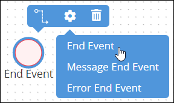
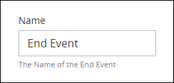
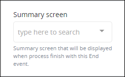
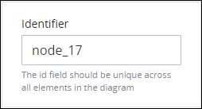

# Add and Configure End Event Elements

## Add an End Event Element


### Don't Know What an End Event Is?

See [Process Modeling Element Descriptions](process-modeling-element-descriptions.md) for a description of the [End Event](process-modeling-element-descriptions.md#end-event) element.

### Permissions Required

Your ProcessMaker user account or group membership must have the following permissions to add an End Event element to the Process model unless your user account has the **Make this user a Super Admin** setting selected:

* Processes: View Processes
* Processes: Edit Processes

See the [Process](../../../processmaker-administration/permission-descriptions-for-users-and-groups.md#processes) permissions or ask your ProcessMaker Administrator for assistance.


Follow these steps to add an End Event element to the Process model:

1. [View your Processes](../../viewing-processes/view-the-list-of-processes/view-your-processes.md#view-all-active-processes). The **Processes** page displays.
2. [Create a new Process](../../viewing-processes/view-the-list-of-processes/create-a-process.md) or click the **Open Modeler** iconto edit the selected Process model. Process Modeler displays.
3. Locate the **End Event** control in the **Controls** palette that is to the left of the Process Modeler canvas. If the [**Hide Menus** button](../navigate-around-your-process-model.md#maximize-the-process-modeler-canvas-view)is enabled, the **Controls** palette displays the **End Event** control's icon.

   

4. Drag the control into the Process model canvas where you want to place it. If a Pool element is in your Process model, the End Event element cannot be placed outside of the Pool element.
5. Do one of the following:
   * From the **Elements** drop-down menu, select the **End Event** option.  
   * Click anywhere in the Process model. The End Event element selects by default.

After the element is placed into the Process model, you may move it by dragging it to the new location.


Moving an End Event element has the following limitations in regards to the following Process model elements:

* **Pool element:** If the End Event element is inside of a [Pool](process-modeling-element-descriptions.md#pool) element, it cannot be moved outside of the Pool element. If you attempt to do so, Process Modeler places the End Event element inside the Pool element closest to where you attempted to move it.
* **Lane element:** If the End Event element is inside of a Lane element, it can be moved to another Lane element in the same Pool element. However, the End Event element cannot be moved outside of the Pool element.


## Settings


Your ProcessMaker user account or group membership must have the following permissions to configure an End Event element unless your user account has the **Make this user a Super Admin** setting selected:

* Processes: View Processes
* Processes: Edit Processes

See the [Process](../../../processmaker-administration/permission-descriptions-for-users-and-groups.md#processes) permissions or ask your ProcessMaker Administrator for assistance.


The End Event element has the following panels that contain settings:

* **Configuration** panel
  * [Edit the element name](add-and-configure-end-event-elements.md#edit-the-element-name)
  * [Select the ProcessMaker Screen that summarizes a completed Request](add-and-configure-end-event-elements.md#select-the-processmaker-screen-that-summarizes-a-completed-request)
* **Advanced** panel
  * [Edit the element's identifier value](add-and-configure-end-event-elements.md#edit-the-elements-identifier-value)

### Configuration Panel Settings

#### Edit the Element Name

An element name is a human-readable reference for a Process element. Process Modeler automatically assigns the name of a Process element with its element type. However, an element's name can be changed.

Follow these steps to edit the name for an End Event element:

1. Ensure that the **Hide Menus** buttonis not enabled. See [Maximize the Process Modeler Canvas View](../navigate-around-your-process-model.md#maximize-the-process-modeler-canvas-view).
2. Select the End Event element from the Process model in which to edit its name. Panels to configure this element display.
3. Expand the **Configuration** panel if it is not presently expanded. The **Name** setting displays.  

   

4. In the **Name** setting, edit the selected element's name and then press **Enter**.

#### Select the ProcessMaker Screen That Summarizes a Completed Request

After a [Request](../../../using-processmaker/requests/what-is-a-request.md) completes when an End Event element triggers, a [ProcessMaker Screen](../../design-forms/what-is-a-form.md) can display a summary of the completed Request. If a Process model has multiple End Event elements, then each End Event element can reference a different ProcessMaker Screen to display a different summary.

For example, if an End Event element triggers from Lane 1 of a Pool element, then use a different ProcessMaker Screen to display the Request summary than an End Event element that triggers from Lane 2.

When an End Event element is placed into a Process model, it is not configured to display a summary ProcessMaker Screen when it triggers. Therefore, it must be configured.

Follow these steps to select the ProcessMaker Screen that displays when an End Event element triggers:

1. Ensure that the **Hide Menus** buttonis not enabled. See [Maximize the Process Modeler Canvas View](../navigate-around-your-process-model.md#maximize-the-process-modeler-canvas-view).
2. Select the End Event element from the Process model in which to select the ProcessMaker Screen that displays when that End Event element is triggered, thereby completing that Request. Panels to configure this element display.
3. Expand the **Configuration** panel if it is not presently expanded, and then locate the **Summary screen** setting.  

   

4. From the **Summary screen** drop-down menu, select the ProcessMaker Screen that has been designed to display Request summaries if that End Event element triggers. This drop-down menu displays only [Display](../../design-forms/screens-builder/types-for-screens.md#display)-type ProcessMaker Screens to display a message to the Request participant. Note that another End Event element located elsewhere in the Process model, such as another [Pool](process-modeling-element-descriptions.md#pool) or [Lane](process-modeling-element-descriptions.md#lane) element, may reference a different ProcessMaker Screen to display Request summaries when it triggers.

### Advanced Panel Settings

#### Edit the Element's Identifier Value

Process Modeler automatically assigns a unique value to each Process element added to a Process model. However, an element's identifier value can be changed if it is unique to all other elements in the Process model, including the Process model's identifier value.


All identifier values for all elements in the Process model must be unique.


Follow these steps to edit the identifier value for an End Event element:

1. Ensure that the **Hide Menus** buttonis not enabled. See [Maximize the Process Modeler Canvas View](../navigate-around-your-process-model.md#maximize-the-process-modeler-canvas-view).
2. Select the End Event element from the Process model in which to edit its identifier value. Panels to configure this element display.
3. Expand the **Advanced** panel if it is not presently expanded. The **Node Identifier** setting displays. This is a required setting.  

   

4. In the **Node Identifier** setting, edit the End Event element's identifier to a unique value from all elements in the Process model and then press **Enter**.

## Related Topics













