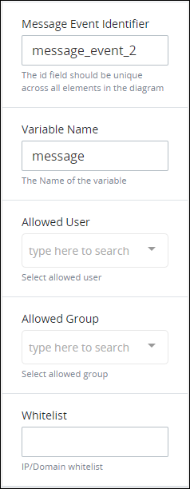

# Add and Configure Intermediate Message Catch Event Elements

## Add an Intermediate Message Catch Event Element


### Don't Know What an End Event Is?

See [Process Modeling Element Descriptions](process-modeling-element-descriptions.md) for a description of the [Intermediate Message Catch Event](process-modeling-element-descriptions.md#intermediate-message-catch-event) element.

### Permissions Required

Your ProcessMaker user account or group membership must have the following permissions to add an Intermediate Message Catch Event element to the Process model unless your user account has the **Make this user a Super Admin** setting selected:

* Processes: View Processes
* Processes: Edit Processes

See the [Process](../../../processmaker-administration/permission-descriptions-for-users-and-groups.md#processes) permissions or ask your ProcessMaker Administrator for assistance.


Follow these steps to add an Intermediate Message Catch Event element to the Process model:

1. [View your Processes](https://processmaker.gitbook.io/processmaker-4-community/-LPblkrcFWowWJ6HZdhC/~/drafts/-LRhVZm0ddxDcGGdN5ZN/primary/designing-processes/viewing-processes/view-the-list-of-processes/view-your-processes#view-all-processes). The **Processes** page displays.
2. [Create a new Process](../../viewing-processes/view-the-list-of-processes/create-a-process.md) or click the **Open Modeler** iconto edit the selected Process model. Process Modeler displays.
3. Locate the **Intermediate Message Catch Event** element in the panel to the left of the Process Modeler canvas.  

   

4. Drag the element into the Process model canvas where you want to place it. If a Pool element is in your Process model, the Intermediate Message Catch Event element cannot be placed outside of the Pool element.

After the element is placed into the Process model, you may move it by dragging it to the new location.


Moving an Intermediate Message Catch Event element has the following limitations in regards to the following Process model elements:

* **Pool element:** If the Intermediate Message Catch Event element is inside of a [Pool](process-modeling-element-descriptions.md#pool) element, it cannot be moved outside of the Pool element. If you attempt to do so, Process Modeler places the Intermediate Message Catch Event element inside the Pool element closest to where you attempted to move it.
* **Lane element:** If the Intermediate Message Catch Event element is inside of a Lane element, it can be moved to another Lane element in the same Pool element. However, the Intermediate Message Catch Event element cannot be moved outside of the Pool element.


## Configure an Intermediate Message Catch Event Element


Your ProcessMaker user account or group membership must have the following permissions to configure an Intermediate Message Catch Event element unless your user account has the **Make this user a Super Admin** setting selected:

* Processes: View Processes
* Processes: Edit Processes

See the [Process](../../../processmaker-administration/permission-descriptions-for-users-and-groups.md#processes) permissions or ask your ProcessMaker Administrator for assistance.


### Edit the Identifier Value

Process Modeler automatically assigns a unique value to each Process element added to a Process model. However, an element's identifier value can be changed if it is unique to all other elements in the Process model, including the Process model's identifier value.


All identifier values for all elements in the Process model must be unique.


Follow these steps to edit the identifier value for an Intermediate Message Catch Event element:

1. Select the Intermediate Message Catch Event element from the Process model in which to edit its identifier value. The **Configuration** setting section displays.
2. Expand the **Configuration** setting section if it is not presently expanded. The **Identifier** field displays. This is a required field.  

   

3. In the **Identifier** field, edit the End Event element's identifier to a unique value from all elements in the Process model and then press **Enter**. The element's identifier value is changed.

### Edit the Element Name

An element name is a human-readable reference for a Process element. Process Modeler automatically assigns the name of a Process element with its element type. However, an element's name can be changed.

Follow these steps to edit the name for an Intermediate Message Catch Event element:

1. Select the Intermediate Message Catch Event element from the Process model in which to edit its name. The **Configuration** setting section displays.
2. Expand the **Configuration** setting section if it is not presently expanded. The **Name** field displays.  

   

3. In the **Name** field, edit the selected element's name and then press **Enter**. The element's name is changed.

### Configure How to Trigger an Intermediate Message Catch Event Element

Follow these guidelines how to trigger an Intermediate Message Catch Event element:

* Optionally, specify the incoming [Message Flow](process-modeling-element-descriptions.md#message-flow) element representing the external API call that triggers the Intermediate Message Catch Event element. If you don't specify which Message Flow element triggers the Intermediate Message Catch Event element when that element has multiple incoming Message Flow elements, then the first Message Flow element that triggers will trigger the Intermediate Message Catch Event element; this represents when the first external API call occurs that meet the conditions set to trigger the Intermediate Message Catch Event. If there is only one incoming Message Flow element, then it is not necessary to specify which element triggers the Intermediate Message Catch Event element.
* Optionally, specify the JSON object key that the Intermediate Message Catch Event element stores in the [Request's](../../../using-processmaker/requests/what-is-a-request.md) JSON data model. This JSON object key contains a value \(or null\) that it received during the Request. If no JSON object key is provided, then the Intermediate Message Catch Event element passes data to the Request's JSON data model.
* Optionally, specify the ProcessMaker user whose authorization credentials are required to make the external API call to the Intermediate Message Catch Event element.
* Optionally, specify the ProcessMaker group of which any member's authorization credentials can be used to make the external API call to the Intermediate Message Catch Event element.
* Optionally, specify the IP address or domain that is the Intermediate Message Catch Event is allowed to receive the API call. If no IP addresses or domains are specified, then any IP address or domain can potentially trigger the Intermediate Message Catch Event element.

Adding settings to the Intermediate Message Catch Event element restricts how this element triggers. Inversely, the fewer settings you enter provides greater likelihood the Intermediate Message Catch Event element triggers.

Follow these steps to configure how to trigger an Intermediate Message Catch Event element:

1. Select the Intermediate Message Catch Event element from the Process model in which to edit its identifier value. The **Configuration** setting section displays.
2. Expand the **Configuration** setting section if it is not presently expanded, and then scroll to the **Message Event Identifier** field.  

   

3. In the **Message Event Identifier** field, enter the unique **Identifier** field value for the incoming Message Flow element that represents the external API call. When the incoming Message Flow element matching the **Identifier** field value triggers, then the Intermediate Message Catch Event element evaluates the other settings to determine if it triggers.

   To locate the **Identifier** field value for an incoming Message Flow element, follow these steps:

   1. Select the incoming Message Flow element connecting to the Intermediate Message Catch Event element.
   2. Expand the **Configuration** section for that Message Flow element if it is not presently expanded.
   3. Copy the value in the **Identifier** field. See [Set Message Flow Elements Between Separate Pool Elements](set-and-delete-message-flow-between-elements.md#edit-the-identifier-value).
   4. Paste that value into the Intermediate Message Catch Event element's **Message Event Identifier** field.

4. In the **Data Name** field, enter the JSON object key in the Request's JSON data model that the Intermediate Message Catch Event element stores data from the external API call. If you do not provide a key, then the Intermediate Message Catch Event element passes data to the Request's JSON data model.
5. From the **Allowed User** drop-down menu, select the ProcessMaker user whose authorization credentials are required to make the external API call to the Intermediate Message Catch Event element. Do not select a ProcessMaker user in the following circumstances:
   * There is no restriction whose ProcessMaker user's authorization credentials are associated with the API call.
   * You intend to select a ProcessMaker group from which any member's authorization credentials can be associated with the API call.
6. From the **Allowed Group** drop-down menu, select the ProcessMaker group of which any member's authorization credentials can be used to make the external API call to the Intermediate Message Catch Event element. Do not select a ProcessMaker group in the following circumstances:
   * There is no restriction whose ProcessMaker user's authorization credentials are associated with the API call.
   * You intend to select a ProcessMaker user whose authorization credentials are required to make the API call.
7. In the **Whitelist** field, enter the IP address or domain name from which the Intermediate Message Catch Event element is allowed to receive the external API call. Separate multiple items with commas. If no IP addresses or domains are specified, then any IP address or domain can potentially trigger the Intermediate Message Catch Event element.

## Assign ProcessMaker Vocabularies That Validate Request Data from This Element


### ProcessMaker Package Required

Your ProcessMaker instance must have the [Vocabularies package](../../../package-development-distribution/package-a-connector/vocabularies.md) installed to assign which ProcessMaker Vocabularies validate Request data at an Intermediate Message Catch Event element. Use the Vocabularies package to maintain uniform JSON schemas across all assets in your organization. These assets include [Processes](../../viewing-processes/what-is-a-process.md), [ProcessMaker Screens](../../design-forms/what-is-a-form.md), and [ProcessMaker Scripts](../../scripts/what-is-a-script.md).

A ProcessMaker Vocabulary is a JSON schema. The JSON schema describes the data objects, types, and structure that you want in both a machine and human readable format. Apply one or more ProcessMaker Vocabularies to your Processes and/or specific BPMN 2.0 elements in your Process models to ensure the JSON data model in Request data complies with the data structure outlined in the JSON schema that you need to meet regulatory specifications or ensure Request data contains required information.

The Vocabularies package is not available in the ProcessMaker open-source edition. Contact [ProcessMaker Sales](mailto:sales@processmaker.com) or ask your ProcessMaker sales representative how the Vocabularies package can be installed in your ProcessMaker instance.

### Permissions Required

Your ProcessMaker user account or group membership must have the following permissions to set which ProcessMaker user or group can start a Request for a Process unless your user account has the **Make this user a Super Admin** setting selected:

* Processes: View Processes
* Processes: Edit Processes

See the [Process](../../../processmaker-administration/permission-descriptions-for-users-and-groups.md#processes) permissions or ask your ProcessMaker Administrator for assistance.


Assign [ProcessMaker Vocabularies](../../vocabularies-management/what-is-a-vocabulary.md) that validate Request data complies with a specific JSON schema. This is often mandatory for many types of business sectors including banking and healthcare. Ensure the quality and compliance of Request data. For example, during a Loan Application process, ensure that personal information has been included in the Request to that moment in that in-progress Request. The Vocabularies package must be installed in your ProcessMaker instance to make this configuration.

Use a ProcessMaker Vocabulary on an Intermediate Message Catch Event element to validate Request data complies with the Vocabulary's JSON schema. See [What is a Vocabulary?](../../vocabularies-management/what-is-a-vocabulary.md) for more information.

Each moment ProcessMaker evaluates workflow routing for an in-progress Request, ProcessMaker also evaluates the Request data's conformity to the ProcessMaker Vocabularies applied to the Process and/or a specific BPMN 2.0 element in the Process model. The Request's JSON data model must conform to the ProcessMaker Vocabulary's JSON schema.

During an in-progress Request, if ProcessMaker evaluates that the Request data no longer complies with all ProcessMaker Vocabularies to that moment, the Request status changes from In Progress to Error. The error displays in the [Request summary](../../../using-processmaker/requests/request-details/summary-for-requests-with-errors.md). ProcessMaker Vocabularies are cumulative in an in-progress Request: as the Request progresses, if Request data does not conform with any Vocabulary's JSON schema to that moment in the Request, the Request errors.

If no ProcessMaker Vocabularies are assigned, ProcessMaker does not validate Request data complies with a specific JSON schema prior to continuing workflow for that Request.

One or more ProcessMaker Vocabularies must be created to your ProcessMaker instance before assigning a Vocabulary. See [Create a New Vocabulary](../../vocabularies-management/manage-your-vocabularies/create-a-new-vocabulary.md#create-a-new-processmaker-vocabulary). Multiple ProcessMaker Vocabularies can be assigned to a Start Event element.

Follow these steps to assign ProcessMaker Vocabularies that validate Request data from an Intermediate Message Catch Event element:

1. Select the Intermediate Message Catch Event element from the Process model in which to assign ProcessMaker Vocabularies that validate Request data prior to when this element completes. The **Configuration** setting section displays.
2. Expand the **Vocabularies** setting section. The **Assigned** setting displays.
3. Click theicon to add a ProcessMaker Vocabulary. The **Assign Vocabulary** option displays.  
4. From the **Select Vocabulary** drop-down menu, select a ProcessMaker Vocabulary from which to validate Request data complies with its JSON schema.

   To remove a ProcessMaker Vocabulary that is currently selected, select the Vocabulary again or press `Enter` when the drop-down is visible.

   If no ProcessMaker Vocabularies are configured in your ProcessMaker instance, then the following message displays: **List is empty.** Create at least one ProcessMaker Vocabulary. See [Create a New Vocabulary](../../vocabularies-management/manage-your-vocabularies/create-a-new-vocabulary.md#create-a-new-processmaker-vocabulary).

5. Click **Save**.
6. Repeat Steps 3 through 5 as necessary for each ProcessMaker Vocabulary required to validate Request data complies with its JSON schema.


Click the **Remove** iconfrom the **Vocabularies** setting to remove a ProcessMaker Vocabulary from assignment to this element.


After one or more ProcessMaker Vocabularies are assigned to an Intermediate Message Catch Event element, the Vocabulary icon displays above that element.

## Related Topics



















