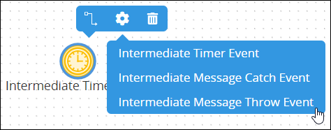
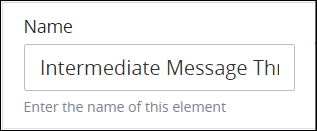
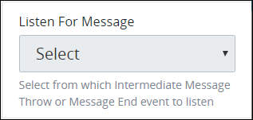

# Add and Configure Intermediate Message Throw Event Elements

## Add an Intermediate Message Throw Event Element


### Don't Know What an End Event Is?

See [Process Modeling Element Descriptions](process-modeling-element-descriptions.md) for a description of the [Intermediate Message Throw Event](process-modeling-element-descriptions.md#intermediate-message-throw-event) element.

### Permissions Required

Your ProcessMaker user account or group membership must have the following permissions to add an Intermediate Message Throw Event element to the Process model unless your user account has the **Make this user a Super Admin** setting selected:

* Processes: View Processes
* Processes: Edit Processes

See the [Process](../../../processmaker-administration/permission-descriptions-for-users-and-groups.md#processes) permissions or ask your ProcessMaker Administrator for assistance.


Follow these steps to add an Intermediate Message Throw Event element to the Process model:

1. [View your Processes](../../viewing-processes/view-the-list-of-processes/view-your-processes.md#view-all-active-processes). The **Processes** page displays.
2. [Create a new Process](../../viewing-processes/view-the-list-of-processes/create-a-process.md) or click the **Open Modeler** iconto edit the selected Process model. Process Modeler displays.
3. Locate the **Intermediate Event** control in the **Controls** palette that is to the left of the Process Modeler canvas. If the **Hide Menus** buttonis enabled, the **Controls** palette displays the **Intermediate Event** control's icon.  
4. Drag the control into the Process model canvas where you want to place it. If a Pool element is in your Process model, the Intermediate Message Throw Event element cannot be placed outside of the Pool element.
5. Select the **Intermediate Message Throw Event** option from the **Elements** drop-down menu. The Intermediate Message Throw Event element displays.  

After the element is placed into the Process model, you may move it by dragging it to the new location.


Moving an Intermediate Message Throw Event element has the following limitations in regards to the following Process model elements:

* **Pool element:** If the Intermediate Message Throw Event element is inside of a [Pool](process-modeling-element-descriptions.md#pool) element, it cannot be moved outside of the Pool element. If you attempt to do so, Process Modeler places the Intermediate Message Throw Event element inside the Pool element closest to where you attempted to move it.
* **Lane element:** If the Intermediate Message Throw Event element is inside of a Lane element, it can be moved to another Lane element in the same Pool element. However, the Intermediate Message Throw Event element cannot be moved outside of the Pool element.


## Settings


Your ProcessMaker user account or group membership must have the following permissions to configure an Intermediate Message Throw Event element unless your user account has the **Make this user a Super Admin** setting selected:

* Processes: View Processes
* Processes: Edit Processes

See the [Process](../../../processmaker-administration/permission-descriptions-for-users-and-groups.md#processes) permissions or ask your ProcessMaker Administrator for assistance.


The Intermediate Message Throw Event element has the following panels that contain settings:

* **Configuration** panel
  * [Edit the element name](add-and-configure-intermediate-message-catch-event-elements.md#edit-the-element-name)
  * 
* **Advanced** panel
  * [Edit the element's identifier value](add-and-configure-intermediate-message-catch-event-elements.md#edit-the-elements-identifier-value)

### Configuration Panel Settings

#### Edit the Element Name

An element name is a human-readable reference for a Process element. Process Modeler automatically assigns the name of a Process element with its element type. However, an element's name can be changed.

Follow these steps to edit the name for an Intermediate Message Catch Event element:

1. Ensure that the **Hide Menus** buttonis not enabled. See [Maximize the Process Modeler Canvas View](../navigate-around-your-process-model.md#maximize-the-process-modeler-canvas-view).
2. Select the Intermediate Message Throw Event element from the Process model in which to edit its name. Panels to configure this element display.
3. Expand the **Configuration** panel if it is not presently expanded. The **Name** setting displays.  
4. In the **Name** setting, edit the selected element's name and then press **Enter**.

#### Configure How to Trigger an Intermediate Message Catch Event Element

An Intermediate Message Catch Event element delays a [Request](../../../using-processmaker/requests/what-is-a-request.md) until that element receives a message from either an Intermediate Message Throw Event element or a Message End Event element \(but not both\) located in a different [Pool](process-modeling-element-descriptions.md#pool) element than the Intermediate Message Catch Event element receiving the message. After the Intermediate Message Catch Event element receives its message, that element triggers. In Process Modeler, only Intermediate Message Throw Event and Message End Event elements are available that are placed in a different Pool element within the Process model. Select from which element to listen for a message based on the Intermediate Message Throw Event or Message End Event element's **Message Name** setting value.

Follow these steps to configure how to trigger an Intermediate Message Catch Event element:

1. Ensure that the **Hide Menus** buttonis not enabled. See [Maximize the Process Modeler Canvas View](../navigate-around-your-process-model.md#maximize-the-process-modeler-canvas-view).
2. Select the Intermediate Message Catch Event element from the Process model in which to configure how it is triggered. Panels to configure this element display.
3. Expand the **Configuration** panel if it is not presently expanded, and then locate the **Listen For Message** setting.  
4. From the **Listen For Message** drop-down menu, select from which Intermediate Message Throw Event element or End Event element triggers the Intermediate Message Catch Event element.

### Advanced Panel Settings

#### Edit the Element's Identifier Value

Process Modeler automatically assigns a unique value to each Process element added to a Process model. However, an element's identifier value can be changed if it is unique to all other elements in the Process model, including the Process model's identifier value.


All identifier values for all elements in the Process model must be unique.


Follow these steps to edit the identifier value for an Intermediate Message Catch Event element:

1. Ensure that the **Hide Menus** buttonis not enabled. See [Maximize the Process Modeler Canvas View](../navigate-around-your-process-model.md#maximize-the-process-modeler-canvas-view).
2. Select the Intermediate Message Catch Event element from the Process model in which to edit its identifier value. Panels to configure this element display.
3. Expand the **Advanced** panel if it is not presently expanded. The **Node Identifier** setting displays. This is a required setting.  

   

4. In the **Node Identifier** setting, edit the Intermediate Message Catch Event element's identifier to a unique value from all elements in the Process model and then press **Enter**.

## Related Topics

