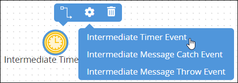
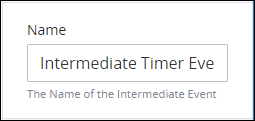
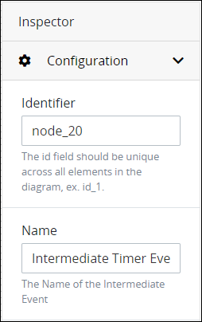

# Add and Configure Intermediate Timer Event Elements

## Add an Intermediate Timer Event Element


### Don't Know What an Intermediate Timer Event Element Is?

See [Process Modeling Element Descriptions](process-modeling-element-descriptions.md) for a description of the [Intermediate Timer Event](process-modeling-element-descriptions.md#intermediate-timer-event) element.

### Permissions Required

Your ProcessMaker user account or group membership must have the following permissions to add an Intermediate Timer Event element to the Process model unless your user account has the **Make this user a Super Admin** setting selected:

* Processes: View Processes
* Processes: Edit Processes

See the [Process](../../../processmaker-administration/permission-descriptions-for-users-and-groups.md#processes) permissions or ask your ProcessMaker Administrator for assistance.


Follow these steps to add an Intermediate Timer Event element to the Process model:

1. [View your Processes](https://processmaker.gitbook.io/processmaker-4-community/-LPblkrcFWowWJ6HZdhC/~/drafts/-LRhVZm0ddxDcGGdN5ZN/primary/designing-processes/viewing-processes/view-the-list-of-processes/view-your-processes#view-all-processes). The **Processes** page displays.
2. [Create a new Process](../../viewing-processes/view-the-list-of-processes/create-a-process.md) or click the **Open Modeler** iconto edit the selected Process model. Process Modeler displays.
3. Locate the **Intermediate Event** control in the **Controls** palette that is to the left of the Process Modeler canvas. If the **Hide Menus** buttonis enabled, the **Controls** palette displays the **Intermediate Event** control's icon.  
4. Drag the control into the Process model canvas where you want to place it. If a Pool element is in your Process model, the Intermediate Timer Event element cannot be placed outside of the Pool element.
5. Do one of the following:
   * Select the **Intermediate Timer Event** option from the **Elements** drop-down menu.  
   * Click anywhere in the Process model. The Intermediate Timer Event element selects by default.

After the element is placed into the Process model, you may move it by dragging it to the new location.


Moving an Intermediate Timer Event element has the following limitations in regards to the following Process model elements:

* **Pool element:** If the Intermediate Timer Event element is inside of a [Pool](process-modeling-element-descriptions.md#pool) element, it cannot be moved outside of the Pool element. If you attempt to do so, Process Modeler places the Intermediate Timer Event element inside the Pool element closest to where you attempted to move it.
* **Lane element:** If the Intermediate Timer Event element is inside of a Lane element, it can be moved to another Lane element in the same Pool element. However, the Intermediate Timer Event element cannot be moved outside of the Pool element.


## Settings


Your ProcessMaker user account or group membership must have the following permissions to configure an Intermediate Timer Event element unless your user account has the **Make this user a Super Admin** setting selected:

* Processes: View Processes
* Processes: Edit Processes

See the [Process](../../../processmaker-administration/permission-descriptions-for-users-and-groups.md#processes) permissions or ask your ProcessMaker Administrator for assistance.


The Intermediate Timer Event element has the following panels that contain settings:

* **Configuration** panel
  * [Edit the element name](add-and-configure-intermediate-timer-event-elements.md#edit-the-element-name)
* **Timing Control** panel
  * [Set the timing controls](add-and-configure-intermediate-timer-event-elements.md#set-the-timing-controls)
* **Advanced** panel
  * [Edit the element's identifier value](add-and-configure-intermediate-timer-event-elements.md#edit-the-elements-identifier-value)

### Configuration Panel Settings

#### Edit the Element Name

An element name is a human-readable reference for a Process element. Process Modeler automatically assigns the name of a Process element with its element type. However, an element's name can be changed.

Follow these steps to edit the name for an Intermediate Timer Event element:

1. Ensure that the **Hide Menus** buttonis not enabled. See [Maximize the Process Modeler Canvas View](../navigate-around-your-process-model.md#maximize-the-process-modeler-canvas-view).
2. Select the Intermediate Timer Event element from the Process model in which to edit its name. Panels to configure this element display.
3. Expand the **Configuration** panel if it is not presently expanded. The **Name** setting displays.  

   

4. In the **Name** setting, edit the selected element's name and then press **Enter**.

### Timing Control Panel Settings

#### Set the Timing Controls

When an Intermediate Timer Event element is placed into a Process model, it is set to a delay of one \(1\) hour. If these are not the timing control settings you want, the Intermediate Timer Event element must be configured. Set the timer controls for an Intermediate Timer Event element using one of the following methods:

* Set an interval in which to delay triggering the Intermediate Time Event element in a specified number of days, weeks, months, or years.
* Set the date and hour when the trigger the Intermediate Timer Event element.

Follow these steps to set the timer controls for an Intermediate Timer Event element:

1. Ensure that the **Hide Menus** buttonis not enabled. See [Maximize the Process Modeler Canvas View](../navigate-around-your-process-model.md#maximize-the-process-modeler-canvas-view).
2. Select the Intermediate Timer Event element from the Process model in which to set its timer controls. Panels to configure this element display.
3. Expand the **Timing Control** panel if it is not presently expanded. The **Type** setting displays.

   

4. Do one of the following to set the timer control:
   * **Delay the timer:** From the **Type** drop-down menu, select the **Delay** option. **Delay** is the default setting. From the **Delay** setting, select at which interval of time to trigger the Intermediate Timer Event element. **1** is the default setting. Then select one of the following time periods for that element to trigger:
     * Minute
     * Hour \(default setting\)
     * Day
     * Month
   * **Set date and time to trigger the Intermediate Start Event element:** From the **Type** drop-down menu, select the **Date/Time** option. The **Wait until specific date/time** setting displays.  

     

     From the **Wait until specific date/time** field, use the date control to select the date and time to trigger the Intermediate Timer Event element. If this field has not been previously set, the current date is the default.  

     

### Advanced Panel Settings

#### Edit the Element's Identifier Value

Process Modeler automatically assigns a unique value to each Process element added to a Process model. However, an element's identifier value can be changed if it is unique to all other elements in the Process model, including the Process model's identifier value.


All identifier values for all elements in the Process model must be unique.


Follow these steps to edit the identifier value for an Intermediate Timer Event element:

1. Ensure that the **Hide Menus** buttonis not enabled. See [Maximize the Process Modeler Canvas View](../navigate-around-your-process-model.md#maximize-the-process-modeler-canvas-view).
2. Select the Intermediate Timer Event element from the Process model in which to edit its identifier value. Panels to configure this element display.
3. Expand the **Advanced** panel if it is not presently expanded. The **Node Identifier** setting displays. This is a required setting.  

   

4. In the **Node Identifier** setting, edit the Intermediate Timer Event element's identifier to a unique value from all elements in the Process model and then press **Enter**.

## Related Topics









