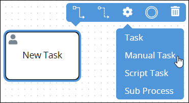
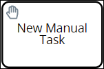
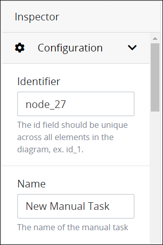
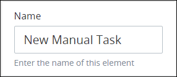
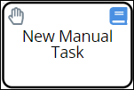

# Add and Configure Manual Task Elements

## Add a Manual Task Element


### Don't Know What a Manual Task Element Is?

See [Process Modeling Element Descriptions](process-modeling-element-descriptions.md) for a description of the [Manual Task](process-modeling-element-descriptions.md#manual-task) element.

### Permissions Required

Your ProcessMaker user account or group membership must have the following permissions to add a Manual Task element to the Process model unless your user account has the **Make this user a Super Admin** setting selected:

* Processes: View Processes
* Processes: Edit Processes

See the [Process](../../../processmaker-administration/permission-descriptions-for-users-and-groups.md#processes) permissions or ask your ProcessMaker Administrator for assistance.


Follow these steps to add a Manual Task element to the Process model:

1. [View your Processes](https://processmaker.gitbook.io/processmaker-4-community/-LPblkrcFWowWJ6HZdhC/~/drafts/-LRhVZm0ddxDcGGdN5ZN/primary/designing-processes/viewing-processes/view-the-list-of-processes/view-your-processes#view-all-processes). The **Processes** page displays.
2. [Create a new Process](../../viewing-processes/view-the-list-of-processes/create-a-process.md) or click the **Open Modeler** iconto edit the selected Process model. Process Modeler displays.
3. Locate the **Task** control in the **Controls** palette that is to the left of the Process Modeler canvas. If the **Hide Menus** buttonis enabled, the **Controls** palette displays the **Task** control's icon.

   

4. Drag the control into the Process model canvas where you want to place it. If a Pool element is in your Process model, the Task element cannot be placed outside of the Pool element.
5. Select the **Manual Task** option from the **Elements** drop-down menu. The Manual Task element displays.  

After the element is placed into the Process model, you may move it by dragging it to the new location.


Moving a Manual Task element has the following limitations in regards to the following Process model elements:

* **Pool element:** If the Manual Task element is inside of a [Pool](process-modeling-element-descriptions.md#pool) element, it cannot be moved outside of the Pool element. If you attempt to do so, Process Modeler places the Manual Task element inside the Pool element closest to where you attempted to move it.
* **Lane element:** If the Manual Task element is inside of a Lane element, it can be moved to another Lane element in the same Pool element. However, the Manual Task element cannot be moved outside of the Pool element.


## Settings


Your ProcessMaker user account or group membership must have the following permissions to configure a Manual Task element unless your user account has the **Make this user a Super Admin** setting selected:

* Processes: View Processes
* Processes: Edit Processes

See the [Process](../../../processmaker-administration/permission-descriptions-for-users-and-groups.md#processes) permissions or ask your ProcessMaker Administrator for assistance.


The Manual Task element has the following panels that contain settings:

* **Configuration** panel
  * Edit the element name
* **Advanced** panel
  * Edit the element's identifier value

### Edit the Element's Identifier Value

Process Modeler automatically assigns a unique value to each Process element added to a Process model. However, an element's identifier value can be changed if it is unique to all other elements in the Process model, including the Process model's identifier value.


All identifier values for all elements in the Process model must be unique.


Follow these steps to edit the identifier value for a Manual Task element:

1. Select the Manual Task element from the Process model in which to edit its identifier value. The **Configuration** setting section displays.
2. Expand the **Configuration** setting section if it is not presently expanded. The **Identifier** field displays. This is a required field.  

   

3. In the **Identifier** field, edit the Task element's identifier to a unique value from all elements in the Process model and then press **Enter**. The element's identifier value is changed.

### Edit the Element Name

An element name is a human-readable reference for a Process element. Process Modeler automatically assigns the name of a Process element with its element type. However, an element's name can be changed.

Follow these steps to edit the name for a Task element:

1. Select the Task element from the Process model in which to edit its name. The **Configuration** setting section displays.
2. Expand the **Configuration** setting section if it is not presently expanded. The **Name** field displays.  

   

3. In the **Name** field, edit the selected element's name and then press **Enter**. The element's name is changed.

### Select the ProcessMaker Screen Associated with the Manual Task

When a Manual Task element triggers, a [ProcessMaker Screen](../../design-forms/what-is-a-form.md) can display instructions or information in its [Task summary](../../../using-processmaker/task-management/view-a-task-summary.md#task-form) so its Task assignee can perform the manual task. The ProcessMaker Screen must be of [Display](../../design-forms/screens-builder/types-for-screens.md#display) type.

When a Manual Task element is placed into a Process model, it is not configured to display a ProcessMaker Screen when it triggers. Therefore, it must be configured.

Follow these steps to select the ProcessMaker Screen that displays when a Manual Task element triggers:

1. Select the Manual Task element from the Process model in which to select the ProcessMaker Screen that displays when that Manual Task element is triggered, thereby providing instructions or information to the Task assignee. The **Configuration** setting section displays.
2. Expand the **Configuration** setting section if it is not presently expanded, and then scroll to the **Summary screen** drop-down menu.  

   

3. From the **Summary screen** drop-down menu, select the ProcessMaker Screen that has been designed to display when that Manual Task element triggers. This drop-down menu displays only Display types to display a message to the Task assignee in the Task summary. Note that another Manual Task element located elsewhere in the Process model may reference a different ProcessMaker Screen to display information for a different Task assignee.

### Specify When the Manual Task is Due

Specify when a Manual Task element is due from when that activity is assigned to a Request participant. The default period of time for a task to be due is 72 hours \(three days\).

The Task due date displays for each [pending assigned Task](../../../using-processmaker/requests/view-completed-requests.md#view-completed-requests-in-which-you-are-a-participant). After the specified time has expired for a manual task, an overdue indicator displays for that task to the assigned task recipient.


Specify due time for a Manual Task element in total number of hours. This includes hours not normally associated with business hours, including overnight hours, weekends, and holidays.


Follow these steps to specify when a Manual Task element is due:

1. Select the Manual Task element from the Process model in which to specify how many hours the activity is due. The **Configuration** setting section displays.
2. The **Due In** field displays below the **Configuration** settings section.  

   

3. In the **Due In** field, specify the total number of hours the activity is due in one of the following ways:
   * Enter the number in the **Due In** field and then press **Enter**. The number of hours is entered.
   * Hover your cursor over the **Due In** field, and then use the spin arrows to increase or decrease the total number of hours by one.

### Select to Whom to Assign the Manual Task

Select to whom to assign the Task represented by the Manual Task element:

* **Requester:** Assign that Task to the person who started the Request \(also known as the requester\).
* **User:** Assign that Task to a specified ProcessMaker user.
* **Group:** Assign that Task to any member of a specified ProcessMaker group. When a Task is assigned to a ProcessMaker group, round robin assignment rules determine which group member is the assignee without manually assigning the Task.
* **Previous Task assignee:** Assign that Task to the previous Task assignee in that Request's workflow.

Follow these steps to select to whom to assign the Task that is referenced in a Manual Task element:

1. Select the Manual Task element from the Process model in which to select the Task assignee. The **Configuration** setting section displays.
2. The **Task Assignment** drop-down menu displays below the **Configuration** settings section.  

   

3. From the **Task Assignment** drop-down menu, select one of the following options:
   * **Requester:** Select **Requester** to assign the Task to the requester.
   * **User:** Select **User** to assign the Task to a specified ProcessMaker user. When this option is selected, the **Assigned User** drop-down menu displays below the **Task Assignment** drop-down menu.  

     

     From the **Assigned User** drop-down menu, select the person's full name as the Task element's assignee.

   * **Group:** Select **Group** to assign the Task to a specified ProcessMaker group. When this option is selected, the **Assigned Group** drop-down menu displays below the **Task Assignment** drop-down menu.  

     

     From the **Assigned Group** drop-down menu, select the group as the Task assignee.

   * **Previous Task Assignee:** Select **Previous Task Assignee** to assign the Task to who was assigned the Task in the preceding Task element.
4. Select the **Allow Reassignment** checkbox to allow the Task assignee to reassign the Task if necessary. If the **Allow Reassignment** checkbox is selected, the **Reassign** button displays in the Task summary to allow the Task assignee to reassign that Task. See [View a Task Summary](../../../using-processmaker/task-management/view-a-task-summary.md#summary).

### Assign the Task Using Rules

Instead of [selecting to whom to assign a Task](add-and-configure-task-elements.md#select-to-whom-to-assign-the-task) that is reference in a Manual Task element, assign that Task's assignee using one or more rules.

Select to whom to assign the Task that is referenced in a Manual Task element using a rule:

* **Requester:** Assign that Task to the person who started the Request, also known as the requester.
* **User:** Assign that Task to a selected ProcessMaker user.
* **Group:** Assign that Task to a selected ProcessMaker group. When a Task is assigned to a ProcessMaker group, round robin assignment rules determine which group member is the assignee without manually assigning the Task.

The rule that determines the Task assignee uses an expression syntax described in [Expression Syntax Components](add-and-configure-task-elements.md#expression-syntax-components). Each rule can only have one expression, but by using logical operators multiple conditions can be specified in that expression. You may use multiple rules to better confine the condition\(s\) to whom to assign the Task.

Follow these steps to select to whom to assign the Task that is referenced in a Manual Task element using a rule:

1. Select the Manual Task element from the Process model in which to assign the Task via a rule. The **Configuration** setting section displays.
2. The **Assign by Expression** option displays below the **Configuration** settings section.  

   

3. Click the **+Rule** button. The **Expression** and **Task Assignment** fields display.  

   

4. In the **Expression** field, enter or edit the expression that determines that Manual Task element's Task assignee using the syntax components described in [Expression Syntax Components](add-and-configure-task-elements.md#expression-syntax-components), and then press **Enter**.
5. From the **Task Assignment** drop-down menu, select that Task's assignee from the following options:
   * **Requester:** Select the **Requester** option to assign that Manual Task element's Task to the Requester if the expression in the **Expression** field evaluates as True.
   * **User:** Select the **User** option to assign that Task element's Task to a ProcessMaker user if the expression in the **Expression** field evaluates as True. When the **User** option is selected, the **Assigned User** drop-down menu displays below the **Task Assignment** option.  

     

     From the **Assigned User** drop-down menu, select which ProcessMaker user to assign that Task.

   * **Group:** Select the **Group** option to assign that Manual Task element's Task to a ProcessMaker group if the expression in the **Expression** field evaluates as True. When the **Group** option is selected, the **Assigned Group** drop-down menu displays below the **Task Assignment** option.  

     

     From the **Assigned Group** drop-down menu, select which ProcessMaker group to assign that Task.
6. Click **Save**.

#### Expression Syntax Components

Use the following expression syntax components to compose the expression that describes to whom is assigned a Task referenced in a Manual Task element.

**Literals**

| Component | Syntax | Example |
| :--- | :--- | :--- |
| string | `"hello world"` or `'hello world'` | `FullNameInput == "Louis Canera"` |
| number | `100` | `cost > 500` |
| array | `[`value1`,` value2`]` | `myFruit not in ["apples", "oranges"]` |
| Boolean | `true` and `false` | `directorSigned` |

**Arithmetic Operations**

| Component | Syntax |
| :--- | :--- |
| addition | `+` |
| subtraction | `-` |
| multiplication | `*` |
| division | `/` |

**Logical Operators**

| Component | Syntax |
| :--- | :--- |
| not | `not` |
| and | `and` |
| or | `or` |

**Comparison Operators**

| Component | Syntax |
| :--- | :--- |
| equal to | `==` |
| not equal to | `!=` |
| less than | `<` |
| greater than | `>` |
| less than or equal to | `<=` |
| greater than or equal to | `>=` |

**String Operator**

| Component | Syntax |
| :--- | :--- |
| concatenate matches | `~` |

**Array Operators**

| Component | Syntax |
| :--- | :--- |
| contains | `in` |
| does not contain | `not in` |

**Range**

| Component | Syntax | Example |
| :--- | :--- | :--- |
| range | `..` | `foo in 1..10` |

### Set Task Notifications

Set when [notifications](../../../using-processmaker/notifications.md) regarding Tasks are sent to the following:

* **Requester:** Send notifications to the person who started the Request \(also known as the requester\) when the Task associated with this Manual Task element is assigned and/or completed.
* **Task assignee:** Send notifications to Task assignees associated with this Manual Task element when that Task is assigned and/or completed. The Task for a Manual Task element is completed when the Task assignee clicks the **Complete Task** button from the **Form** tab in the [Task summary](../../../using-processmaker/task-management/view-a-task-summary.md#task-form).
* **Request participants:** Send notifications to all Request participants of this Process when the Task associated with this Manual Task element is assigned or completed.

Follow these steps to set Task notifications in a Manual Task element:

1. Select the Manual Task element from the Process model in which to set Task notifications. The **Configuration** setting section displays.
2. The **Task Notifications** settings displays below the **Configuration** settings section.  

   

3. From the **Requester** settings, set Task notifications for the requester following these guidelines:
   * Enable the **Assigned** setting to notify the requester when the Task associated with this Manual Task element is assigned. Otherwise, disable this setting to not send this notification.
   * Enable the **Completed** setting to notify the requester when the Task associated with this Manual Task element is completed. Otherwise, disable this setting to not send this notification.
   * Enable the **Due** setting to notify the requester when the Task associated with this Manual Task element is due to be completed. Otherwise, disable this setting to not send this notification.
4. From the **Assignee** settings, set Task notifications for assignees of this Manual Task element following these guidelines:
   * Enable the **Assigned** setting to notify Task assignees associated with this Manual Task element when they are assigned this Task. Otherwise, disable this setting to not send this notification.
   * Enable the **Completed** setting to notify Task assignees associated with this Manual Task element when they complete this Task. Otherwise, disable this setting to not send this notification.
   * Enable the **Due** setting to notify Task assignees associated with this Manual Task element is due to be completed. Otherwise, disable this setting to not send this notification.
5. From the **Participants** settings, set Task notifications to all Request participants of this Process following these guidelines:
   * Enable the **Assigned** setting to notify all Request participants of this Process when the Task associated with this Manual Task element is assigned. Otherwise, disable this setting to not send this notification.
   * Enable the **Completed** setting to notify all Request participants of this Process when the Task associated with this Manual Task element is completed. Otherwise, disable this setting to not send this notification.
   * Enable the **Due** setting to notify all Request participants of this Process when the Task associated with this Manual Task element is due to be completed. Otherwise, disable this setting to not send this notification.

## Assign ProcessMaker Vocabularies That Validate Request Data from This Element


### ProcessMaker Package Required

Your ProcessMaker instance must have the [Vocabularies package](../../../package-development-distribution/package-a-connector/vocabularies.md) installed to assign which ProcessMaker Vocabularies validate Request data at a Manual Task element. Use the Vocabularies package to maintain uniform JSON schemas across all assets in your organization. These assets include [Processes](../../viewing-processes/what-is-a-process.md), [ProcessMaker Screens](../../design-forms/what-is-a-form.md), and [ProcessMaker Scripts](../../scripts/what-is-a-script.md).

A ProcessMaker Vocabulary is a JSON schema. The JSON schema describes the data objects, types, and structure that you want in both a machine and human readable format. Apply one or more ProcessMaker Vocabularies to your Processes and/or specific BPMN 2.0 elements in your Process models to ensure the JSON data model in Request data complies with the data structure outlined in the JSON schema that you need to meet regulatory specifications or ensure Request data contains required information.

The Vocabularies package is not available in the ProcessMaker open-source edition. Contact [ProcessMaker Sales](mailto:sales@processmaker.com) or ask your ProcessMaker sales representative how the Vocabularies package can be installed in your ProcessMaker instance.

### Permissions Required

Your ProcessMaker user account or group membership must have the following permissions to set which ProcessMaker user or group can start a Request for a Process unless your user account has the **Make this user a Super Admin** setting selected:

* Processes: View Processes
* Processes: Edit Processes

See the [Process](../../../processmaker-administration/permission-descriptions-for-users-and-groups.md#processes) permissions or ask your ProcessMaker Administrator for assistance.


Assign [ProcessMaker Vocabularies](../../vocabularies-management/what-is-a-vocabulary.md) that validate Request data complies with a specific JSON schema. This is often mandatory for many types of business sectors including banking and healthcare. Ensure the quality and compliance of Request data. For example, during a Loan Application process, ensure that personal information has been included in the Request to that moment in that in-progress Request. The Vocabularies package must be installed in your ProcessMaker instance to make this configuration.

Use a ProcessMaker Vocabulary on a Manual Task element to validate Request data complies with the Vocabulary's JSON schema after the Task assignee submits the Task but prior to when the Request continues workflow. See [What is a Vocabulary?](../../vocabularies-management/what-is-a-vocabulary.md) for more information.

Each moment ProcessMaker evaluates workflow routing for an in-progress Request, ProcessMaker also evaluates the Request data's conformity to the ProcessMaker Vocabularies applied to the Process and/or a specific BPMN 2.0 element in the Process model. The Request's JSON data model must conform to the ProcessMaker Vocabulary's JSON schema.

During an in-progress Request, if ProcessMaker evaluates that the Request data no longer complies with all ProcessMaker Vocabularies to that moment, the Request status changes from In Progress to Error. The error displays in the [Request summary](../../../using-processmaker/requests/request-details/summary-for-requests-with-errors.md). ProcessMaker Vocabularies are cumulative in an in-progress Request: as the Request progresses, if Request data does not conform with any Vocabulary's JSON schema to that moment in the Request, the Request errors.

If no ProcessMaker Vocabularies are assigned, ProcessMaker does not validate Request data complies with a specific JSON schema prior to continuing workflow for that Request.

One or more ProcessMaker Vocabularies must be created to your ProcessMaker instance before assigning a Vocabulary. See [Create a New Vocabulary](../../vocabularies-management/manage-your-vocabularies/create-a-new-vocabulary.md#create-a-new-processmaker-vocabulary). Multiple ProcessMaker Vocabularies can be assigned to a Start Event element.

Follow these steps to assign ProcessMaker Vocabularies that validate Request data from a Manual Task element:

1. Select the Manual Task element from the Process model in which to assign ProcessMaker Vocabularies that validate Request data prior to when this element completes. The **Configuration** setting section displays.
2. Expand the **Vocabularies** setting section. The **Assigned** setting displays.
3. Click theicon to add a ProcessMaker Vocabulary. The **Assign Vocabulary** option displays.  
4. From the **Select Vocabulary** drop-down menu, select a ProcessMaker Vocabulary from which to validate Request data complies with its JSON schema.

   To remove a ProcessMaker Vocabulary that is currently selected, select the Vocabulary again or press `Enter` when the drop-down is visible.

   If no ProcessMaker Vocabularies are configured in your ProcessMaker instance, then the following message displays: **List is empty.** Create at least one ProcessMaker Vocabulary. See [Create a New Vocabulary](../../vocabularies-management/manage-your-vocabularies/create-a-new-vocabulary.md#create-a-new-processmaker-vocabulary).

5. Click **Save**.
6. Repeat Steps 3 through 5 as necessary for each ProcessMaker Vocabulary required to validate Request data complies with its JSON schema.


Click the **Remove** iconfrom the **Vocabularies** setting to remove a ProcessMaker Vocabulary from assignment to this element.


After one or more ProcessMaker Vocabularies are assigned to a Manual Task element, the Vocabulary icon displays above that element.

## Related Topics





























