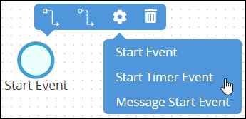
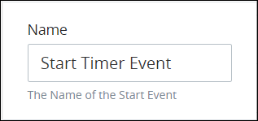
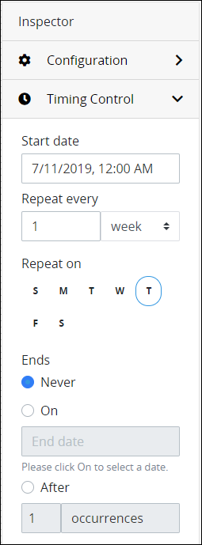
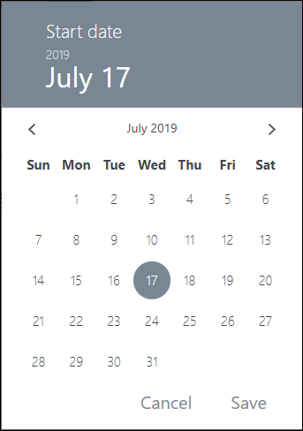
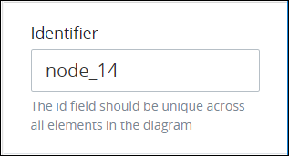

# Add and Configure Start Timer Event Elements

## Add a Start Timer Event Element


### Don't Know What a Start Timer Event Element Is?

See [Process Modeling Element Descriptions](process-modeling-element-descriptions.md) for a description of the [Start Timer Event](process-modeling-element-descriptions.md#start-timer-event) element.

### Permissions Required

Your ProcessMaker user account or group membership must have the following permissions to add a Start Timer Event element to the Process model unless your user account has the **Make this user a Super Admin** setting selected:

* Processes: Edit Processes
* Processes: View Processes

See the [Process](../../../processmaker-administration/permission-descriptions-for-users-and-groups.md#processes) permissions or ask your ProcessMaker Administrator for assistance.


Follow these steps to add a Start Timer Event element to the Process model:

1. [View your Processes](../../viewing-processes/view-the-list-of-processes/view-your-processes.md#view-all-active-processes). The **Processes** page displays.
2. [Create a new Process](../../viewing-processes/view-the-list-of-processes/create-a-process.md) or click the **Open Modeler** iconto edit the selected Process model. Process Modeler displays.
3. Locate the **Start Event** control in the **Elements and Connectors** palette that is to the left of the Process Modeler canvas. If the [**Hide Menus** button](../navigate-around-your-process-model.md#maximize-the-process-modeler-canvas-view)is enabled, the **Elements and Connectors** palette displays the **Start Event** control's icon.

   

4. Drag the control into the Process model canvas where you want to place it. If a Pool element is in your Process model, the Start Timer Event element cannot be placed outside of the Pool element.
5. From the **Elements** drop-down menu, select the **Start Timer Event** option. The Start Timer Event element displays.  

After the element is placed into the Process model, you may move it by dragging it to the new location.


Moving a Start Timer Event element has the following limitations in regards to the following Process model elements:

* **Pool element:** If the Start Timer Event element is inside of a [Pool](process-modeling-element-descriptions.md#pool) element, it cannot be moved outside of the Pool element. If you attempt to do so, Process Modeler places the Start Timer Event element inside the Pool element closest to where you attempted to move it.
* **Lane element:** If the Start Timer Event element is inside of a Lane element, it can be moved to another Lane element in the same Pool element. However, the Start Timer Event element cannot be moved outside of the Pool element.


## Settings


Your ProcessMaker user account or group membership must have the following permissions to configure a Start Timer Event element unless your user account has the **Make this user a Super Admin** setting selected:

* Processes: View Processes
* Processes: Edit Processes

See the [Process](../../../processmaker-administration/permission-descriptions-for-users-and-groups.md#processes) permissions or ask your ProcessMaker Administrator for assistance.


The Start Timer Event element has the following panels that contain settings:

* **Configuration** panel
  * [Edit the element name](add-and-configure-start-timer-event-elements.md#edit-the-element-name)
* **Timing Control** panel
  * [Set the timing controls](add-and-configure-start-timer-event-elements.md#set-the-timing-controls)
* **Advanced** panel
  * [Edit the element's identifier value](add-and-configure-start-timer-event-elements.md#edit-the-elements-identifier-value)

### Configuration Panel Settings

#### Edit the Element Name

An element name is a human-readable reference for a Process element. Process Modeler automatically assigns the name of a Process element with its element type. However, an element's name can be changed.

Follow these steps to edit the name for a Start Timer Event element:

1. Ensure that the **Hide Menus** buttonis not enabled. See [Maximize the Process Modeler Canvas View](../navigate-around-your-process-model.md#maximize-the-process-modeler-canvas-view).
2. Select the Start Timer Event element from the Process model in which to edit its name. Panels to configure this element display.
3. Expand the **Configuration** panel if it is not presently expanded. The **Name** setting displays.  
4. In the **Name** setting, edit the selected element's name and then press **Enter**.

### Timing Control Panel Settings

#### Set the Timing Controls

When a Start Timer Event element is placed into a Process model, it has the following settings by default before it triggers:

* The timing control is set to midnight of the current date.
* The timing control is set to repeat weekly on the current day.

If these are not the timing control settings you want, the Start Timer Event element must be configured. Set the timer controls for a Start Timer Event element using the following parameters:

* Set the date and hour when the trigger the Start Timer Event element, thereby starting a [Request](../../../using-processmaker/requests/what-is-a-request.md).
* Optionally, set an interval from which to periodically trigger the Start Time Event element, thereby staring a Request at that interval. This may be done in any of the following intervals:
  * Set the timer to periodically trigger on a specified number of days, weeks, months, or years.
  * Set the timer to periodically trigger on specific days of the week.
* Set when the timer control ends from any of the following options, thereby limiting when to start a Request:
  * The timer never ends.
  * The timer ends on a specified date.
  * The timer ends after a number of occurrences.

Follow these steps to set the timer controls for a Start Timer Event element:

1. Ensure that the **Hide Menus** buttonis not enabled. See [Maximize the Process Modeler Canvas View](../navigate-around-your-process-model.md#maximize-the-process-modeler-canvas-view).
2. Select the Start Timer Event element from the Process model in which to set its timer controls. Panels to configure this element display.
3. Expand the **Timing Control** panel if it is not presently expanded. The **Start date** setting displays.

   

4. From the **Start date** setting, use the date control to select the date to initially trigger the Start Timer Event element. If this setting has not been previously set, the current date is the default.  

   

5. Set the periodic interval to trigger the Start Timer Event element again, thereby starting a new Request. Follow these guidelines:
   * From the **Repeat every** setting, select at how many intervals of a set time period to trigger the Start Timer Event element. **1 week** is the default setting. Then select one of the following time periods for that element to trigger:
     * Day
     * Week \(default setting\)
     * Month
     * Year
   * Alternatively, select from the **Repeat on** setting the day\(s\) of the week in which to trigger the Start Timer Event element. Selected days display with a blue-colored circle around each.
6. Set when to end the timer control from the following options:
   * Select **Never** to never end the timer control. **Never** is the default setting.
   * Select **On** to select a specific date in which to end the timer control. If this setting has not been previously set, the current date is the default.
   * Select **After** and then enter how many occurrences to end the timer control after the Start Timer Event element has triggered that may times. If this setting has not been previously set, **1** is the default setting.

### Advanced Panel Settings

#### Edit the Element's Identifier Value

Process Modeler automatically assigns a unique value to each Process element added to a Process model. However, an element's identifier value can be changed if it is unique to all other elements in the Process model, including the Process model's identifier value.


All identifier values for all elements in the Process model must be unique.


Follow these steps to edit the identifier value for a Start Timer Event element:

1. Ensure that the **Hide Menus** buttonis not enabled. See [Maximize the Process Modeler Canvas View](../navigate-around-your-process-model.md#maximize-the-process-modeler-canvas-view).
2. Select the Start Timer Event element from the Process model in which to edit its identifier value. Panels to configure this element display.
3. Expand the **Advanced** panel if it is not presently expanded. The **Node Identifier** setting displays. This is a required setting.

   

4. In the **Node Identifier** setting, edit the Start Timer Event element's identifier to a unique value from all elements in the Process model and then press **Enter**.

## Related Topics











