# Add and Configure Task Elements

## Add a Task Element


### Don't Know What a Task Element Is?

See [Process Modeling Element Descriptions](process-modeling-element-descriptions.md) for a description of the [Task](process-modeling-element-descriptions.md#user-task) element.

### Permissions Required

Your ProcessMaker user account or group membership must have the following permissions to add a Task element to the Process model unless your user account has the **Make this user a Super Admin** setting selected:

* Processes: View Processes
* Processes: Edit Processes

See the [Process](../../../processmaker-administration/permission-descriptions-for-users-and-groups.md#processes) permissions or ask your ProcessMaker Administrator for assistance.


Follow these steps to add a Task element to the Process model:

1. [View your Processes](../../viewing-processes/view-the-list-of-processes/view-your-processes.md#view-all-active-processes). The **Processes** page displays.
2. [Create a new Process](../../viewing-processes/view-the-list-of-processes/create-a-process.md) or click the **Open Modeler** iconto edit the selected Process model. Process Modeler displays.
3. Locate the **Task** control in the **Controls** palette that is to the left of the Process Modeler canvas. If the [**Hide Menus** button](../navigate-around-your-process-model.md#maximize-the-process-modeler-canvas-view)is enabled, the **Controls** palette displays the **Task** control's icon. 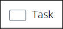 
4. Drag the control into the Process model canvas where you want to place it. If a Pool element is in your Process model, the Task element cannot be placed outside of the Pool element.
5. Do one of the following:
   * From the **Elements** drop-down menu, select the **Task** option. 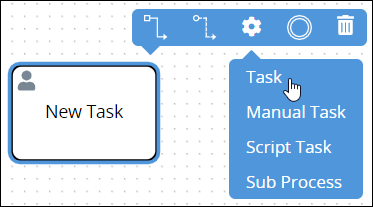 
   * Click anywhere in the Process model. The Task element selects by default.


After adding the Task element, consider adding either of the following Boundary-type Process model elements to design business solutions when your best-case scenarios don't happen:

* [Boundary Timer Event](add-and-configure-boundary-timer-event-elements.md#add-a-boundary-timer-event-element) element \([Don't know what that is?](process-modeling-element-descriptions.md#boundary-timer-event)\)
* [Boundary Error Event](add-and-configure-boundary-error-event-elements.md#add-a-boundary-error-event-element) element \([Don't know what that is?](process-modeling-element-descriptions.md#boundary-error-event)\)


After the element is placed into the Process model, you may move it by dragging it to the new location.


Moving a Task element has the following limitations in regards to the following Process model elements:

* **Pool element:** If the Task element is inside of a [Pool](process-modeling-element-descriptions.md#pool) element, it cannot be moved outside of the Pool element. If you attempt to do so, Process Modeler places the Task element inside the Pool element closest to where you attempted to move it.
* **Lane element:** If the Task element is inside of a Lane element, it can be moved to another Lane element in the same Pool element. However, the Task element cannot be moved outside of the Pool element.


## Settings


Your ProcessMaker user account or group membership must have the following permissions to configure a Task element unless your user account has the **Make this user a Super Admin** setting selected:

* Processes: View Processes
* Processes: Edit Processes

See the [Process](../../../processmaker-administration/permission-descriptions-for-users-and-groups.md#processes) permissions or ask your ProcessMaker Administrator for assistance.


The Task element has the following panels that contain settings:

* **Configuration** panel
  * [Edit the element name](add-and-configure-end-event-elements.md#edit-the-element-name)
  * [Select the ProcessMaker Screen to do that Task](add-and-configure-task-elements.md#select-the-processmaker-screen-to-do-that-task)
  * [Specify when the Task is due](add-and-configure-task-elements.md#specify-when-the-task-is-due)
  * [Display the next assigned Task to the Task assignee](add-and-configure-task-elements.md#display-the-next-assigned-task-to-the-task-assignee)
* **Assignment Rules** panel
  * [Select to whom to assign the Task](add-and-configure-task-elements.md#select-to-whom-to-assign-the-task)
  * [Assign the Task using rules](add-and-configure-task-elements.md#assign-the-task-using-rules)
* **Notifications** panel
  * [Set Task notifications](add-and-configure-task-elements.md#set-task-notifications)
* **Email Notifications** panel \(available when the [Send Email](../../../package-development-distribution/package-a-connector/email.md) package is installed\)
  * [Overview](add-and-configure-task-elements.md#overview)
  * [Set the email notification's subject and body content](add-and-configure-task-elements.md#set-the-email-notifications-subject-and-body-content)
  * [Set recipients for this email notification](add-and-configure-task-elements.md#set-recipients-for-this-email-notification)
  * [Set when this email notification sends](add-and-configure-task-elements.md#set-when-this-email-notification-sends)
  * [Edit an email notification](add-and-configure-task-elements.md#edit-an-email-notification)
  * [Copy an email notification](add-and-configure-task-elements.md#copy-an-email-notification)
  * [Delete an email notification](add-and-configure-task-elements.md#delete-an-email-notification)
* **Web Entry** panel \(available when the [Web Entry package](../../../package-development-distribution/package-a-connector/web-entry.md) is installed\)
  * [Select to whom to assign the Task via a Web Entry](add-and-configure-task-elements.md#select-to-whom-to-assign-the-task-via-a-web-entry)
* **Vocabularies** panel \(available when the [Vocabularies package](../../../package-development-distribution/package-a-connector/vocabularies.md) is installed\)
  * [Assign ProcessMaker Vocabularies that validate Request data from this element](add-and-configure-task-elements.md#assign-processmaker-vocabularies-that-validate-request-data-from-this-element)
* **Advanced** panel
  * [Edit the element's identifier value](add-and-configure-task-elements.md#edit-the-elements-identifier-value)

### Configuration Panel Settings

The Task element has multiple settings in the **Configuration** panel:

* [Edit the element name](add-and-configure-task-elements.md#edit-the-element-name)
* [Select the ProcessMaker Screen to do that Task](add-and-configure-task-elements.md#select-the-processmaker-screen-to-do-that-task)
* [Specify when the Task is due](add-and-configure-task-elements.md#specify-when-the-task-is-due)
* [Display the next assigned Task to the Task assignee](add-and-configure-task-elements.md#display-the-next-assigned-task-to-the-task-assignee)

#### Edit the Element Name

An element name is a human-readable reference for a Process element. Process Modeler automatically assigns the name of a Process element with its element type. However, an element's name can be changed.

Follow these steps to edit the name for a Task element:

1. Ensure that the **Hide Menus** buttonis not enabled. See [Maximize the Process Modeler Canvas View](../navigate-around-your-process-model.md#maximize-the-process-modeler-canvas-view).
2. Select the Task element from the Process model in which to edit its name. Panels to configure this element display.
3. Expand the **Configuration** panel if it is not presently expanded. The **Name** setting displays.  

   

4. In the **Name** setting, edit the selected element's name and then press **Enter**.

#### Select the ProcessMaker Screen To Do That Task

Since Task elements are designed to collect or display [Request](../../../using-processmaker/requests/what-is-a-request.md) information, specify which [ProcessMaker Screen](../../design-forms/what-is-a-form.md) a selected Task element uses. A ProcessMaker Screen must already exist before it can be selected for use in a Task element.


Ensure to select a ProcessMaker Screen for each Task element in your Process model. If a ProcessMaker Screen is not specified and Requests are started for that Process, users who are assigned Tasks with no ProcessMaker Screens have no way of interacting with the Task.


Follow these steps to select a ProcessMaker Screen for a Task element:

1. Ensure that the **Hide Menus** buttonis not enabled. See [Maximize the Process Modeler Canvas View](../navigate-around-your-process-model.md#maximize-the-process-modeler-canvas-view).
2. Select the Task element from the Process model in which to specify its ProcessMaker Screen. Panels to configure this element display.
3. Expand the **Configuration** panel if it is not presently expanded, and then locate the **Screen For Input** setting. This is a required setting.  

   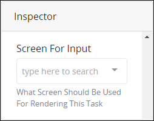

4. From the **Screen For Input** drop-down menu, select which ProcessMaker Screen that Task element references. Only Email-type ProcessMaker Screens display from this drop-down menu. After a ProcessMaker Screen is selected, the **Open Screen** link displays.
5. Optionally, click the **Open Screen** link to view and/or edit your selected ProcessMaker Screen. Note that your ProcessMaker user account must have appropriate [Screen category](../../../processmaker-administration/permission-descriptions-for-users-and-groups.md#screens) permissions to view and/or edit the selected Screen.


If no ProcessMaker Screens exist, the **Screen For Input** drop-down menu contains no options. Ensure to select a ProcessMaker Screen for every Task element in the Process model before deploying your Process.


#### Specify When the Task is Due

Specify when a [Task](../../../using-processmaker/task-management/what-is-a-task.md) in a Task element is due from when that task is assigned to a Request participant.

The task due date displays for each [pending assigned Task](../../../using-processmaker/requests/view-completed-requests.md#view-completed-requests-in-which-you-are-a-participant). After the specified time has expired for a task, an overdue indicator displays for that task to the assigned task recipient.


Specify due time for a Task element in total number of hours. This includes hours not normally associated with business hours, including overnight hours, weekends, and holidays.


When a Task element is placed into a Process model, the default period of time for a task to be due is 72 hours \(three days\).

Follow these steps to specify when a Task element is due:

1. Ensure that the **Hide Menus** buttonis not enabled. See [Maximize the Process Modeler Canvas View](../navigate-around-your-process-model.md#maximize-the-process-modeler-canvas-view).
2. Select the Task element from the Process model in which to specify how many hours the task is due. Panels to configure this element display.
3. Expand the **Configuration** panel if it is not presently expanded, and then locate the **Due In** setting.  

   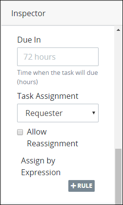

4. In the **Due In** setting, specify the total number of hours the task is due in one of the following ways:
   * Enter the number in the **Due In** setting and then press **Enter**.
   * Hover your cursor over the **Due In** setting, and then use the spin arrows to increase or decrease the total number of hours by one.

#### Display the Next Assigned Task to the Task Assignee

When the **Display the Next Assigned Task to the Task Assignee** setting is used in a Task element, the Task assignee receives a waiting message after that Task assignee submits that Task. This is different than the default functionality, whereby the [**To Do Tasks**](../../../using-processmaker/task-management/view-tasks-you-need-to-do.md#view-your-assigned-tasks) page displays after each Task is submitted.

Use this setting when you understand that this Task assignee will be assigned multiple Tasks during the same Request, regardless of whomever that Task assignee is. This becomes convenient for that Task assignee to display a next Task immediately after submitting the initial Task during that Request, especially if Script Task elements are between Task elements so that Tasks are assigned quickly.

The **Display the Next Assigned Task to the Task Assignee** setting applies only during the same Request.

The following message displays to the Task assignee after that Request participant submits the Task that uses the **Display the Next Assigned Task to the Task Assignee** setting: **Please Wait: We're getting the next task for you...**.

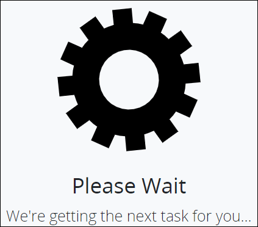

Follow these steps to configure a Task element to display the next assigned Task to the Task assignee:

1. Ensure that the **Hide Menus** buttonis not enabled. See [Maximize the Process Modeler Canvas View](../navigate-around-your-process-model.md#maximize-the-process-modeler-canvas-view).
2. Select the Task element from the Process model in which to configure it to display the next assigned Task to the Task assignee. Panels to configure this element display.
3. Expand the **Configuration** panel if it is not presently expanded, and then locate the **Display Next Assigned Task to Task Assignee** setting. 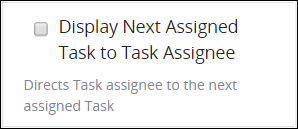 
4. Select the **Display Next Assigned Task to Task Assignee** setting.

### Assignment Rules Panel Settings

Specify [whom to assign the Task](add-and-configure-task-elements.md#select-to-whom-to-assign-the-task) or to [use assignment rules to assign the Task](add-and-configure-task-elements.md#assign-the-task-using-rules).

#### Select to Whom to Assign the Task

Instead of [assign the Task's assignee using one or more rules](add-and-configure-task-elements.md#assign-the-task-using-rules), select to whom to assign a Task:

* **Requester:** Assign that Task to the person who started the Request, also known as the requester.
* **User:** Assign that Task to a specified ProcessMaker [user](../../../processmaker-administration/add-users/what-is-a-user.md).
* **Group:** Assign that Task to any member of a specified ProcessMaker [group](../../../processmaker-administration/assign-groups-to-users/what-is-a-group.md). When a Task is assigned to a ProcessMaker group, round robin assignment rules determine which group member is the assignee without manually assigning the Task.
* **Previous Task assignee:** Assign that Task to the previous Task assignee in that Request's workflow.
* **By User ID:** Assign that Task to a ProcessMaker user based on a **Variable Name** value as entered into a [ProcessMaker Screen](../../design-forms/what-is-a-form.md) during a previous Task in that Request. For example, if a [Line Input control](../../design-forms/screens-builder/control-descriptions/line-input-control-settings.md) in a ProcessMaker Screen has the **Variable Name** value of `Name`, to contain a user's name, then use that value to thereby assign the Task to that ProcessMaker user.
* **Self Service:** Assign that Task to allow any member in a specified ProcessMaker group to voluntarily self-assign any Task from a queue.

Follow these steps to select to whom to assign the Task that is referenced in a Task element:

1. Ensure that the **Hide Menus** buttonis not enabled. See [Maximize the Process Modeler Canvas View](../navigate-around-your-process-model.md#maximize-the-process-modeler-canvas-view).
2. Select the Task element from the Process model in which to select the Task assignee. Panels to configure this element display.
3. Expand the **Assignment Rules** panel if it is not presently expanded. The **Task Assignment** setting displays.  

   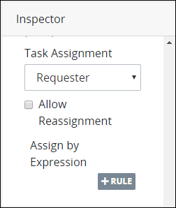

4. From the **Task Assignment** drop-down menu, select one of the following options:
   * **Requester:** Select **Requester** to assign the Task to the requester. This is the default option.
   * **User:** Select **User** to assign the Task to a specified ProcessMaker user. When this option is selected, the **Assigned User** drop-down menu displays below the **Task Assignment** drop-down menu.  

     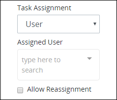

     From the **Assigned User** drop-down menu, select the person's full name as the Task element's assignee.

   * **Group:** Select **Group** to assign the Task to a specified ProcessMaker group via round robin rules, whereby each member of the group has an equal chance to be assigned the Task without manually assigning the Task to a group member using a rotation. When this option is selected, the **Assigned Group** drop-down menu displays below the **Task Assignment** drop-down menu.  

     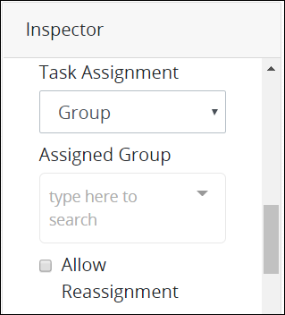

     From the **Assigned Group** drop-down menu, select the group from which to assign the Task via round robin rules.

   * **Previous Task Assignee:** Select **Previous Task Assignee** to assign the Task to who was assigned the previous Task in this Request.
   * **By User ID:** Select **By User ID** to assign the Task to a ProcessMaker user based on a **Variable Name** value as entered into a ProcessMaker Screen during a previous Task in that Request. For example, if a Line Input control in a ProcessMaker Screen has the **Variable Name** value of `Name`, to contain a user's name, then use that value to thereby assign the Task to that ProcessMaker user. When this option is selected, the **Variable Name of User ID Value** setting displays.

     In the **Variable Name of User ID Value** setting, enter the **Variable Name** value from which to reference the ProcessMaker user to whom to assign the Task.

   * **Self Service:** Select **Self Service** to allow any member in a specified ProcessMaker group to voluntarily self-assign any Task from a queue. When this option is selected, the **Assigned Group** drop-down menu displays below the **Task Assignment** drop-down menu.

     From the **Assigned Group** drop-down menu, select the group from which any of its members can self-assign Tasks from a queue.
5. Enable the **Lock task assignment to user** option to assign this Task to the same Task assignee if workflow in the Request returns to this Task. If the initial Task assignee was a member of a ProcessMaker group, the Task is reassigned to the same ProcessMaker group member. This option is useful if the initial Task assignee in the Request might need to provide clarification regarding information that Request participant initially submitted in that Task.
6. Enable the **Allow Reassignment** option to allow the Task assignee to reassign the Task if necessary. If the **Allow Reassignment** option is enabled, the **Reassign** button displays in the Task summary to allow that Task assignee to reassign that Task. See [View a Task Summary](../../../using-processmaker/task-management/view-a-task-summary.md#summary).

#### Assign the Task Using Rules

Instead of [selecting to whom to assign a Task](add-and-configure-task-elements.md#select-to-whom-to-assign-the-task) that is referenced in a Task element, assign the Task's assignee using one or more rules:

* **Requester:** Assign that Task to the person who started the Request, also known as the requester.
* **User:** Assign that Task to a specified ProcessMaker user.
* **Group:** Assign that Task to any member of a specified ProcessMaker group. When a Task is assigned to a ProcessMaker group, round robin assignment rules determine which group member is the assignee without manually assigning the Task.
* **Previous Task assignee:** Assign that Task to the previous Task assignee in that Request's workflow.
* By User ID: Assign that Task to a ProcessMaker user based on a **Variable Name** value as entered into a [ProcessMaker Screen](../../design-forms/what-is-a-form.md) during a previous Task in that Request. For example, if a [Line Input control](../../design-forms/screens-builder/control-descriptions/line-input-control-settings.md) in a ProcessMaker Screen has the **Variable Name** value of `Name`, to contain a user's name, then use that value to thereby assign the Task to that ProcessMaker user.
* **Self Service:** Assign that Task to allow any member in a specified ProcessMaker group to voluntarily self-assign any Task from a queue.

The rule that determines the Task assignee uses an expression syntax described in [Expression Syntax Components](add-and-configure-task-elements.md#expression-syntax-components). Each rule can only have one expression, but by using logical operators multiple conditions can be specified in that expression. You may use multiple rules to better confine the condition\(s\) to whom to assign the Task. You may use [Magic Variables](../../reference-global-variables-in-your-processmaker-assets.md) in your expression syntax.

Follow these steps to select to whom to assign the Task that is referenced in a Task element using a rule:

1. Ensure that the **Hide Menus** buttonis not enabled. See [Maximize the Process Modeler Canvas View](../navigate-around-your-process-model.md#maximize-the-process-modeler-canvas-view).
2. Select the Task element from the Process model in which to assign the Task via a rule. Panels to configure this element display.
3. Expand the **Assignment Rules** panel if it is not presently expanded, and then locate the **+Rule** button.
4. Click the **+Rule** button.  

   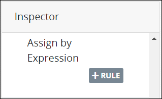

   The **Expression** and **Task Assignment** settings display.  

   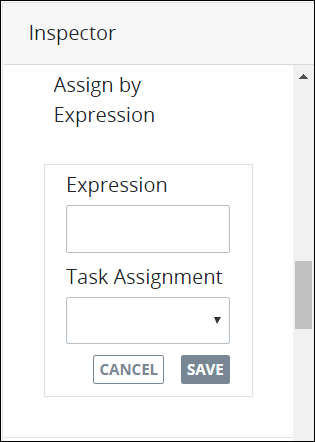

5. In the **Expression** setting, enter or edit the expression that determines that Task element's Task assignee using the syntax components described in [Expression Syntax Components](add-and-configure-task-elements.md#expression-syntax-components), and then press **Enter**.
6. From the **Select the Task Assignee** drop-down menu, select that Task's assignee from the following options:
   * **Requester:** Select the **Requester** option to assign that Task element's Task to the requester if the expression in the **Expression** setting evaluates as True.
   * **User:** Select the **User** option to assign that Task element's Task to a ProcessMaker user if the expression in the **Expression** setting evaluates as True. When this option is selected, the **Assigned User** drop-down menu displays below the **Select the Task assignee** drop-down menu.

     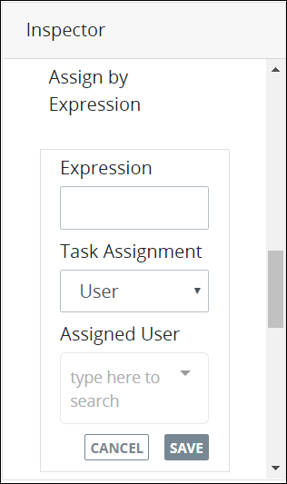

     From the **Assigned User** drop-down menu, select which ProcessMaker user to assign that Task.

   * **Group:** Select the **Group** option to assign that Task element's Task to a ProcessMaker group if the expression in the **Expression** setting evaluates as True. When this option is selected, the **Assigned Group** drop-down menu displays below the **Select the Task assignee** drop-down menu.

     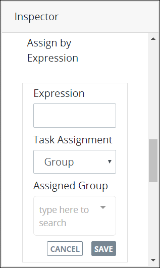

     From the **Assigned Group** drop-down menu, select which ProcessMaker group to assign that Task.

   * **Previous Task Assignee:** Select **Previous Task Assignee** to assign the Task to who was assigned the previous Task in this Request.
   * **By User ID:** Select **By User ID** to assign the Task to a ProcessMaker user based on a **Variable Name** value as entered into a ProcessMaker Screen during a previous Task in that Request. For example, if a Line Input control in a ProcessMaker Screen has the **Variable Name** value of `Name`, to contain a user's name, then use that value to thereby assign the Task to that ProcessMaker user. When this option is selected, the **Variable Name of User ID Value** setting displays.

     In the **Variable Name of User ID Value** setting, enter the **Variable Name** value from which to reference the ProcessMaker user to whom to assign the Task.

   * **Self Service:** Select **Self Service** to allow any member in a specified ProcessMaker group to voluntarily self-assign any Task from a queue. When this option is selected, the **Assigned Group** drop-down menu displays below the **Select the Task Assignee** drop-down menu.

     From the **Assigned Group** drop-down menu, select the group from which any of its members can self-assign Tasks from a queue.
7. Click **Save**.

#### Expression Syntax Components

Use the following expression syntax components to compose the expression that describes to whom is assigned a Task referenced in a Task element.

Spaces are allowed before and after expression components, such as arithmetic and comparison operators, to more easily read the expression.

Combine expressions using logical operators. Example: `(not approved) or (cost > 500)`.


[Magic Variables](../../reference-global-variables-in-your-processmaker-assets.md) can be used in when composing expressions.


**Literals**

| Component | Syntax | Example |
| :--- | :--- | :--- |
| string | `"hello world"` or `'hello world'` | `FullNameInput == "Louis Canera"` |
| number | `100` | `cost > 500` |
| array | `[`value1`,` value2`]` | `myFruit not in ["apples", "oranges"]` |
| Boolean | `true` and `false` | `directorSigned` |

**Arithmetic Operations**

| Component | Syntax |
| :--- | :--- |
| addition | `+` |
| subtraction | `-` |
| multiplication | `*` |
| division | `/` |

**Logical Operators**

| Component | Syntax |
| :--- | :--- |
| not | `not` |
| and | `and` |
| or | `or` |

**Comparison Operators**

| Component | Syntax |
| :--- | :--- |
| equal to | `==` |
| not equal to | `!=` |
| less than | `<` |
| greater than | `>` |
| less than or equal to | `<=` |
| greater than or equal to | `>=` |

**String Operator**

| Component | Syntax |
| :--- | :--- |
| concatenate matches | `~` |

**Array Operators**

| Component | Syntax |
| :--- | :--- |
| contains | `in` |
| does not contain | `not in` |

**Range**

| Component | Syntax | Example |
| :--- | :--- | :--- |
| range | `..` | `foo in 1..10` |

### Notifications Panel Settings

#### Set Task Notifications


Set [email notifications for Tasks](add-and-configure-task-elements.md#set-email-notifications) separately. Settings in the **Notifications** panel configure Task notifications only within the ProcessMaker application.


Set when [notifications](../../../using-processmaker/notifications.md) regarding Tasks are sent to the following:

* **Requester:** Send notifications to the Request initiator \(referred to as the requester\) when the Task associated with this Task element is assigned and/or completed.
* **Task assignee:** Send notifications to Task assignees associated with this Task element when that Task is assigned and/or completed.
* **Request participants:** Send notifications to all Request participants of this Process when the Task associated with this Task element is assigned or completed.

Follow these steps to set Task notifications in a Task element:

1. Ensure that the **Hide Menus** buttonis not enabled. See [Maximize the Process Modeler Canvas View](../navigate-around-your-process-model.md#maximize-the-process-modeler-canvas-view).
2. Select the Task element from the Process model in which to set Task notifications. Panels to configure this element display.
3. Expand the **Notifications** panel if it is not presently expanded. Settings display to set Task notifications.  

   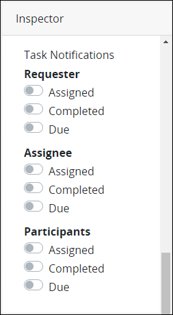

4. From the **Requester** settings, set Task notifications for the Requester following these guidelines:
   * Enable the **Assigned** setting to notify the Requester when the Task associated with this Task element is assigned. Otherwise, disable this setting to not send this notification.
   * Enable the **Completed** setting to notify the Requester when the Task associated with this Task element is completed. Otherwise, disable this setting to not send this notification.
   * Enable the **Due** setting to notify the Requester when the Task associated with this Task element is due to be completed. Otherwise, disable this setting to not send this notification.
5. From the **Assignee** settings, set Task notifications for assignees of this Task element following these guidelines:
   * Enable the **Assigned** setting to notify Task assignees associated with this Task element when they are assigned this Task. Otherwise, disable this setting to not send this notification.
   * Enable the **Completed** setting to notify Task assignees associated with this Task element when they complete this Task. Otherwise, disable this setting to not send this notification.
   * Enable the **Due** setting to notify Task assignees associated with this Task element is due to be completed. Otherwise, disable this setting to not send this notification.
6. From the **Participants** settings, set Task notifications to all Request participants of this Process following these guidelines:
   * Enable the **Assigned** setting to notify all Request participants of this Process when the Task associated with this Task element is assigned. Otherwise, disable this setting to not send this notification.
   * Enable the **Completed** setting to notify all Request participants of this Process when the Task associated with this Task element is completed. Otherwise, disable this setting to not send this notification.
   * Enable the **Due** setting to notify all Request participants of this Process when the Task associated with this Task element is due to be completed. Otherwise, disable this setting to not send this notification.

### Email Notifications Panel Settings

#### Overview


### Looking for ProcessMaker Notifications?

Set [ProcessMaker application notifications](add-and-configure-task-elements.md#set-task-notifications) for Tasks separately. Settings in the **Email Notifications** panel configure only email notifications for Tasks.

### ProcessMaker Package Required

The **Email Notification** panel is available only when the [Send Email package](../../../package-development-distribution/package-a-connector/email.md) is installed in your ProcessMaker instance. The Send Email [package](../../../package-development-distribution/first-topic.md) is not available in the ProcessMaker open-source edition. Contact [ProcessMaker Sales](mailto:sales@processmaker.com) or ask your ProcessMaker sales representative how the Send Email package can be installed in your ProcessMaker instance.


The following may be email Task notification recipients:

* ProcessMaker [users](../../../processmaker-administration/add-users/what-is-a-user.md) and/or [group](../../../processmaker-administration/assign-groups-to-users/what-is-a-group.md) members.
* Specific email addresses for individuals who are not ProcessMaker users in your ProcessMaker instance.

The email body for the Task notification may be plain text or referenced from a [Email](../../design-forms/screens-builder/types-for-screens.md#email)-type ProcessMaker Screen. If referencing the email body from a Display-type [ProcessMaker Screen](../../design-forms/what-is-a-form.md), you may use the value from a Screen's **Variable Name** setting as a variable in this setting. For example, if your Process model references a ProcessMaker Screen that contains a [Line Input control](../../design-forms/screens-builder/control-descriptions/line-input-control-settings.md) with the **Variable Name** setting value of `EmailAddress` into which the Request participant enters an email address, use [mustache syntax](https://mustache.github.io/mustache.5.html) `{{EmailAddress}}` to use that Line Input control's value in the ProcessMaker Screen.

Set when email Task notifications are sent to email recipients:

* **Task trigger:** Send email notifications when the Task triggers.
* **Task completion:** Send email notifications when the Task completes.
* **Conditionally when a Request data object or Magic Variable meets a specific setting or condition:** Specify an expression to conditionally send the email notification when a Request data object or [Magic Variable](../../reference-global-variables-in-your-processmaker-assets.md) meets a specific setting or condition. Specify this condition using an expression syntax described in [Expression Syntax Components](add-and-configure-task-elements.md#expression-syntax-components-1).

An email notification is an aggregate of multiple settings in the **Email Notifications** panel:

* [Set the email notification's subject and body content](add-and-configure-task-elements.md#set-the-email-notifications-subject-and-body-content)
* [Set recipients for this email notification](add-and-configure-task-elements.md#set-recipients-for-this-email-notification)
* [Set when this email notification sends](add-and-configure-task-elements.md#set-when-this-email-notification-sends)

After setting an email notification, the following settings are available:

* [Edit an email notification](add-and-configure-task-elements.md#edit-an-email-notification)
* [Copy an email notification](add-and-configure-task-elements.md#copy-an-email-notification)
* [Delete an email notification](add-and-configure-task-elements.md#delete-an-email-notification)

#### Set the Email Notification's Subject and Body Content

Follow these steps to set the email Task notification's subject and body content in a Task element:

1. Ensure that the **Hide Menus** buttonis not enabled. See [Maximize the Process Modeler Canvas View](../navigate-around-your-process-model.md#maximize-the-process-modeler-canvas-view).
2. Select the Task element from the Process model in which to set email Task notifications. Panels to configure this element display.
3. Expand the **Email Notifications** panel if it is not presently expanded. The **Notifications** setting displays. 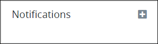 
4. Click the iconto add an email notification. The **Add Notification** settings display.
5. From the **Subject** setting, revise the default text if necessary that displays as the email subject. By default, ProcessMaker displays the current Task element's [**Name** setting](add-and-configure-task-elements.md#edit-the-element-name) as part of the **Subject** setting. 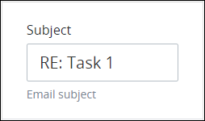 
6. From the **Body** setting, select one of the following options:
   * **Plain Text:**

     Select the **Plain Text** option to enter plain text to display as the email body. This is the default option. Follow these steps:

     1. From the **Body** setting, ensure that the **Plain Text** option is selected. 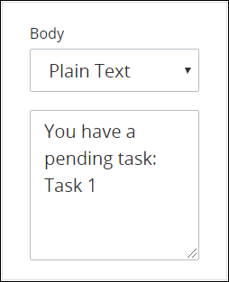 
     2. In the setting below the **Plain Text** option, revise the default text if necessary that displays as the email body. By default, ProcessMaker displays the current Task element's [**Name** setting](add-and-configure-task-elements.md#edit-the-element-name) as part of the **Plain Text** option.

   * **Display Screen:**

     Select the **Display Screen** option to select a [Email](../../design-forms/screens-builder/types-for-screens.md#email)-type [ProcessMaker Screen](../../design-forms/what-is-a-form.md) from which to display its content as the email body. Follow these steps:

     1. From the **Body** setting, ensure that the **Display Screen** option is selected.  
     2. From the drop-down menu below the **Display Screen** option, select from which ProcessMaker Screen to display its content as the email body. Only Email-type ProcessMaker Screens display from this drop-down menu.
     3. Optionally, click the **Open Screen** link to view and/or edit your selected ProcessMaker Screen. Note that your ProcessMaker user account must have appropriate [Screen category](../../../processmaker-administration/permission-descriptions-for-users-and-groups.md#screens) permissions to view and/or edit the selected Screen.
7. [Set recipients for this email notification](add-and-configure-task-elements.md#set-recipients-for-this-email-notification).

#### Set Recipients for This Email Notification


These instructions continue from the [Set the Email Notification's Subject and Body Content](add-and-configure-task-elements.md#set-the-email-notifications-subject-and-body-content) section. An email notification is an aggregate of multiple settings in the **Email Notifications** panel for a selected Task element.


Use the **Recipients** setting to set which ProcessMaker users, groups, and/or non-ProcessMaker users to send this email notification. Follow these steps:

1. [Set this email notification's subject and body content](add-and-configure-task-elements.md#set-the-email-notifications-subject-and-body-content).
2. From the **Recipients** setting, select which ProcessMaker users and/or groups to send this email notification. To remove an email recipient that is currently selected, click the icon for that selection or press `Enter` when the drop-down is visible. 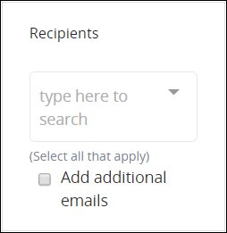 
3. Optionally, specify email addresses for individuals who are not ProcessMaker users in your ProcessMaker instance. Follow these steps:
   1. Select the **Add additional emails** option. The **enter email** setting displays. 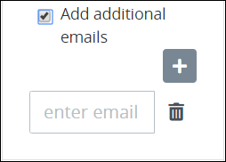 
   2. In the **enter email** setting, enter the email address for the non-ProcessMaker user to receive this email notification.
   3. Click the **Add** icon. The non-ProcessMaker user's email address is added.
   4. Click the **Delete** iconto delete the non-ProcessMaker user's email address if necessary.
   5. Repeat Steps 2 through 4 as necessary for each non-ProcessMaker user's email address to receive this email notification.
4. [Set when this email notification sends](add-and-configure-task-elements.md#set-when-this-email-notification-sends).

#### Set When This Email Notification Sends


These instructions continue from the [Set Recipients for This Email Notification](add-and-configure-task-elements.md#set-recipients-for-this-email-notification) section. An email notification is an aggregate of multiple settings in the **Email Notifications** panel for a selected Task element.


Use the **Send At** or **Expression** settings to set when this email notification is sent. Follow these steps:

1. [Set this email notification's subject and body content](add-and-configure-task-elements.md#set-the-email-notifications-subject-and-body-content).
2. [Set recipients for this email notification](add-and-configure-task-elements.md#set-recipients-for-this-email-notification).
3. Do one of the following based on when you need the email notification sent:
   * **After this Task triggers or completes:** From the **Send At** setting, select one of the following options:
     * **Task Start:** Select the **Task Start** option to send this email notification when this Task triggers. This is the default option.
     * **Task Completion:** Select the **Task Completion** option to send this email notification when this Task completes \(when the Task assignee submits the ProcessMaker Screen associated with this Task\). 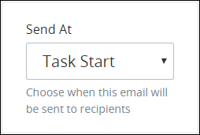 
   * **Conditionally when a Request data object or Magic Variable meets a specific setting or condition:** In the **Expression** setting, enter the expression to conditionally send the email notification when a Request data object or [Magic Variable](../../reference-global-variables-in-your-processmaker-assets.md) meets a specific setting or condition, and then press **Enter**. Specify this condition using an expression syntax described in [Expression Syntax Components](add-and-configure-task-elements.md#expression-syntax-components-1). Use logical operators to specify multiple conditions in that expression if necessary. If the **Expression** setting does not contain a value, then the **Send At** setting determines when to send email notifications for this Task. 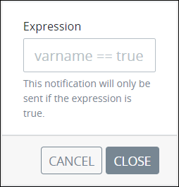 
4. Click **Close**. This email notification is saved and displays below the **Notifications** setting using the **Subject** setting as the email notification label. Optionally do any of the following with this email notification:
   * [Edit this email notification](add-and-configure-task-elements.md#edit-an-email-notification)
   * [Copy this email notification](add-and-configure-task-elements.md#copy-an-email-notification)
   * [Delete this email notification](add-and-configure-task-elements.md#delete-an-email-notification)

#### Expression Syntax Components

Use the following expression syntax components to compose the expression that describes under which condition\(s\) an email notification sends.

Spaces are allowed before and after expression components, such as arithmetic and comparison operators, to more easily read the expression.

Combine expressions using logical operators. Example: `(not approved) or (cost > 500)`.


[Magic Variables](../../reference-global-variables-in-your-processmaker-assets.md) can be used in when composing expressions.


**Literals**

| Component | Syntax | Expression Example |
| :--- | :--- | :--- |
| string | `"hello world"` or `'hello world'` | `FullNameInput == "Louis Canera"` |
| number | `100` | `cost > 500` |
| array | `[`value1`,` value2`]` | `myFruit not in ["apples", "oranges"]` |
| Boolean | `true` and `false` | `directorSigned` |

**Arithmetic Operations**

| Component | Syntax |
| :--- | :--- |
| addition | `+` |
| subtraction | `-` |
| multiplication | `*` |
| division | `/` |

**Logical Operators**

| Component | Syntax |
| :--- | :--- |
| not | `not` |
| and | `and` |
| or | `or` |

**Comparison Operators**

| Component | Syntax |
| :--- | :--- |
| equal to | `==` |
| not equal to | `!=` |
| less than | `<` |
| greater than | `>` |
| less than or equal to | `<=` |
| greater than or equal to | `>=` |

**String Operator**

| Component | Syntax |
| :--- | :--- |
| concatenate matches | `~` |

**Array Operators**

| Component | Syntax |
| :--- | :--- |
| contains | `in` |
| does not contain | `not in` |

**Range**

| Component | Syntax | Example |
| :--- | :--- | :--- |
| range | `..` | `foo in 1..10` |

#### Edit an Email Notification

Follow these steps to edit an email notification:

1. Ensure that the **Hide Menus** buttonis not enabled. See [Maximize the Process Modeler Canvas View](../navigate-around-your-process-model.md#maximize-the-process-modeler-canvas-view).
2. Select the Task element from the Process model in which to edit an email notification. Panels to configure this element display.
3. Expand the **Email Notifications** panel if it is not presently expanded. Email notifications display below the **Notifications** setting.
4. Click the **Edit** iconbeside the email notification to edit.
5. Edit the email notification settings as described in the following sections:
   * [Set the email notification's subject and body content](add-and-configure-task-elements.md#set-the-email-notifications-subject-and-body-content)
   * [Set recipients for this email notification](add-and-configure-task-elements.md#set-recipients-for-this-email-notification)
   * [Set when this email notification sends](add-and-configure-task-elements.md#set-when-this-email-notification-sends)

#### Copy an Email Notification

Follow these steps to copy an email notification:

1. Ensure that the **Hide Menus** buttonis not enabled. See [Maximize the Process Modeler Canvas View](../navigate-around-your-process-model.md#maximize-the-process-modeler-canvas-view).
2. Select the Task element from the Process model in which to copy an email notification. Panels to configure this element display.
3. Expand the **Email Notifications** panel if it is not presently expanded. Email notifications display below the **Notifications** setting.
4. Click the **Duplicate** iconbeside the email notification to copy. The email notification is copied.
5. Edit the copied email notification settings as described in the following sections:
   * [Set the email notification's subject and body content](add-and-configure-task-elements.md#set-the-email-notifications-subject-and-body-content)
   * [Set recipients for this email notification](add-and-configure-task-elements.md#set-recipients-for-this-email-notification)
   * [Set when this email notification sends](add-and-configure-task-elements.md#set-when-this-email-notification-sends)

#### Delete an Email Notification


Consider carefully when deleting an email notification. Deleting a configured email notification cannot be undone.


Follow these steps to delete an email notification:

1. Ensure that the **Hide Menus** buttonis not enabled. See [Maximize the Process Modeler Canvas View](../navigate-around-your-process-model.md#maximize-the-process-modeler-canvas-view).
2. Select the Task element from the Process model in which to delete an email notification. Panels to configure this element display.
3. Expand the **Email Notifications** panel if it is not presently expanded. Email notifications display below the **Notifications** setting.
4. Click the **Delete** iconbeside the email notification to delete. The following message displays to confirm deletion of this email notification: **Are you sure you want to delete this notification?** 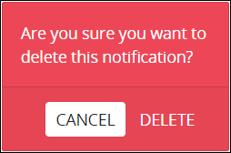 
5. Click **Delete**.

### Web Entry Panel Settings

#### Select to Whom to Assign the Task via a Web Entry


### ProcessMaker Package Required

Your ProcessMaker instance must have the [Web Entry package](../../../package-development-distribution/package-a-connector/web-entry.md) installed to select to whom to assign a Task via a Web entry. The Web Entry package allows anonymous or authenticated ProcessMaker users to start or participate in Requests via a published URL. The Web Entry package is not available in the ProcessMaker open-source edition.

The Web Entry package is not available in the ProcessMaker open-source edition. Contact [ProcessMaker Sales](mailto:sales@processmaker.com) or ask your ProcessMaker sales representative how the Web Entry package can be installed in your ProcessMaker instance.


When a Task element is placed into a Process model, Web Entry settings for that element are not configured. Therefore, even if the [Web Entry](../../../package-development-distribution/package-a-connector/web-entry.md) package is installed in your ProcessMaker instance, it must be configured for use.

Follow these steps to select to whom to assign the Task via a Web Entry:

1. Ensure that the **Hide Menus** buttonis not enabled. See [Maximize the Process Modeler Canvas View](../navigate-around-your-process-model.md#maximize-the-process-modeler-canvas-view).
2. Select the Task element from the Process model in which to select to whom to assign the Task via a Web Entry. Panels to configure this element display.
3. Expand the **Web Entry** panel if it is not presently expanded. The **Mode** setting displays.  
4. From the **Mode** drop-down menu, select one of the following options:
   * **Disabled:** Select the **Disabled** option to disable the Web Entry package from assigning this Task element via a Web Entry. This is the default setting.
   * **Anonymous:** Select the **Anonymous** option to assign the Task to any person who has access to the Web Entry's URL. This person may not be a ProcessMaker user.  

     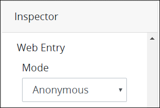

   * **Authenticated:** Select the **Authenticated** option to assign the Task to an authenticated ProcessMaker user or group member via the Web Entry's URL.  

     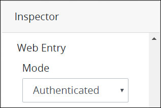

     Select whether to assign a ProcessMaker user or group the Task via the Web Entry's URL. To do so, follow these guidelines:

     **ProcessMaker User**

     1. From the **Web Entry Start Permission** drop-down menu, select the **User** option. The **User** drop-down menu displays below the **Web Entry Start Permission** drop-down menu.  

        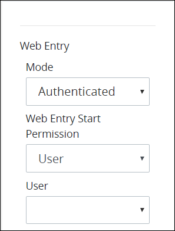

     2. From the **User** drop-down menu, select which ProcessMaker user to assign the Task via the Web Entry's URL.

     **ProcessMaker Group**

     1. From the **Web Entry Start Permission** drop-down menu, select the **Group** option. The **Group** drop-down menu displays below the **Web Entry Start Permission** drop-down menu.  

        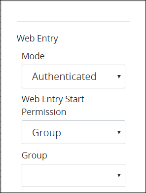

     2. From the **Group** drop-down menu, select which ProcessMaker group to assign the Task via the Web Entry's URL. Any member of that ProcessMaker group may be assigned the Task via the Web Entry's URL.
5. From the **Completed Action** drop-down menu, select one of the following options:
   * **Screen:** Select the **Screen** option to indicate that a ProcessMaker Screen displays after the Task assignee submits the Task. **Screen** is the default setting.  
     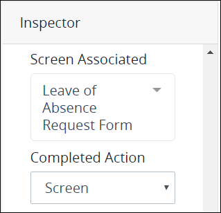 

     After the **Screen** option is selected, the **Screen For Completed** drop-down menu displays below the **Completed Action** drop-down menu. From the **Screen For Completed** drop-down menu, select the ProcessMaker Screen that displays after the Task assignee submits the Task. This drop-down menu displays only [Display](../../design-forms/screens-builder/types-for-screens.md#display) types to display a message to the Task assignee. This is a required setting.

     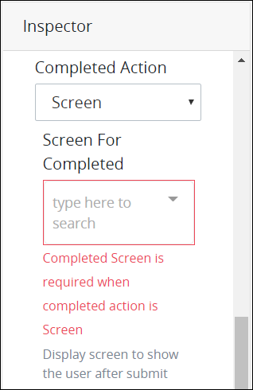 

   * **Url:** Select the **Url** option to indicate that the Task assignee is redirected to a URL after the Task assignee submits the ProcessMaker Screen selected from the **Screen Associated** drop-down menu.  

     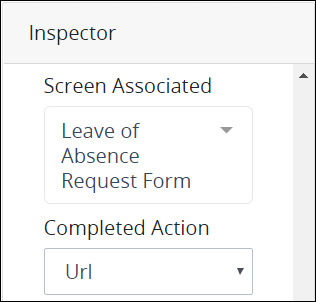

     After the **Url** option is selected, the **Url to redirect to** setting  displays below the **Completed Action** drop-down menu. In the **Url to redirect to** setting, enter the URL to redirect the Requester after the Task assignee submits the ProcessMaker Screen selected from the **Screen Associated** drop-down menu, and then press **Enter**. This is a required setting.  

     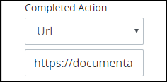
6. The **Web Entry URL** displays the Web Entry URL from which the Task assignee accesses the ProcessMaker Screen selected from the **Screen Associated** drop-down menu. The **Web Entry URL** value cannot be changed. The Web Entry package generates this URL using the following structure: _`ProcessMaker instance domain`_`/webentry/`_`Web Entry numerical instance`_`/`_`Identifier Value of this Start Event element`_. If necessary, click the **Copy to clipboard** link to copy the **Web Entry URL** value so that it is available in your clipboard.  

   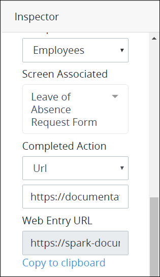

### Vocabularies Panel Settings

#### Assign ProcessMaker Vocabularies That Validate Request Data from This Element


### ProcessMaker Package Required

Your ProcessMaker instance must have the [Vocabularies package](../../../package-development-distribution/package-a-connector/vocabularies.md) installed to assign which ProcessMaker Vocabularies validate Request data at a Task element. Use the Vocabularies package to maintain uniform JSON schemas across all assets in your organization. These assets include [Processes](../../viewing-processes/what-is-a-process.md), [ProcessMaker Screens](../../design-forms/what-is-a-form.md), and [ProcessMaker Scripts](../../scripts/what-is-a-script.md).

A ProcessMaker Vocabulary is a JSON schema. The JSON schema describes the data objects, types, and structure that you want in both a machine and human readable format. Apply one or more ProcessMaker Vocabularies to your Processes and/or specific BPMN 2.0 elements in your Process models to ensure the JSON data model in Request data complies with the data structure outlined in the JSON schema that you need to meet regulatory specifications or ensure Request data contains required information.

The Vocabularies package is not available in the ProcessMaker open-source edition. Contact [ProcessMaker Sales](mailto:sales@processmaker.com) or ask your ProcessMaker sales representative how the Vocabularies package can be installed in your ProcessMaker instance.


Assign [ProcessMaker Vocabularies](../../vocabularies-management/what-is-a-vocabulary.md) that validate Request data complies with a specific JSON schema. This is often mandatory for many types of business sectors including banking and healthcare. Ensure the quality and compliance of Request data. For example, during a Loan Application process, ensure that personal information has been included in the Request to that moment in that in-progress Request. The Vocabularies package must be installed in your ProcessMaker instance to make this configuration.

Use a ProcessMaker Vocabulary on a Task element to validate Request data complies with the Vocabulary's JSON schema after the Task assignee submits the Task [ProcessMaker User Documentation](https://app.gitbook.com/@processmaker/s/processmaker/~/drafts/-LvL_OO36QyaNSbIeD0x/). See [What is a Vocabulary?](../../vocabularies-management/what-is-a-vocabulary.md) for more information.

Each moment ProcessMaker evaluates workflow routing for an in-progress Request, ProcessMaker also evaluates the Request data's conformity to the ProcessMaker Vocabularies applied to the Process and/or a specific BPMN 2.0 element in the Process model. The Request's JSON data model must conform to the ProcessMaker Vocabulary's JSON schema.

During an in-progress Request, if ProcessMaker evaluates that the Request data no longer complies with all ProcessMaker Vocabularies to that moment, the Request status changes from In Progress to Error. The error displays in the [Request summary](../../../using-processmaker/requests/request-details/summary-for-requests-with-errors.md). ProcessMaker Vocabularies are cumulative in an in-progress Request: as the Request progresses, if Request data does not conform with any Vocabulary's JSON schema to that moment in the Request, the Request errors.

If no ProcessMaker Vocabularies are assigned, ProcessMaker does not validate Request data complies with a specific JSON schema prior to continuing workflow for that Request.

One or more ProcessMaker Vocabularies must be created to your ProcessMaker instance before assigning a Vocabulary. See [Create a New Vocabulary](../../vocabularies-management/manage-your-vocabularies/create-a-new-vocabulary.md#create-a-new-processmaker-vocabulary). Multiple ProcessMaker Vocabularies can be assigned to a Task element.

Follow these steps to assign ProcessMaker Vocabularies that validate Request data from a Task element:

1. Ensure that the **Hide Menus** buttonis not enabled. See [Maximize the Process Modeler Canvas View](../navigate-around-your-process-model.md#maximize-the-process-modeler-canvas-view).
2. Select the Task element from the Process model in which to assign ProcessMaker Vocabularies that validate Request data prior to when this element completes. Panels to configure this element display.
3. Expand the **Vocabularies** panel if it is not presently expanded. The **Assigned** setting displays. 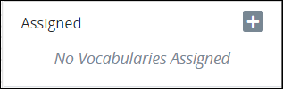 
4. Click theicon to add a ProcessMaker Vocabulary. The **Assign Vocabulary** option displays.  
5. From the **Select Vocabulary** drop-down menu, select a ProcessMaker Vocabulary from which to validate Request data complies with its JSON schema.

   If no ProcessMaker Vocabularies are configured in your ProcessMaker instance, then the following message displays: **List is empty.** Create at least one ProcessMaker Vocabulary. See [Create a New Vocabulary](../../vocabularies-management/manage-your-vocabularies/create-a-new-vocabulary.md#create-a-new-processmaker-vocabulary).

6. Click **Save**.
7. Repeat Steps 3 through 6 as necessary for each ProcessMaker Vocabulary required to validate Request data complies with its JSON schema.


Click the **Remove** iconfrom the **Vocabularies** setting to remove a ProcessMaker Vocabulary from assignment to this element.


After one or more ProcessMaker Vocabularies are assigned to a Task element, the Vocabulary icon displays above that element.

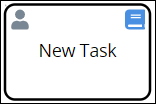

### Advanced Panel Settings

#### Edit the Element's Identifier Value

Process Modeler automatically assigns a unique value to each Process element added to a Process model. However, an element's identifier value can be changed if it is unique to all other elements in the Process model, including the Process model's identifier value.


All identifier values for all elements in the Process model must be unique.


Follow these steps to edit the identifier value for a Task element:

1. Ensure that the **Hide Menus** buttonis not enabled. See [Maximize the Process Modeler Canvas View](../navigate-around-your-process-model.md#maximize-the-process-modeler-canvas-view).
2. Select the Task element from the Process model in which to edit its identifier value. Panels to configure this element display.
3. Expand the **Advanced** panel if it is not presently expanded. The **Node Identifier** setting displays. This is a required setting.  

   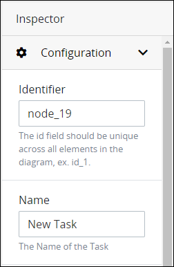

4. In the **Node Identifier** setting, edit the Task element's identifier to a unique value from all elements in the Process model and then press **Enter**.

## Related Topics

































