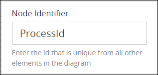
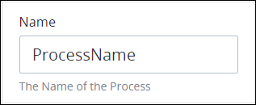

# Edit the Process Model Information

## Edit the Process Model Identifier


Your ProcessMaker user account or group membership must have the following permissions to edit the Process model identifier unless your user account has the **Make this user a Super Admin** setting selected:

* Processes: Edit Processes
* Processes: View Processes

See the [Process](../../../processmaker-administration/permission-descriptions-for-users-and-groups.md#processes) permissions or ask your ProcessMaker Administrator for assistance.


Process Modeler assigns a unique identifier to the Process model. However, the Process model's identifier value can be changed if it is unique to all other elements in the Process model.

Follow these steps to edit the identifier value for a Process model:

1. [View your Processes](https://processmaker.gitbook.io/processmaker-4-community/-LPblkrcFWowWJ6HZdhC/~/drafts/-LRhVZm0ddxDcGGdN5ZN/primary/designing-processes/viewing-processes/view-the-list-of-processes/view-your-processes#view-all-processes). The **Processes** page displays.
2. [Create a new Process](../../viewing-processes/view-the-list-of-processes/create-a-process.md) or click the **Open Modeler** iconto edit the selected Process model. Process Modeler displays.
3. Ensure that the **Hide Menus** buttonis not enabled. See [Maximize the Process Modeler Canvas View](../navigate-around-your-process-model.md#maximize-the-process-modeler-canvas-view).
4. Click anywhere in the Process model other than any Process element so that no elements are selected. The **Configuration** panel displays.
5. Expand the **Configuration** panel if it is not presently expanded. The **Node Identifier** setting displays. This is a required field.  
6. In the **Node Identifier** setting, edit the Process model's identifier to a unique value from all elements in the Process model and then press **Enter**. The identifier value is changed.

## Edit the Process Model Name


Your ProcessMaker user account or group membership must have the following permissions to edit the Process model name unless your user account has the **Make this user a Super Admin** setting selected:

* Processes: View Processes
* Processes: Edit Processes

See the [Process](../../../processmaker-administration/permission-descriptions-for-users-and-groups.md#processes) permissions or ask your ProcessMaker Administrator for assistance.


Process Modeler assigns a name to the Process model that has no association with the Process name. This name has no affect on the Process model or Requests, so its name is not relevant. The default Process model name can be changed.

Follow these steps to edit the Process model name:

1. [View your Processes](https://processmaker.gitbook.io/processmaker-4-community/-LPblkrcFWowWJ6HZdhC/~/drafts/-LRhVZm0ddxDcGGdN5ZN/primary/designing-processes/viewing-processes/view-the-list-of-processes/view-your-processes#view-all-processes). The **Processes** page displays.
2. [Create a new Process](../../viewing-processes/view-the-list-of-processes/create-a-process.md) or click the **Open Modeler** iconto edit the selected Process model. Process Modeler displays.
3. Ensure that the **Hide Menus** buttonis not enabled. See [Maximize the Process Modeler Canvas View](../navigate-around-your-process-model.md#maximize-the-process-modeler-canvas-view).
4. Click anywhere in the Process model other than any Process element so that no elements are selected. The **Configuration** panel displays.
5. Expand the **Configuration** panel if it is not presently expanded. The **Name** setting displays.  
6. In the **Name** setting, edit the Process model's name and then press **Enter**. The name is changed.

## Related Topics







































