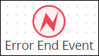
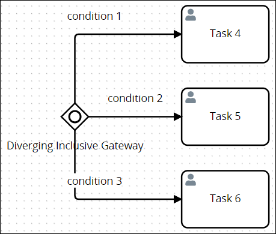
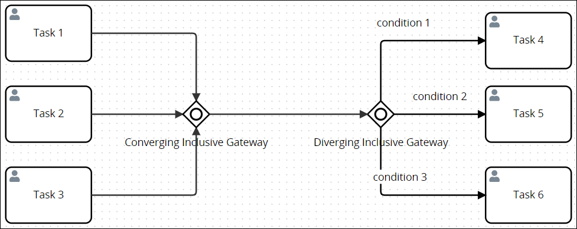

# Process Modeling Element Descriptions

## Overview

The following are brief descriptions about each Process modeling element that ProcessMaker provides. See the [BPMN 2.0 specification](https://www.omg.org/spec/BPMN/2.0/About-BPMN/) for more information.


### Looking for Information About Connectors?

While connectors are used similarly as Process model elements in Process Modeler, connectors are not part of the BPMN 2.0 specification. Connections provide integrations with third-party services that are configured in a Process model so that ProcessMaker integrates with that third-party service during [Requests](../../../using-processmaker/requests/what-is-a-request.md). See the following topics for more information:

* [What is a Connector?](../model-processes-using-connectors/what-is-a-connector.md)
* [Available Connectors from ProcessMaker](../model-processes-using-connectors/available-connectors-from-processmaker/)

### Permissions Required

Your ProcessMaker user account or group membership must have the following permissions to use Process modeling elements in Process Modeler unless your user account has the **Make this user a Super Admin** setting selected:

* Processes: View Processes
* Processes: Edit Processes

See the [Process](../../../processmaker-administration/permission-descriptions-for-users-and-groups.md#processes) permissions or ask your ProcessMaker Administrator for assistance.


## Events

Use event-type elements to represent when a type of event occurs. These event types specify when a timer, message, or error occurs in the Process. ProcessMaker provides the following event-type Process model elements:

* [Start Event](process-modeling-element-descriptions.md#start-event)
* [Start Timer Event](process-modeling-element-descriptions.md#start-timer-event)
* [Message Start Event](process-modeling-element-descriptions.md#message-start-event)
* [Intermediate Timer Event](process-modeling-element-descriptions.md#intermediate-timer-event)
* [Intermediate Message Catch Event](process-modeling-element-descriptions.md#intermediate-message-catch-event)
* [Intermediate Message Throw Event](process-modeling-element-descriptions.md#intermediate-message-throw-event)
* [End Event](process-modeling-element-descriptions.md#end-event)
* [Message End Event](process-modeling-element-descriptions.md#message-end-event)
* [Error End Event](process-modeling-element-descriptions.md#error-end-event)

The following are event-type Process model elements that represent when alternative workflow routing occurs with [Task](process-modeling-element-descriptions.md#task) element, [Script Task](process-modeling-element-descriptions.md#script-task) element, [Manual Task](process-modeling-element-descriptions.md#manual-task) element, and/or [Sub Process](process-modeling-element-descriptions.md#sub-process) element in the Process. Use these event-type Process model elements to design business solutions when expected or nominal business workflow do not occur:

* [Boundary Timer Event](process-modeling-element-descriptions.md#boundary-timer-event)
* [Boundary Error Event](process-modeling-element-descriptions.md#boundary-error-event)
* [Boundary Message Event](process-modeling-element-descriptions.md#boundary-message-event)

### Start Event

A Start Event element starts a [Request](../../../using-processmaker/requests/what-is-a-request.md) for a Process. Note that a Start Event element does not represent an assignee because a Request has not started until a Start Event element triggers. Each Start Event element can be configured who can start a Request or via the [ProcessMaker API](../../../processmaker-api-documentation/access-processmaker-api-documentation.md). A Start Event element cannot have an incoming [Sequence Flow](process-modeling-element-descriptions.md#sequence-flow) element, though it may have an outgoing [Message Flow](process-modeling-element-descriptions.md#message-flow) element. A Process model can have multiple Start Event elements, each representing a different ProcessMaker [user](../../../processmaker-administration/add-users/what-is-a-user.md) or [group](../../../processmaker-administration/assign-groups-to-users/what-is-a-group.md) \(or via Web entry if the [Web Entry package](../../../package-development-distribution/package-a-connector/web-entry.md) is installed to your ProcessMaker instance\).

Use a Start Event element to represent how a Request for that Process starts in one of the following ways:

* The Request can be started by an authenticated ProcessMaker [user](../../../processmaker-administration/add-users/what-is-a-user.md) \(Jane Doe\) or any member of a specified [group](../../../processmaker-administration/assign-groups-to-users/what-is-a-group.md) \(Accounting department\).
* The Request can be started by either an anonymous or authenticated ProcessMaker user through a published URL. This allows a ProcessMaker Screen to be available on a public-facing Web site that starts the Request when that Screen is submitted. Note that this feature is only available if the Web Entry package is installed in your ProcessMaker instance. See [Web Entry](../../../package-development-distribution/package-a-connector/web-entry.md).
* The Request can be started via the ProcessMaker API.

Below is a Start Event element when it has been placed into a Process model.


See [Add and Configure Event Elements](add-and-configure-an-event-element.md#add-a-start-event-element).


### Start Timer Event

A Start Timer Event element starts a [Request](../../../using-processmaker/requests/what-is-a-request.md) for a Process at a specified time or at a periodic interval. A Start Timer Event element cannot have an incoming [Sequence Flow](process-modeling-element-descriptions.md#sequence-flow) element. Use this element to indicate that a Request for that Process must begin at a specific date and time, such as on an employee’s employment anniversary to schedule a performance review. A Process model can have multiple Start Timer Event elements.

Below is a Start Timer Event element when it has been placed into a Process model.


See [Add and Configure Start Timer Event Elements](add-and-configure-start-timer-event-elements.md).


### Message Start Event

A Message Start Event element starts a [Request](../../../using-processmaker/requests/what-is-a-request.md) for a Process when it triggers from a message. The Message Start Event element listens for a message from a specified source. The purpose of the message transfer is to send data from one Pool element's Request data to another Pool element within the same Process model, thereby using the sent Request data to start a Request for the receiving Pool element; each Pool element represents its own Request with its own distinct Request data.

A [Message Flow](process-modeling-element-descriptions.md#message-flow) element can connect from the element sending the message to the Message Start Event element. A Process model can have multiple Message Start Event elements.

This message may originate from any of the following:

* **Intermediate Message Throw Event element:** An [Intermediate Message Throw Event](process-modeling-element-descriptions.md#intermediate-message-throw-event) element sends a message to the Message Start Event. Use this functionality to start a different Process's Request while the Request that sends the message is in progress. If the Message Start Event element is in the same Process model as the Intermediate Message Throw Event element for which it listens for its message, these elements must be in separate [Pool](process-modeling-element-descriptions.md#pool) elements since each Pool element has its own Request.
* **Message End Event element:** A [Message End Event](process-modeling-element-descriptions.md#message-end-event) element sends a message to the Message Start Event. Use this functionality to start a different Process's Request when the Request that sends the message completes. If the Message Start Event element is in the same Process model as the Message End Event element for which it listens for its message, these elements must be in separate Pool elements.
* **Third-party service:** A third-party service such as a CRM may send a message via the [ProcessMaker API](../../../processmaker-api-documentation/access-processmaker-api-documentation.md) to the Message Start Event, thereby starting a Request.

A Message Start Event element functions as follows during a Request:

1. The Message Start Event element listens for a message based on that message's name. The message name is a placeholder for the message.
2. The Intermediate Message Throw Event element or Message End Event element triggers.
3. That triggering element sends its message containing Request data to the Message Start Event element.
4. If the message name matches that for which the Message Start Event element is listening, then that element triggers; the Request starts. Otherwise, the message is ignored.

Below is a Message Start Event element when it has been placed into a Process model.


See [Add and Configure Message Start Event Elements](add-and-configure-message-start-event-elements.md).


### Intermediate Timer Event

An Intermediate Timer Event element delays a [Request](../../../using-processmaker/requests/what-is-a-request.md) for a Process until a specific time. When the specified time occurs, the Intermediate Timer Event element triggers, thereby resuming workflow for that Process's Request. Use this element to cause a Request to wait until a specific time. For example, use this element to make a Process wait 30 days before checking if you receive an invoice from a customer after services are rendered.

Below is an Intermediate Timer Event element when it has been placed into a Process model.


See [Add and Configure Intermediate Timer Event Elements](add-and-configure-intermediate-timer-event-elements.md).


### Intermediate Message Catch Event

An Intermediate Message Catch Event element delays a [Request](../../../using-processmaker/requests/what-is-a-request.md) until that element receives a message. The purpose of the message transfer is to send data between Requests running from the same Process model since each Pool element represents its own Request with its own distinct Request data.

This message may originate from any of the following:

* **Intermediate Message Throw Event element:** An [Intermediate Message Throw Event](process-modeling-element-descriptions.md#intermediate-message-throw-event) element sends a message to the Intermediate Message Catch Event. Use this functionality to resume workflow to the Process Request using the Intermediate Message Catch Event element from another Request. If the Intermediate Message Catch Event element is in the same Process model as the Intermediate Message Throw Event element for which it listens for its message, these elements must be in separate [Pool](process-modeling-element-descriptions.md#pool) elements since each Pool element has its own Request.
* **Message End Event element:** A [Message End Event](process-modeling-element-descriptions.md#message-end-event) element sends a message to the Intermediate Message Catch Event. Use this functionality to resume  workflow to the Process Request using the Intermediate Message Catch Event element when the Request that sends the message completes. If the Intermediate Message Catch Event element is in the same Process model as the Message End Event element for which it listens for its message, these elements must be in separate Pool elements.
* **Third-party service:** A third-party service such as a CRM may send a message via the [ProcessMaker API](../../../processmaker-api-documentation/access-processmaker-api-documentation.md) to the Intermediate Message Catch Event, thereby resuming workflow for that Request.

A [Message Flow](process-modeling-element-descriptions.md#message-flow) element can connect from the element sending the message to the Intermediate Message Catch Event element. Ensure that Intermediate Message Catch Event element and its triggering element are in different Pool elements. When configuring the Intermediate Message Catch Event element during Process modeling, select which message from the triggering element sends to the Intermediate Message Catch Event element.

An Intermediate Message Catch Event element functions as follows during a Request:

1. Workflow in the Request using the Intermediate Message Catch Event element pauses when it reaches this event. The Intermediate Message Catch Event element listens for a message based on that message's name. The message name is a placeholder for the message.
2. The Intermediate Message Throw Event element or Message End Event element triggers.
3. That triggering element sends its message containing Request data to the Intermediate Message Catch Event element.
4. If the message name matches that for which the Intermediate Message Catch Event element is listening, then that element triggers; workflow resumes in that Request. Otherwise, the message is ignored.

Consider the following example how the Intermediate Message Catch Event element functions. This example uses the Intermediate Message Throw Event element  in an overly simple purchase request and order fulfillment Process model.

The Intermediate Message Catch Event element \(labeled "Catch from Order"\) is in the second Pool, "Purchase Fulfillment."

After the "Purchase Fulfillment" Request starts, the following occurs:

1. Workflow delays after the "Preparation" Task element.
2. When the Intermediate Message Throw Event element triggers from the "Purchase Order" Request \(labeled "Throw to Fulfillment"\), it sends its message to the Intermediate Message Catch Event element in the "Purchase Fulfillment" Request. Workflow continues in the "Purchase Order" Request to the End Event element.
3. In the "Purchase Fulfillment" Request, the Intermediate Message Catch Event element triggers and receives the Intermediate Message Throw Event element's message.
4. Workflow resumes in the "Purchase Fulfillment" Request.

Below is an Intermediate Message Catch Event element when it has been placed into a Process model.


See [Add and Configure Intermediate Timer Event Elements](add-and-configure-intermediate-timer-event-elements.md).


### Intermediate Message Throw Event

An Intermediate Message Throw Event element sends a message to a [Message Start Event](process-modeling-element-descriptions.md#message-start-event) or an [Intermediate Message Catch Event](process-modeling-element-descriptions.md#intermediate-message-throw-event) element. The purpose of the message transfer is to send data between Requests running from the same Process model since each [Pool](process-modeling-element-descriptions.md#pool) element represents its own Request with its own distinct Request data.

A [Message Flow](process-modeling-element-descriptions.md#message-flow) element can connect from the Intermediate Message Throw Event element to the element listening for its message.

An Intermediate Message Throw Event element functions as follows during a Request:

1. The Intermediate Message Throw Event element triggers.
2. The Intermediate Message Throw Event element sends its message. The message has a name which is a placeholder for the Request data it sends to the catching element.
3. If the message name matches that for which the catching element is listening, then that element triggers. Otherwise, the message is ignored.


See the [Intermediate Message Catch Event](process-modeling-element-descriptions.md#intermediate-message-catch-event) element description for a simple example how an Intermediate Message Throw Event element works.


Below is an Intermediate Message Throw Event element when it has been placed into a Process model.


See [Add and Configure Intermediate Message Throw Event Elements](add-and-configure-intermediate-message-throw-event-elements.md).


### End Event

An End Event element completes a [Request](../../../using-processmaker/requests/what-is-a-request.md) for a Process. An End Event element cannot have an outgoing [Sequence Flow](process-modeling-element-descriptions.md#sequence-flow) element. A Process model can have multiple End Event elements.

Below is an End Event element when it has been placed into a Process model.


See [Add and Configure End Event Elements](add-and-configure-end-event-elements.md).


### Message End Event

A Message End Event element sends a message to a [Message Start Event](process-modeling-element-descriptions.md#message-start-event) or an [Intermediate Message Catch Event](process-modeling-element-descriptions.md#intermediate-message-throw-event) element when the Request using the Message End Event element completes. The purpose of the message transfer is to send data between Requests running from the same Process model since each [Pool](process-modeling-element-descriptions.md#pool) element represents its own Request with its own distinct Request data.

A [Message Flow](process-modeling-element-descriptions.md#message-flow) element can connect from the Message End Event element to the element listening for its message.

A Message End Event element functions as follows during a Request:

* The Message End Event element triggers when the Request using it completes.
* The Message End Event element sends its message. The message has a name which is a placeholder for the Request data it sends to the catching element.
* If the message name matches that for which the catching element is listening, then that element triggers. Otherwise, the message is ignored.

Below is a Message End Event element when it has been placed into a Process model.


See [Add and Configure Message End Event Elements](add-and-configure-message-end-event-elements.md).


### Error End Event

An Error End Event element records the error before that Request completes if an error occurs. The purpose of sending the error is to provide an alternate business solution if expected workflow routing experiences an error.

Use an Error End Event element in the following ways:

* **In a Pool element:** If an Error End Event element records an error during a Request within a [Pool](process-modeling-element-descriptions.md#pool) element \(or the Process model does not use a Pool element\), that Request completes but shows the error in the [Completed Request summary](../../../using-processmaker/requests/request-details/summary-for-completed-requests.md). If a Process model contains more than one Pool element, the Error End Event element does not affect workflow for the Request\(s\) in the other Pool element\(s\). Use an Error end Event element when that Process model is called from a parent Process via a [Sub Process](process-modeling-element-descriptions.md#sub-process) element.
* **In a child Process called from a parent Process's Sub Process element:** If an Error End Event element records an error during a Request for a child Process called from a parent Process's Sub Process element, that error is sent to the Sub Process element when the child Process's Request completes. One of the following occurs:
  * **The Sub Process element has an associated Boundary Error Event element:** Workflow in the parent Process's Request routes through the Boundary Error Event element. If the Boundary Error Event element is not configured to interrupt workflow, workflow also resumes as if the error had not occurred in the child Request \(thereby creating parallel workflow in the parent Request\). Use this Process design to handle errors from the child Request.
  * **The Sub Process does not have an associated Boundary Error Event element:** Workflow resumes in the parent Process's Request as if the error had not occurred in the child Request.

Below is an Error End Event element when it has been placed into a Process model.


See [Add and Configure Error End Event Elements](add-and-configure-error-end-event-elements.md).


### Boundary Timer Event

A Boundary Timer Event element represents that alternate workflow routing occurs when a specified amount of time expires with a [Task](process-modeling-element-descriptions.md#task) element, [Script Task](process-modeling-element-descriptions.md#script-task) element, [Manual Task](process-modeling-element-descriptions.md#manual-task) element, or [Sub Process](process-modeling-element-descriptions.md#sub-process) element. Workflow routes through the Boundary Timer Event element when the specified time expires. Use a Boundary Timer Event element to design business solutions when intended and nominal workflow in your Process do not occur in an expected period of time. Consider these examples:

* **Escalate Task problems:** When a Task assignee does not complete a Task when it is due, escalate to that assignee's manager to ensure project tasks are completed on schedule.
*  **ProcessMaker Script fail-safe:** If a ProcessMaker Script does not complete in a period of time, route workflow to a system administrator to investigate why the Script provided no response.
* **Escalate child sub-process problems:** If the Request for a child Sub Process does not complete in a required period of time, route workflow to a manager's Task in the parent Process's Request so that the child Request does not delay the parent Request.

Configure Boundary Timer Event elements with either interrupting or non-interrupting workflow:

* **Interrupting workflow:** When workflow routes through the Boundary Timer Event element, workflow is interrupted and does not route through the intended workflow. 
* **Non-interrupting workflow:** Workflow routes both through the Boundary Timer Event element and the intended workflow, thereby creating parallel workflow in that Request. 

Below is a Boundary Timer Event element when it is associated with a Task element. A Boundary Timer Event may also be associated with a Script Task element, Manual Task element, or Sub Process element.

### Boundary Error Event

### Boundary Message Event

## Tasks

Tasks represent activities performed by persons in ProcessMaker software, offline \(such as in the physical environment\), or by a [ProcessMaker Script](../../scripts/). ProcessMaker provides the following Task-type Process model elements:

* [Task](process-modeling-element-descriptions.md#task)
* [Script Task](process-modeling-element-descriptions.md#script-task)
* [Manual Task](process-modeling-element-descriptions.md#manual-task)

### Task

A Task element represents an activity a person performs while participating in a [Request](../../../using-processmaker/requests/what-is-a-request.md) via ProcessMaker. A Task element is different than a [Manual Task](process-modeling-element-descriptions.md#manual-task) element, in which a person performs an activity in the physical environment. Assign the [Task](../../../using-processmaker/task-management/what-is-a-task.md) that the Task element represents to any of the following types of Request participants:

* The ProcessMaker user who started the Request, referred to as the Requester
* A specific ProcessMaker [user](../../../processmaker-administration/add-users/what-is-a-user.md)
* Any member of a specified ProcessMaker [group](../../../processmaker-administration/assign-groups-to-users/what-is-a-group.md)
* The previous Task assignee in that Request's workflow

People perform Task activities through ProcessMaker Screens as digital [forms](../../design-forms/screens-builder/types-for-screens.md#forms) and [displays](../../design-forms/screens-builder/types-for-screens.md#display). ProcessMaker Screens are designed in [Screens Builder](../../design-forms/screens-builder/).

Below is a Task element when it has been placed into a Process model.


See [Add and Configure Task Elements](add-and-configure-task-elements.md).


### Script Task

A Script Task element represents an activity performed by a [ProcessMaker Script](../../scripts/what-is-a-script.md). Use ProcessMaker Scripts in the following ways:

* Interact with legacy systems in your organization such as ERPs and CRMs.
* Connect with third-party services like Adobe DocuSign, Short Message Service \(SMS\), or APIs.

ProcessMaker Scripts are designed in [Scripts Editor](../../scripts/scripts-editor.md). ProcessMaker Scripts are independent of Process models: any ProcessMaker Script can be reused in any Process model in your organization. This architecture allows Process Owners to focus on Process modeling in a no-code environment while ProcessMaker Developers develop reusable ProcessMaker Scripts. ProcessMaker Scripts can leverage ProcessMaker Screens variable values for in-progress Requests.

Below is a Script Task element when it has been placed into a Process model.


See [Add and Configure Script Task Elements](add-and-configure-script-task-elements.md).


### Manual Task

A Manual Task element represents an activity a person performs offline and/or in the physical environment such that ProcessMaker cannot monitor its activity. A Manual Task element is different than a [Task](process-modeling-element-descriptions.md#task) element, in which a person performs an activity via ProcessMaker. ProcessMaker relies on the Task assignee to acknowledge completion of that activity. An example of a Manual Task activity is moving physical merchandise in a warehouse: this activity occurs offline and is one which does not involve ProcessMaker interaction.

Below is a Manual Task element when it has been placed into a Process model.


See [Add and Configure Manual Task Elements](add-and-configure-manual-task-elements.md).


## Sub Process

A Sub Process element calls a Sub Process that can be re-used by other Processes in the ProcessMaker instance. The Sub Process that the Sub Process element calls is referred to as the "child" Sub Process and must be an external Process from the calling Process it \(referred to as the "parent" Process\).

The child Sub Process that the Sub Process element calls from the parent Process's [Request](../../../using-processmaker/requests/what-is-a-request.md) must be in the same ProcessMaker instance and not [archived](../../viewing-processes/view-the-list-of-processes/remove-a-process.md).

The child Sub Process has its own Request. The Request for the parent Process waits until the child Sub Process's Request completes before its workflow continues. When the child Sub Process's Request completes, the parent Process's Request continues from the Sub Process element.


To prevent routing for the parent Process's Request from waiting until the child Sub Process's Request completes, use a [Parallel Gateway](process-modeling-element-descriptions.md#parallel-gateway) element preceding the Sub Process element. Use a parallel outgoing [Sequence Flow](the-quick-toolbar.md) element from the Parallel Gateway element to continue routing the parent Process while the Sub Process element waits for the child Sub Process's Request to complete.


Below is a Sub Process element when it has been placed into a Process model.


See [Add and Configure Sub Process Elements](add-and-configure-sub-process-elements.md).


## Gateways

Gateway elements route [Request](../../../using-processmaker/requests/what-is-a-request.md) workflow in the following ways:

* Limit workflow based on one passing conditions, as the [Exclusive Gateway](process-modeling-element-descriptions.md#exclusive-gateway) element does.
* Limit workflow based on multiple passing conditions, as the [Inclusive Gateway](process-modeling-element-descriptions.md#inclusive-gateway) element does.
* Limit workflow based on an event, as the [Event-Based Gateway](process-modeling-element-descriptions.md#event-based-gateway) elements does.
* Synchronize or continue parallel workflows, as the [Parallel Gateway](process-modeling-element-descriptions.md#parallel-gateway) element does.

### Exclusive Gateway

An Exclusive Gateway element evaluates a [Request's](../../../using-processmaker/requests/what-is-a-request.md) workflow routing conditions for a Process. These routing conditions are configured on each outgoing [Sequence Flow](process-modeling-element-descriptions.md#sequence-flow) element from the Exclusive Gateway element. When a Request is in progress and the Exclusive Gateway element triggers, each of its outgoing Sequence Flow elements' conditions are evaluated to determine which single Sequence Flow element workflow routes for that Request. Unlike the [Inclusive Gateway](process-modeling-element-descriptions.md#inclusive-gateway) element, only one Sequence Flow element can trigger from the Exclusive Gateway element to route workflow.

Use an Exclusive Gateway element when you want only one condition to pass. Otherwise, consider using an Inclusive Gateway element whereby any conditions that pass specified conditions allow workflow routing to continue.

Below is an Exclusive Gateway element when it has been placed into a Process model.


See the following topics about Exclusive Gateway elements:

* [Add and Configure Exclusive Gateway Elements](add-and-configure-exclusive-gateway-elements.md#add-an-exclusive-gateway-element)
* [Configure a Sequence Flow from an Exclusive Gateway Element](the-quick-toolbar.md#configure-a-sequence-flow-from-an-exclusive-gateway-element)


### Inclusive Gateway

An Inclusive Gateway element functions in two different ways, but not at the same time from the same element:

* **Converging workflow \(synchronize workflow\):** An Inclusive Gateway element may synchronize [Request](../../../using-processmaker/requests/what-is-a-request.md) workflow from two or more incoming [Sequence Flow](process-modeling-element-descriptions.md#sequence-flow) elements to the Inclusive Gateway element. All incoming Sequence Flow elements converging to the Inclusive Gateway element must trigger before the Inclusive Gateway element triggers, thereby synchronizing a Request's workflow. Use this coordinate workflow.  
* **Diverging workflow \(evaluate routing conditions\):** An Inclusive Gateway element may also evaluate a Request's workflow routing conditions for a Process. These routing conditions are configured on each outgoing [Sequence Flow](process-modeling-element-descriptions.md#sequence-flow) element from the Inclusive Gateway element. When a Request is in progress and the Inclusive Gateway element triggers, each of its outgoing Sequence Flow elements' conditions are evaluated to determine which Sequence Flow element\(s\) continue routing for that Request. Unlike the [Exclusive Gateway](process-modeling-element-descriptions.md#exclusive-gateway) element, multiple Sequence Flow elements can trigger from the Inclusive Gateway element, thereby causing multiple workflow routes simultaneously for the same Request that stem from that Inclusive Gateway element. Use an Inclusive Gateway element when you potentially want multiple workflow routes to occur simultaneously in that Request. Otherwise, consider using an Exclusive Gateway element to allow only one Sequence Flow element's condition\(s\) to continue workflow route for that Request.  

One Inclusive Gateway element can only converge or diverge workflow, but not both. Use two Inclusive Gateway elements to both converge and diverge workflow.

Below is an Inclusive Gateway element when it has been placed into a Process model.


See [Add and Configure Inclusive Gateway Elements](add-and-configure-inclusive-gateway-elements.md).


### Parallel Gateway

A Parallel Gateway element synchronizes [Request](../../../using-processmaker/requests/what-is-a-request.md) workflow for a Process by converging or diverging parallel [Sequence Flow](process-modeling-element-descriptions.md#sequence-flow) elements. The Parallel Gateway element has two separate functions, but not at the same time from the same element:

* **Converging workflow:** Converging workflow represents two or more incoming Sequence Flow elements to the Parallel Gateway element. All incoming Sequence Flow elements converging to the Parallel Gateway element must trigger before the Parallel Gateway element triggers, thereby synchronizing a Request's workflow. Use this coordinate workflow.  

  

* **Diverging workflow:** Diverging workflow represents two or more outgoing Sequence Flow elements from the Parallel Gateway element. When a Parallel Gateway triggers, all outgoing Sequence Flow elements from the gateway element trigger simultaneously without exception. Conditions cannot be placed on any outgoing Sequence Flow elements from the Parallel Gateway element. Use this when multiple workflow routes must occur simultaneously.  

  

One Parallel Gateway element can only converge or diverge workflow, but not both. Use two Parallel Gateway elements to synchronize both converging and diverging parallel workflow.  

Below is a Parallel Gateway element when it has been placed into a Process model.


See [Add and Configure Parallel Gateway Elements](add-and-configure-parallel-gateway-elements.md).


### Event-Based Gateway

An Event-Based Gateway element evaluates a [Request's](../../../using-processmaker/requests/what-is-a-request.md) workflow routing for a Process based on which event occurs immediately after the Event-Based Gateway element. Follow these guidelines to use the Event-Based Gateway element:

* The Event-Based Gateway element requires two or more outgoing [Sequence Flow](process-modeling-element-descriptions.md#sequence-flow) elements. When evaluating events, workflow routes through only one Sequence Flow element; multiple events cannot pass simultaneously from one Event-Based Gateway element during a Request.
* The Event-Based Gateway element can only connect with [Intermediate Timer Event](process-modeling-element-descriptions.md#intermediate-timer-event) or [Intermediate Message Catch Event](process-modeling-element-descriptions.md#intermediate-message-catch-event) elements. This creates the scenario that either a timed event occurs or an Intermediate Message Catch Event element receives a message.

When the Event-Based Gateway element triggers during a Request, workflow for that Request pauses. ProcessMaker then evaluates the events immediately following the Event-Based Gateway element's via its outgoing Sequence Flow elements and waits until one of those events occur. Request workflow resumes by routing to the event that occurs first.

Consider the following example. Suppose that you have a Process that monitors if you receive package shipments on time. Use an Event-Based Gateway element to monitor which event occurs next. Refer to the Process modeling elements below.

In this example, connect the following Process modeling elements from the Event-Based Gateway element:

* **Intermediate Timer Event element:** The first connecting event from the Event-Based Gateway element is an Intermediate Timer Event element that is set to 24 hours. This event represents a 24-hour period in which presumably a notification has not arrived that the package shipped within that time period. If the timer set in the Intermediate Timer Event expires, then workflow routes to a [Manual Task](process-modeling-element-descriptions.md#manual-task) element in which its assignee telephones the shipping company.
* **Intermediate Message Catch Event element:** The second connecting element is an Intermediate Message Catch Event element that represents a notification of the package’s shipment presumably before the timer set in the Intermediate Timer Event element expires. If the Intermediate Message Catch Event element triggers, then the notification was received before the 24-hour period expired. No further action is required.

Below is an Event-Based Gateway element when it has been placed into a Process model.


See [Add and Configure Event-Based Gateway Elements](add-and-configure-event-based-gateway-elements.md).


## Organize Process Participants

BPMN 2.0 provides graphical representations to organize participants in a Process model.

### Pool

A Pool element represents an organization or entity involved in a Process model. The Pool element might represent a specific role \("Human Resources"\), entity \(such as a company\) or a general relationship \(such as a buyer, seller, or manufacturer\).

Each Pool element represents its own Request, and therefore its own Request data. While a Process model can have multiple Pool elements, each Pool element represents its own Request with distinct Request data.

Below is a Pool element when it has been placed into a Process model. "New Pool" is the name of the Pool element.


See [Add and Configure Pool and Lane Elements](add-and-configure-pool-and-lane-elements.md).


### Lane

A Lane element represents a partition within a [Pool](process-modeling-element-descriptions.md#pool) element. Each Lane element indicates a role, actor, or participant within the Pool element. Text within the Lane element indicates the participant in the Process model. Any elements within the Lane element indicate that the participant is the actor or is responsible for performing actions in the Process model. Furthermore, [Sequence Flow](process-modeling-element-descriptions.md#sequence-flow) elements between elements in other Pool or Lane elements indicate with which other Process participants that Lane element interacts.

Below is a Pool element that contains three Lane elements when it has been placed into a Process model: "Requester," "Approval," and "Requisition" from top to bottom in the Pool element. Each Lane element indicates roles within the overall organization.


See [Add and Configure Pool and Lane Elements](add-and-configure-pool-and-lane-elements.md).


## Text Annotations and Associations

Use [Text Annotation](process-modeling-element-descriptions.md#text-annotation) and [Association](process-modeling-element-descriptions.md#association) elements to add human-readable descriptions about the Process model.

### Text Annotation

A Text Annotation element is human-readable text in a Process model that provides description about the Process. Text Annotation elements perform no functional role in Process Requests or workflow routing.

Below is a Text Annotation element when it has been placed into a Process model.


See [Add and Configure Text Annotation and Association Elements](add-and-configure-text-annotation-elements.md).


### Association

An Association element is part of a Text Annotation element that graphically references the Process model element that the Text Annotation element describes. Multiple Association elements can be used from one Text Annotation element. However, a Text Annotation element must be placed into the Process model before an Association element can be used.

Each Annotation element can display a directional arrow to and/or from the Text Annotation element.

Below is an Association element when it has been placed into a Process model.


See [Add and Configure Text Annotation and Association Elements](add-and-configure-text-annotation-elements.md#add-an-association-element).


## Flow Indicators

Flow indicators represent the order in which workflow routing and messaging occur in a Process model. ProcessMaker provides the following Process model elements that indicate workflow:

* [Sequence Flow](process-modeling-element-descriptions.md#sequence-flow)
* [Message Flow](process-modeling-element-descriptions.md#message-flow)

### Sequence Flow

Sequence Flow elements connect Process model elements to represent the intended workflow routing in a Process model. Process workflow is the order in which elements trigger or activate in a Process model. Sequence Flow elements are not to be confused with [Message Flow](process-modeling-element-descriptions.md#message-flow) elements.

As a best practice, indicate a consistent direction of Sequence Flow elements: either left to right or top to bottom, to make Process models easier to understand.

In Process Modeler, Flow indicators display when you click an element in the Process model. The top Flow indicator is for Sequence Flows \(highlighted below\), represented with a solid line.


[Text annotations](process-modeling-element-descriptions.md#text-annotation), [Pool](process-modeling-element-descriptions.md#pool), and [Lane](process-modeling-element-descriptions.md#lane) elements do not use Sequence Flow elements. Furthermore, Sequence Flow elements cannot connect between Process model elements that are in different Pool elements since Pool elements represent different organizations. However, use Message Flow elements to infer communication between elements in different Pool elements.

Sequence Flow elements from Exclusive Gateway and Inclusive Gateway elements can be configured to specify under which condition\(s\) Request workflow routes through that Sequence Flow element. See [Connect Sequence Flow Elements to Indicate Workflow Routing](the-quick-toolbar.md).

[Start Event](process-modeling-element-descriptions.md#start-event), [Start Timer Event](process-modeling-element-descriptions.md#start-timer-event) and Message Start Event elements begin Request workflow in Process design. Therefore, these elements cannot have incoming Sequence Flow elements.

[End Event](process-modeling-element-descriptions.md#end-event), Message End Event, and Error End Event elements terminate Request workflow in Process design. Therefore, these elements cannot have outgoing Sequence Flow elements.


The Sequence Flow element indicates in which order workflow routing occurs between two connected Process model elements. Below are two Process model elements connected in Process Modeler.


See [Set and Delete Sequence Flow Between Elements](the-quick-toolbar.md).


### Message Flow

In a Process model, Message Flow elements represent messaging between elements of \(or within\) one [Pool](process-modeling-element-descriptions.md#pool) element to elements of \(or within\) another Pool element. Message Flow elements cannot connect to Process model elements within the same Pool element. Message Flow elements are not to be confused with [Sequence Flow](process-modeling-element-descriptions.md#sequence-flow) elements.

Use Message Flow elements to represent collaboration and data transfer from one Pool to another. Since each Pool element in a Process uses its own [Request](../../../using-processmaker/requests/what-is-a-request.md) and Request data, use Message Flow elements to exchange data and information between separate Pool elements and/or elements within those Pool elements.

In Process Modeler, Flow indicators display when you click an element in the Process model. The dotted-line Flow indicator is for Message Flows \(highlighted below\).

These messages indicate indirect communication between separate Process participants. The Message Flow element does not indicate whether the message is physical or digital. Use a [Text Annotation](process-modeling-element-descriptions.md#text-annotation) element to add information about the type of communication.


See [Connect Message Flow Elements to Indicate Collaboration](set-and-delete-message-flow-between-elements.md).


## Related Topics



















































