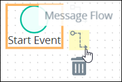
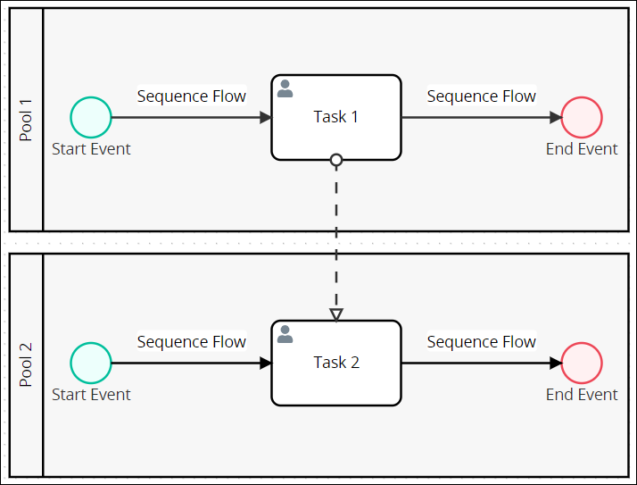
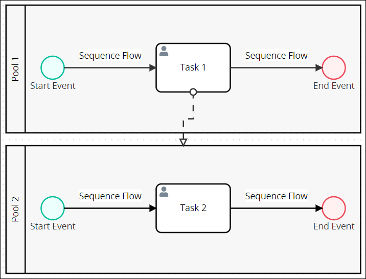
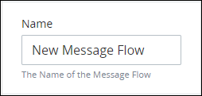
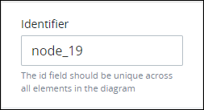

# Connect Message Flow Elements to Indicate Collaboration

## Overview

In a Process model, Message Flow elements represent messaging between elements of \(or within\) one [Pool](process-modeling-element-descriptions.md#pool) element to elements of \(or within\) another Pool element. Message Flow elements cannot connect to Process model elements within the same Pool element. Message Flow elements are not to be confused with [Sequence Flow](process-modeling-element-descriptions.md#sequence-flow) elements.

Use Message Flow elements to represent collaboration and data transfer from one Pool to another. Since each Pool element in a Process uses its own [Request](../../../using-processmaker/requests/what-is-a-request.md) and Request data, use Message Flow elements to exchange data and information between separate Pool elements and/or elements within those Pool elements.

In Process Modeler, Flow indicators display when you click an element in the Process model. The dotted-line Flow indicator is for Message Flows \(highlighted below\).

### Incoming and Outgoing Message Flow

From the context of a Process model element associated with a Message Flow element, that Message Flow element can be "incoming" or "outgoing." Consider the following Process model example to demonstrate their differences.

Below are the differences between incoming and outgoing Message Flow elements:

* **Incoming:** An incoming Message Flow element comes from its connecting element. In the Process model example above, the Message Flow element is incoming to the "Task 2" element.
* **Outgoing:** An outgoing Message Flow element goes to the connecting element. In the Process model example above, the Message Flow element is outgoing from the "Task 1" element. The outgoing Message Flow element must originate from a separate Pool element than from where it connects.

### Restrictions on Message Flow Elements

The following element types do not use Message Flow elements:

* ​[Start Timer Event](process-modeling-element-descriptions.md#start-timer-event)
* [Intermediate Timer Event](process-modeling-element-descriptions.md#intermediate-timer-event)
* [End Event](process-modeling-element-descriptions.md#end-event)
* [Script Task](process-modeling-element-descriptions.md#script-task)
* [Manual Task](process-modeling-element-descriptions.md#manual-task)
* [Sub Process](process-modeling-element-descriptions.md#sub-process)
* [Exclusive Gateway](process-modeling-element-descriptions.md#exclusive-gateway)
* [Inclusive Gateway](process-modeling-element-descriptions.md#inclusive-gateway)
* [Parallel Gateway](process-modeling-element-descriptions.md#parallel-gateway)
* [Event-Based Gateway](process-modeling-element-descriptions.md#event-based-gateway)
* [Text Annotation](process-modeling-element-descriptions.md#text-annotation)
* [Association](process-modeling-element-descriptions.md#association)

## Set the Message Flow Element Between Elements in Separate Pool Elements


### Looking for Information about Sequence Flow Elements?

See [Set and Delete Sequence Flow Between Elements](the-quick-toolbar.md).

### Permissions Required

Your ProcessMaker user account or group membership must have the following permissions to set Message Flow elements in the Process model unless your user account has the **Make this user a Super Admin** setting selected:

* Processes: View Processes
* Processes: Edit Processes

See the [Process](../../../processmaker-administration/permission-descriptions-for-users-and-groups.md#processes) permissions or ask your ProcessMaker Administrator for assistance.


Follow these steps to set the Message Flow element between elements in separate Pool elements:

1. ​[View your Processes](../../viewing-processes/view-the-list-of-processes/view-your-processes.md#view-all-processes). The **Processes** page displays.
2. Click the **Open Modeler** iconto edit the selected Process model. Process Modeler displays. Ensure that the Process model has at least two \(2\) Pool elements from which to establish Message Flow between them.
3. From one Pool element, select the Process model element from which you want to establish communication via the Message Flow element. Available options display to the right of the selected element. Process model element types that do not support the Message Flow element do not have the Message Flow indicator as highlighted below.  

   

4. Click the **Message Flow** icon.
5. Do one of the following:
   * Click the second Pool element to indicate collaboration and data transfer between the two elements.  

     

   * Click an element inside the second Pool element to indicate collaboration and data transfer between the two elements.  

     

## Settings


Your ProcessMaker user account or group membership must have the following permissions to configure a Message Flow element unless your user account has the **Make this user a Super Admin** setting selected:

* Processes: View Processes
* Processes: Edit Processes

See the [Process](../../../processmaker-administration/permission-descriptions-for-users-and-groups.md#processes) permissions or ask your ProcessMaker Administrator for assistance.


The Message Flow element has the following panels that contain settings:

* **Configuration** panel
  * [Edit the element name](set-and-delete-message-flow-between-elements.md#edit-the-element-name)
* **Advanced** panel
  * [Edit the element's identifier value](set-and-delete-message-flow-between-elements.md#edit-the-elements-identifier-value)

### Configuration Panel Settings

#### Edit the Element Name

An element name is a human-readable reference for a Process element. Process Modeler automatically assigns the name of a Process element with its element type. However, an element's name can be changed.

Follow these steps to edit the name for a Message Flow element:

1. Ensure that the **Hide Menus** buttonis not enabled. See [Maximize the Process Modeler Canvas View](../navigate-around-your-process-model.md#maximize-the-process-modeler-canvas-view).
2. Select the Sequence Flow element from the Process model in which to edit its name. Panels to configure this element display.
3. Expand the **Configuration** panel if it is not presently expanded. The **Name** setting displays. 
4. In the **Name** setting, edit the selected element's name and then press **Enter**. The element's name is changed.

### Advanced Panel Settings

#### Edit the Element's Identifier Value

Process Modeler automatically assigns a unique value to each Process element added to a Process model. However, an element's identifier value can be changed if it is unique to all other elements in the Process model, including the Process model's identifier value.


All identifier values for all elements in the Process model must be unique.


Follow these steps to edit the identifier value for a Message Flow element:

1. Ensure that the **Hide Menus** buttonis not enabled. See [Maximize the Process Modeler Canvas View](../navigate-around-your-process-model.md#maximize-the-process-modeler-canvas-view).
2. Select the Message Flow element from the Process model in which to edit its name. Panels to configure this element display.
3. Expand the **Configuration** panel if it is not presently expanded. The **Node Identifier** setting displays. 
4. In the **Node Identifier** setting, edit the Message Flow element's identifier to a unique value from all elements in the Process model and then press **Enter**. The element's identifier value is changed.

## Related Topics











