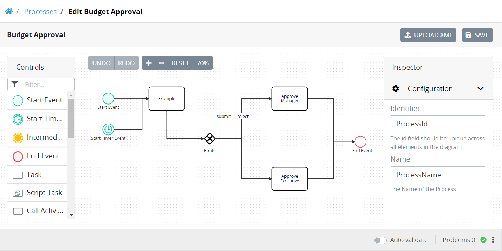

# View the Inspector Panel

## Overview

The **Inspector** panel in Process Modeler displays Process model element settings. Use the **Inspector** panel to configure your Process model and its elements. The **Inspector** panel displays to the right of a your Process model.


Your user account or group membership must have the following permissions to view the **Inspector** panel in Process Modeler:

* Processes: View Processes
* Processes: Edit Processes

See the [Process](../../../processmaker-administration/permission-descriptions-for-users-and-groups.md#processes) permissions or ask your ProcessMaker Administrator for assistance.


Follow these steps to view the **Inspector** panel:

1. [View your Processes](https://processmaker.gitbook.io/processmaker-4-community/-LPblkrcFWowWJ6HZdhC/~/drafts/-LRhVZm0ddxDcGGdN5ZN/primary/designing-processes/viewing-processes/view-the-list-of-processes/view-your-processes#view-all-processes). The **Processes** page displays.
2. [Create a new Process](../../viewing-processes/view-the-list-of-processes/create-a-process.md) or click the **Open Modeler** iconto edit the selected Process model. Process Modeler displays.
3. Do one of the following:
   * Click anywhere in the Process model other than any Process element so that no elements are selected. The **Inspector** panel displays settings for the Process model.
   * Select the Process model element in which to view its settings. The **Inspector** panel displays the settings for that element.
4. Make a change to a setting if necessary. The setting changes. Note that settings are not committed until the Process model is [saved](toolboxes.md#save-your-process-model).

## Related Topics









































