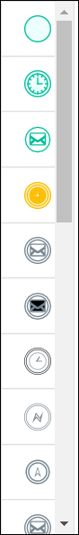
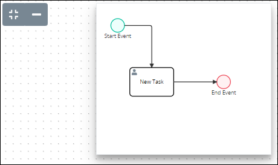

# Navigate Around Your Process Model

## Navigate Around Your Process Model


Your ProcessMaker user account or group membership must have the following permissions to navigate around the Process model unless your user account has the **Make this user a Super Admin** setting selected:

* Processes: View Processes
* Processes: Edit Processes

See the [Process](../../processmaker-administration/permission-descriptions-for-users-and-groups.md#processes) permissions or ask your ProcessMaker Administrator for assistance.


### Manual Navigation

Follow these steps to manually navigate around your Process model:

1. ​[View your Processes](https://processmaker.gitbook.io/processmaker-4-community/-LPblkrcFWowWJ6HZdhC/~/drafts/-LRhVZm0ddxDcGGdN5ZN/primary/designing-processes/viewing-processes/view-the-list-of-processes/view-your-processes#view-all-processes). The **Processes** page displays.
2. [Create a new Process](../viewing-processes/view-the-list-of-processes/create-a-process.md) or click the **Open Modeler** iconto edit the selected Process model. Process Modeler displays.
3. Click your cursor anywhere in the Process Modeler canvas not occupied by an element or control, hold the cursor, and then adjust the view of the Process Modeler canvas.

### Adjust the Viewing Size

If your Process model does not display in your browser window well such that you are navigating around your model with your cursor, adjust the zoom perspective of your model:

* Increase the viewing percentage to view fewer elements and controls.
* Decrease the viewing percentage to see an overview of the entire model.

Follow these steps to adjust the viewing size of your Process model:

1. ​[View your Processes](https://processmaker.gitbook.io/processmaker-4-community/-LPblkrcFWowWJ6HZdhC/~/drafts/-LRhVZm0ddxDcGGdN5ZN/primary/designing-processes/viewing-processes/view-the-list-of-processes/view-your-processes#view-all-processes). The **Processes** page displays.
2. [Create a new Process](../viewing-processes/view-the-list-of-processes/create-a-process.md) or click the **Open Modeler** iconto edit the selected Process model. Process Modeler displays.
3. Adjust the viewing percentage of the Process model following these guidelines:
   * Click thebutton to decrease the viewing percentage, thereby zooming out from the Process Modeler canvas.
   * Click thebutton to increase the viewing percentage, thereby zooming into the Process Modeler canvas.
   * Click the **Reset** button to reset the Process Modeler canvas viewing percentage to 100%.
4. [Manually navigate](navigate-around-your-process-model.md#navigate-around-your-process-model) around your Process model as necessary.

### Maximize the Process Modeler Canvas View

Maximize the Process Modeler canvas view:

* Minimize the Elements and Controls palette to the left side of the canvas. Doing so only displays the BPMN element and control icons \(shown below\).
* Hide the Settings palette to the right side of the canvas.

Following these steps to maximize the Process Modeler canvas view:

1. ​[View your Processes](https://processmaker.gitbook.io/processmaker-4-community/-LPblkrcFWowWJ6HZdhC/~/drafts/-LRhVZm0ddxDcGGdN5ZN/primary/designing-processes/viewing-processes/view-the-list-of-processes/view-your-processes#view-all-processes). The **Processes** page displays.
2. [Create a new Process](../viewing-processes/view-the-list-of-processes/create-a-process.md) or click the **Open Modeler** iconto edit the selected Process model. Process Modeler displays.
3. Click the **Maximize Canvas** icon. The Process Modeler canvas maximizes while the Maximize Canvas icon is enabled.


To disable the **Maximize Canvas** icon when it is enabled, click it to show Process Modeler's default canvas view.


### Quick Navigation

Instead of [manually navigating](navigate-around-your-process-model.md#navigate-around-your-process-model) your Process model, quickly view a specific location in your Process model. Doing so saves time and effort from manual navigation.

Follow these steps to quickly navigate your Process model:

1. ​[View your Processes](https://processmaker.gitbook.io/processmaker-4-community/-LPblkrcFWowWJ6HZdhC/~/drafts/-LRhVZm0ddxDcGGdN5ZN/primary/designing-processes/viewing-processes/view-the-list-of-processes/view-your-processes#view-all-processes). The **Processes** page displays.
2. [Create a new Process](../viewing-processes/view-the-list-of-processes/create-a-process.md) or click the **Open Modeler** iconto edit the selected Process model. Process Modeler displays.
3. Click the **Quick Navigation** icon. An overview of your entire Process model displays.  
4. Click the location in your Process model that you want to view. The selected location displays and the overview of your Process model hides.

## Related Topics





