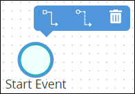

# Delete Process Model Elements or Controls

## Delete Process Model Elements or Controls

Deleting a Process model element or a [connector's control](model-processes-using-connectors/what-is-a-connector.md) also deletes any [Sequence Flow](model-your-process/process-modeling-element-descriptions.md#sequence-flow) and/or [Message Flow](model-your-process/process-modeling-element-descriptions.md#message-flow) elements incoming to or outgoing from that element. For example, if a Process model element is deleted that has both incoming and outgoing Sequence Flow elements, the Sequence Flow elements must be reconnected for the remaining elements/controls.


### Don't Know What Process Model Elements Are?

See [Process Modeling Element Descriptions](model-your-process/process-modeling-element-descriptions.md).

### Don't Know What a Connector or Control Is?

See [What is a Connector?](model-processes-using-connectors/what-is-a-connector.md).

### Permissions Required

Your ProcessMaker user account or group membership must have the following permissions to delete elements from the Process model unless your user account has the **Make this user a Super Admin** setting selected:

* Processes: View Processes
* Processes: Edit Processes

See the [Process](../../processmaker-administration/permission-descriptions-for-users-and-groups.md#processes) permissions or ask your ProcessMaker Administrator for assistance.


### Delete a Non-Pool Element or a Control

Follow these steps to delete any non-Pool element or a control from a Process model:

1. Select the non-Pool element/control to delete. Available options display above the selected element/control.  

   

2. Click the **Delete** icon. The Process model element/control is deleted.

### Delete a Pool Element


When a Pool element is deleted, all elements and controls within it are also deleted. If you want to keep the elements/controls within a Pool element, you must add those elements/controls outside of the Pool element prior to deleting the Pool element.

If you accidentally delete a Pool element with other elements/controls you want to keep, then select the **Undo** button.


Follow these steps to delete a Pool element from a Process model:

1. ​Select the Pool name in the Pool element to delete, thereby selecting the Pool element. Available options display to the right of the selected element.
2. Click the **Delete** icon. The Pool element is deleted. All non-Pool elements and controls within the Pool element are also deleted.

### Delete a Lane Element from a Pool Element

Follow these steps to delete a Lane element from a Pool element:

1. ​Select the Lane element in the Pool element to delete. Available options display above the selected element.
2. Click the **Delete** icon. The Pool element is deleted. All non-Pool elements and controls that were within the deleted Lane element stay in their current positions within the Pool element.

## Related Topics







