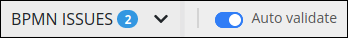

# Validate Your Process is BPMN 2.0 Compliant

## Overview

Before you deploy your Process model to production, ensure that it is BPMN 2.0 compliant for the following reasons:

* Minimize problems when testing your Process prior to deploying it. Regardless of whether your Process model is a self-contained business solution or one which calls another Process/is called by another Process, ensure that it functions correctly by validating its BPMN 2.0 compliance.
* Ensure that if you [export](../viewing-processes/view-the-list-of-processes/export-a-bpmn-compliant-process.md) the Process, you will be able to [import](../viewing-processes/view-the-list-of-processes/import-a-bpmn-compliant-process.md) it later. If the Process model is not BPMN 2.0 compliant, you will not successfully import the Process.
* If you share your Process model with either the open-source community or with other teams in your organization, ensure that the Process model is BPMN 2.0 compliant so that it is useful to others.

## Validate Your Process Is BPMN 2.0 Compliant


Your ProcessMaker user account or group membership must have the following permissions to validate the Process model is BPMN 2.0 compliant unless your user account has the **Make this user a Super Admin** setting selected:

* Processes: Edit Processes
* Processes: View Processes

See the [Process](../../processmaker-administration/permission-descriptions-for-users-and-groups.md#processes) permissions or ask your ProcessMaker Administrator for assistance.


Follow these steps to validate your Process model is BPMN 2.0 compliant:

1. ​[View your Processes](https://processmaker.gitbook.io/processmaker-4-community/-LPblkrcFWowWJ6HZdhC/~/drafts/-LRhVZm0ddxDcGGdN5ZN/primary/designing-processes/viewing-processes/view-the-list-of-processes/view-your-processes#view-all-processes). The **Processes** page displays.
2. ​[Create a new Process](https://processmaker.gitbook.io/processmaker-4-community/-LPblkrcFWowWJ6HZdhC/~/edit/drafts/-LauIZVG_nBSIczT8ilV/designing-processes/viewing-processes/view-the-list-of-processes/create-a-process) or click the **Open Modeler** icon​to edit the selected Process model. Process Modeler displays.
3. Enable the **Auto validate** toggle key so that Process Modeler automatically validates your Process model as you work.
4. Design your Process model. Process Modeler indicates any BPMN 2.0 compliance issues as you design. The following indicators may occur:
   * **No errors found:** If no errors are found, the following text displays to the left of the **Auto validate** toggle key: **BPMN VALID**. The green check mark displays. Your Process model is BPMN 2.0 compliant.
   * **Errors are found:** If errors are found, a drop-down menu displays to the left of the **Auto validate** toggle key with the following text: **BPMN ISSUES**. The amount of errors displays.  
      

     After clicking the **BPMN ISSUES** drop-down menu, the Process Modeler displays how any errors to the right of the **Auto validate** toggle key. Each error icon displayswith a summary of the error. Below is an example.

     

     Furthermore, Process model elements that are associated with errors display a red-colored highlight. However, the red-colored highlight does not display if your Process model is missing required elements, such as a [Start Event](model-your-process/process-modeling-element-descriptions.md#start-event) or [End Event](model-your-process/process-modeling-element-descriptions.md#end-event) element.

     
5. If errors are found, click the **BPMN ISSUES** drop-down again to hide the error summary. Make changes to your Process model and then repeat steps 4 and 5 again until Process Modeler finds no BPMN compliance errors.

## Related Topics











