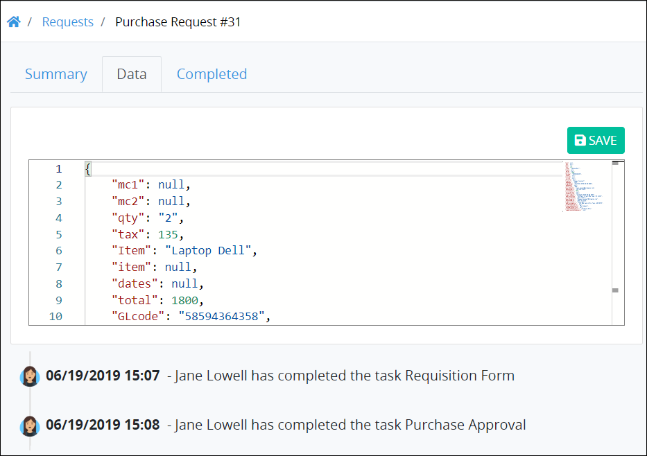

# Reference Magic Variables in ProcessMaker Assets

## Overview

ProcessMaker uses a set of Magic Variables that you may reference in ProcessMaker Query Language \(PMQL\) queries and in your ProcessMaker assets, such as ProcessMaker [Scripts](scripts/what-is-a-script.md) and [Screens](design-forms/what-is-a-form.md).

ProcessMaker uses a schema-less JSON data model from which to read, write, and store Request data. Since the JSON data model is schema-less \(meaning that it does not require a specific schema or structure from which ProcessMaker assets must conform\), the JSON data model is structured from the JSON objects in ProcessMaker assets used in a Request: the **Variable Name** setting values in a ProcessMaker Screen or Request variables a ProcessMaker Script creates. When an in-progress Request routes through the Process, Request data aggregates into the JSON data model, thereby becoming Request data.

However, ProcessMaker uses a set of Magic Variables that become part of the JSON data model for all Requests. ProcessMaker uses these Magic Variables to store ProcessMaker user, Process, and Request related data for all Requests. During an in-progress Request, these ProcessMaker Magic Variables are updated. All ProcessMaker Magic Variables are preceded by an underscore \(`_`\) character in the JSON data model.

ProcessMaker [users](../processmaker-administration/add-users/what-is-a-user.md) that have the [Requests: Edit Request Data](../processmaker-administration/permission-descriptions-for-users-and-groups.md#requests) permission may view the JSON data model for a completed Request. This JSON data model displays from the [**Data** tab in a completed Request's summary](../using-processmaker/requests/request-details/summary-for-completed-requests.md#editable-request-data). Below is an example.



## How to Use Magic Variables

Use ProcessMaker Magic Variables in a variety of ways in ProcessMaker and in ProcessMaker assets.

### Reference in PMQL Queries for Request and Task Searches

Reference ProcessMaker Magic Variables to compose ProcessMaker Query Language \([PMQL](../using-processmaker/search-processmaker-data-using-pmql.md)\) advanced queries for [Request searches](../using-processmaker/requests/search-for-a-request.md#advanced-search-for-a-request) and [Task searches](../using-processmaker/task-management/search-for-a-task.md#advanced-search-for-a-task).

### Mock in Script Testing


Your ProcessMaker user account or group membership must have the following permissions to edit a [ProcessMaker Script](scripts/what-is-a-script.md) unless your user account has the **Make this user a Super Admin** setting selected:

* Scripts: Edit Scripts
* Scripts: View Scripts

See the ProcessMaker [Scripts](../processmaker-administration/permission-descriptions-for-users-and-groups.md#scripts) permissions or ask your ProcessMaker Administrator for assistance.


[Mock ProcessMaker Magic Variable values while mocking Request data](scripts/scripts-editor.md#mock-request-data-coming-into-the-processmaker-script) during testing to ensure your ProcessMaker Script runs as you intended.

### Reference in Screens


Your ProcessMaker user account or group membership must have the following permissions to edit a ProcessMaker Screen control unless your user account has the **Make this user a Super Admin** setting selected:

* Screens: Edit Screens
* Screens: View Screens

See the ProcessMaker [Screens](../processmaker-administration/permission-descriptions-for-users-and-groups.md#screens) permissions or ask your ProcessMaker Administrator for assistance.


Reference ProcessMaker Magic Variables in ProcessMaker Screens in the following ways:

* \*\*\*\*[**Rich Text controls**](design-forms/screens-builder/control-descriptions/rich-text-control-settings.md)**:** Reference a ProcessMaker Magic Variable's value in a Rich Text control through the **Rich Text Content** setting.
* \*\*\*\*[**Computed Properties**](design-forms/screens-builder/manage-computed-properties/)**:** [Reference a ProcessMaker Magic Variable's value from a computed Property](design-forms/screens-builder/manage-computed-properties/#add-a-computed-property). Use JavaScript to return a ProcessMaker Magic Variable's value, then store it in a computed Property.

## Example of All Magic Variables

Below is an example that contains all ProcessMaker Magic Variables. Each contains a value as it might be read from the [**Data** tab in a completed Request summary](../using-processmaker/requests/request-details/summary-for-completed-requests.md#editable-request-data). This example indicates the JSON structure for each ProcessMaker Magic Variable.

```text
{
    "_user": {
        "id": 1,
        "fax": "723.743.8058 x00631",
        "cell": "585.620.0749",
        "city": "Donnaland",
        "email": "lauretta.okuneva@robel.com",
        "media": [],
        "phone": "1-316-934-1911 x762",
        "state": "WV",
        "title": "Customer Service Representative",
        "avatar": "",
        "postal": "97304-3230",
        "status": "ACTIVE",
        "address": "8547 Marielle Hills",
        "country": "US",
        "fullname": "admin admin",
        "language": "en",
        "lastname": "admin",
        "timezone": "America/Los_Angeles",
        "username": "admin",
        "birthdate": "1962-10-23",
        "firstname": "admin",
        "created_at": "2019-07-19T08:13:13-07:00",
        "deleted_at": null,
        "expires_at": null,
        "updated_at": "2019-07-19T08:14:35-07:00",
        "loggedin_at": "2019-07-19T08:14:35-07:00",
        "datetime_format": "m/d/Y H:i",
        "is_administrator": true
    },
    "_request": {
        "id": 1,
        "name": "Pet adoption",
        "status": "ACTIVE",
        "process": {
            "id": 1,
            "name": "Pet adoption",
            "status": "ACTIVE",
            "user_id": 1,
            "created_at": "2019-03-25T10:50:46-07:00",
            "deleted_at": null,
            "updated_at": "2019-07-19T08:15:18-07:00",
            "description": "Pet rescue",
            "cancel_screen_id": null,
            "pause_timer_start": 0,
            "process_category_id": 1,
            "has_timer_start_events": false
        },
        "user_id": 1,
        "created_at": "2019-07-19T08:15:24-07:00",
        "process_id": 1,
        "updated_at": "2019-07-19T08:15:24-07:00",
        "callable_id": "ProcessId",
        "initiated_at": "2019-07-19T08:15:24-07:00"
    }
}
```

## Magic Variable Descriptions

Below are descriptions of each ProcessMaker Magic Variable. Since these descriptions are outlined in tabular format, they do not imply how they are structured in the JSON data model. Refer to the example in the [Example of All Magic Variables](reference-global-variables-in-your-processmaker-assets.md#example-of-all-global-variables) section to see how each JSON object is structured in the overall JSON data model.

### `_user` Magic Variable

The `_user` Magic Variable contains data about the current ProcessMaker user assigned a [Task](process-design/model-your-process/process-modeling-element-descriptions.md#task) element or [Manual Task](process-design/model-your-process/process-modeling-element-descriptions.md#manual-task) element during an in-progress Request. Use JSON dot notation to reference specific data in a Magic Variable. Example: `_user.fullname`. If a Magic Variable contains no data, `null` is the value.

| Magic Variable Name | Description |
| :--- | :--- |
| `_user.id` | Identifier for the ProcessMaker user in that ProcessMaker instance. Automatically increments for each created ProcessMaker user. |
| `_user.fax` | Fax number as entered into the ProcessMaker [user's profile](../using-processmaker/profile-settings.md). |
| `_user.cell` | Cell number as entered into the ProcessMaker user's profile. |
| `_user.city` | City as entered into the ProcessMaker user's profile. |
| `_user.email` | Email address as entered into the ProcessMaker user's profile. |
| `_user.media` |  |
| `_user.phone` | Telephone number as entered into the ProcessMaker user's profile. |
| `_user.state` | State, region, or province as selected in the ProcessMaker user's profile. |
| `_user.title` | Job title as entered into the ProcessMaker user's profile. |
| `_user.avatar` | Image reference for the ProcessMaker user's avatar as entered into the ProcessMaker user's profile. |
| `_user.postal` | Business postal code as entered into the ProcessMaker user's profile. |
| `_user.status` | Status of the ProcessMaker user's account \(active or inactive\). |
| `_user.address` | Business address as entered into the ProcessMaker user's profile. |
| `_user.fullname` | Full name of the ProcessMaker user as entered into the ProcessMaker user's profile. |
| `_user.language` | Language to display ProcessMaker labels as selected in the ProcessMaker user's profile. |
| `_user.timezone` | Time zone as selected in the ProcessMaker user's profile. |
| `_user.username` | User name for the ProcessMaker user as entered into the ProcessMaker user's profile. |
| `_user.birthdate` | Birth date for the ProcessMaker user. This is not entered into a user profile. |
| `_user.firstname` | First name for the ProcessMaker user as entered into the ProcessMaker user's profile. |
| `_user.created_at` | Datetime the ProcessMaker user account was created. |
| `_user.deleted_at` | Datetime the ProcessMaker user account was deleted, if applicable. |
| `_user.expires_at` | Datetime the ProcessMaker user account expires, if applicable. |
| `_user.updated_at` | Datetime the ProcessMaker user account was updated, if applicable.  |
| `_user.loggedin_at` | Datetime the ProcessMaker user logged on to the account, if applicable. |
| `_user.datetime_format` | Datetime format setting as selected in the ProcessMaker user's profile. |
| `_user.is_administrator` | Indicates if the ProcessMaker user account is granted the [**Make this user a Super Admin** option](../processmaker-administration/add-users/manage-user-accounts/edit-a-user-account.md#edit-a-processmaker-user-account). `true` or `false` values. |

### `_request` Magic Variable

The `_request` Magic Variable contains data about the current [Request](../using-processmaker/requests/what-is-a-request.md) or [Process](viewing-processes/what-is-a-process.md) during an in-progress Request. Use JSON dot notation to reference specific data in a Magic Variable. Example: `_request.process.name`. If a Magic Variable contains no data, `null` is the value.

| Magic Variable Name | Description |
| :--- | :--- |
| `_request.id` | Request identifier for its associated Process. Automatically increments for each Request instance. |
| `_request.name` | Name of the Process associated with the Request. |
| `_request.status` | Status of the Request. `ACTIVE` or `INACTIVE` values. |
| `_request.process.id` | Identifier for the Process associated with the Request. Automatically increments for each Process created in the ProcessMaker instance. |
| `_request.process.name` | Name of the Process associated with the Request. |
| `_request.process.status` | Status of the Process associated with the Request. `ACTIVE` or `INACTIVE` values. |
| `_request.process.user_id` | Identifier for the ProcessMaker user that created the Process associated with the Request. |
| `_request.process.created_at` | Timedate the Process associated with the Request was created. |
| `_request.process.deleted_at` | Timedate the Process associated with the Request was archived. |
| `_request.process.updated_at` | Timedate the Process associated with the Request was updated. |
| `_request.process.description` | Description of the Process that is associated with the Request. |
| `_request.process.cancel_screen_id` | Identifier for the Display-type ProcessMaker Screen that is selected to display when a Request is canceled. |
| `_request.process.pause_timer_start` | Start Event Timer setting \(in minutes\) to start a Request. |
| `_request.process.process_category_id` | Identifier for the Process Category associated with the Request. Automatically increments for each Process Category created in the ProcessMaker instance. |
| `_request.process.has_timer_start_events` | Indicates that the Process associated with the Request has at least one Start Timer Event element. `true` or `false` values. |
| `_request.user_id` | Identifier for the ProcessMaker user assigned the Task/Manual Task at that moment in the Request. |
| `_request.created_at` | Datetime the ProcessMaker user account was create that is associated with the `_request.user_id` Magic Variable. |
| `_request.process_id` | Identifier associated with the Process in the ProcessMaker instance. Automatically increments for each Process created in that ProcessMaker instance. |
| `_request.updated_at` | Datetime the Process associated with the Request was last updated, if applicable. |
| `_request.callable_id` | Callable identifier for the Process associated with the Request. `ProcessId` is the value. |
| `_request.initiated_at` | Datetime the Request was started. |

## Related Topics















