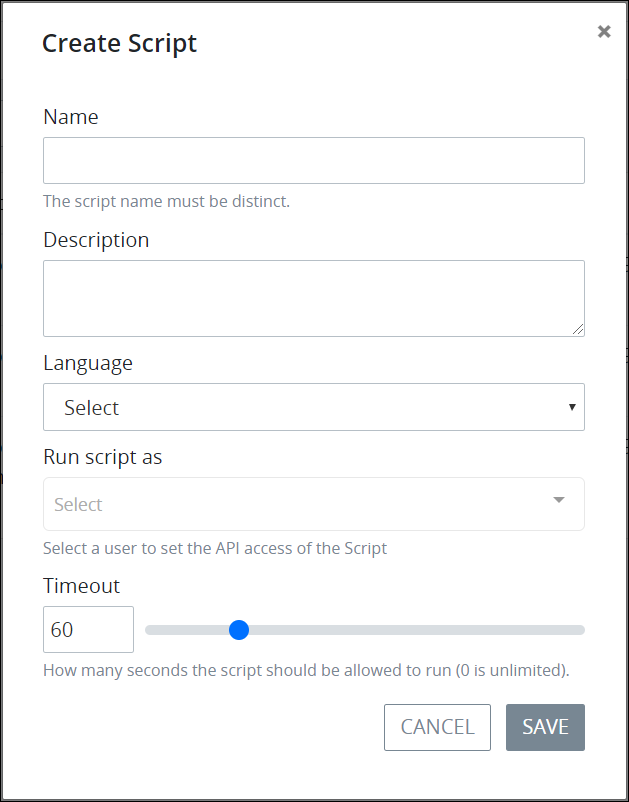

# Create a New Script

## Create a New ProcessMaker Script


Your user account or group membership must have the following permissions to create a ProcessMaker Script:

* Scripts: View Scripts
* Scripts: Create Scripts

See the ProcessMaker [Scripts](../../../processmaker-administration/permission-descriptions-for-users-and-groups.md#scripts) permissions or ask your ProcessMaker Administrator for assistance.


Follow these steps to create a new ProcessMaker Script:

1. [View your ProcessMaker Scripts](view-all-scripts.md). The **Scripts** page displays.
2. Click the **+Script** button. The **Create Script** screen displays.  

   

3. In the **Name** field, enter the name of the ProcessMaker Script. This is a required field.
4. In the **Description** field, enter the description of the ProcessMaker Script.
5. From the **Language** drop-down menu, select one of the following programming languages in which the ProcessMaker Script is written:
   * PHP
   * Lua
6. From the **Run script as** drop-down menu, select which ProcessMaker user's API client authentication key to use with the ProcessMaker Script. This is a required field. Ensure that ProcessMaker user has the API client authentication key configured. See [Create a New Client Authentication Key](../../../processmaker-administration/auth-client-management/manage-client-authentications/create-a-new-client-authentication-key.md#create-a-client-authentication-key).
7. In the **Timeout** field, use the slider control or enter how many seconds the ProcessMaker Script is allowed to run before it times out. Use `0` to indicate that the ProcessMaker Script never times out. The default timeout is **60** seconds.
8. Click **Save**. Scripts Editor displays so you can develop your ProcessMaker Script. See [Scripts Editor](../scripts-editor.md).

## Related Topics

















