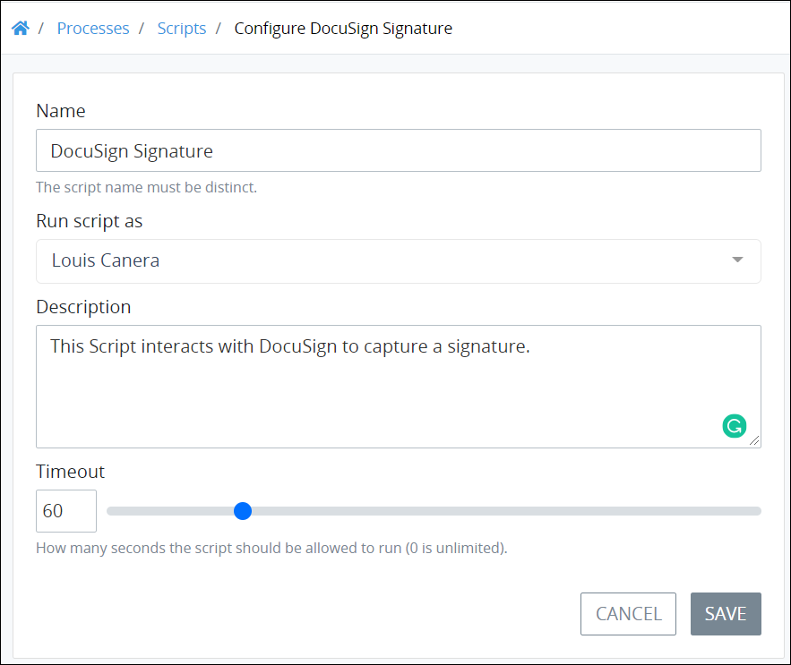

# Configure a Script

## Configure a ProcessMaker Script


Your ProcessMaker user account or group membership must have the following permissions to configure a ProcessMaker Script unless your user account has the **Make this user a Super Admin** setting selected:

* Scripts: View Scripts
* Scripts: Edit Scripts

See the ProcessMaker [Scripts](../../../processmaker-administration/permission-descriptions-for-users-and-groups.md#scripts) permissions or ask your ProcessMaker Administrator for assistance.


Follow these steps to configure a ProcessMaker Script:

1. [View your ProcessMaker Scripts.](view-all-scripts.md#view-all-processmaker-scripts) The **Scripts** page displays.
2. Click the **Configure** iconfor your ProcessMaker Script. The **Edit Configuration** page displays.  

   

3. Edit the following information about the ProcessMaker Script as necessary:
   * In the **Name** field, edit the ProcessMaker Script name. This is a required field.
   * From the **Category** drop-down menu, select one or more Script Categories to associate with this ProcessMaker Script. In doing so, [Script Categories](manage-script-categories/what-is-a-script-category.md) may be sorted from the [**Scripts** page](view-all-scripts.md#view-all-processmaker-scripts). To remove a Script Category that is currently selected, click the icon for that selection or press `Enter` when the drop-down is visible. This is a required field.
   * From the **Run script as** drop-down menu, select which ProcessMaker user's API client token to use with the ProcessMaker REST API. Ensure that the selected ProcessMaker user's account has the appropriate API [permissions](../../../processmaker-administration/permission-descriptions-for-users-and-groups.md) to access the ProcessMaker REST API. This is a required field. 
   * In the **Description** field, edit the description of the ProcessMaker Script. This is a required field.
   * In the **Timeout** field, use the slider control or enter how many seconds the ProcessMaker Script is allowed to run before it times out. Use `0` to indicate that the ProcessMaker Script never times out. The default timeout is **60** seconds. This field requires an integer.
4. Click **Save**.

## Related Topics



















