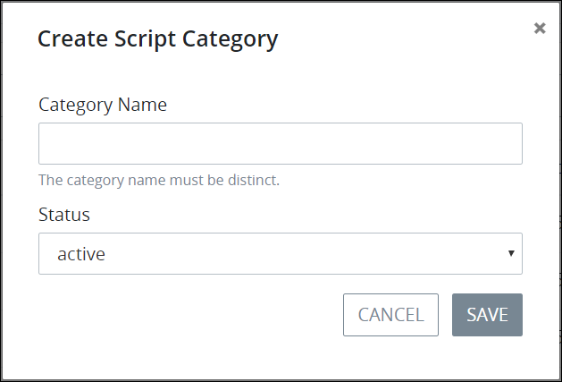

# Create a New Script Category

## Create a New Script Category


Your user account or group membership must have the following permissions to create a new Script Category unless your user account has the **Make this user a Super Admin** setting selected:

* Scripts: Create Script Categories
* Scripts: View Script Categories
* Scripts: View Scripts

See the [Scripts](../../../../processmaker-administration/permission-descriptions-for-users-and-groups.md#scripts) permissions or ask your ProcessMaker Administrator for assistance.


Follow these steps to create a new [Script Category](what-is-a-script-category.md):

1. [View your Script Categories](view-script-categories.md#view-script-categories).
2. Click the **+Category** button. The **Create Script Category** screen displays.  
3. In the **Category Name** field, enter the name of the new Script Category. The Script Category name must be unique from all other Script Category names in your organization and can only use apostrophe characters \(`'`\) and spaces. This is a required field.
4. From the **Status** drop-down menu, select one of the following options for the Script Category's status:

   * **Active:** Active Script Categories can have ProcessMaker Scripts assigned to them.
   * **Inactive:** Inactive Script Categories cannot have ProcessMaker Scripts assigned to them.

   This is a required field.

5. Click **Save**.

## Related Topics











