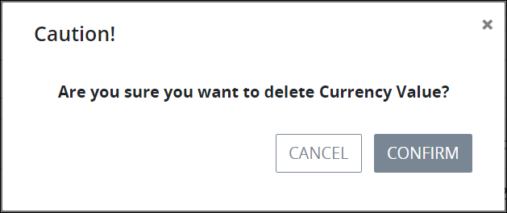

# Delete a Script Category

## Delete a Script Category


Your user account or group membership must have the following permissions to delete a Script Category:

* Categories: View Categories
* Categories: Delete Categories

See the [Categories](../../../../processmaker-administration/permission-descriptions-for-users-and-groups.md#categories) permissions or ask your ProcessMaker Administrator for assistance.



To delete a Script Category, no ProcessMaker Scripts can be assigned to it. Reassign those ProcessMaker Scripts to another Script Category.

Furthermore, deleting a Script Category cannot be undone.


A Script Category cannot be deleted until no ProcessMaker Scripts are assigned to it. If any ProcessMaker Scripts are assigned to the Script Category, its **Delete** icondoes not display.

Follow these steps to delete a [Script Category](what-is-a-script-category.md):

1. [View your Script Categories](view-script-categories.md#view-script-categories).
2. Select the **Delete** icon. A message displays to confirm deletion of the Script Category.  
3. Click **Confirm**. The following message displays: **The category was deleted.**

## Related Topics











