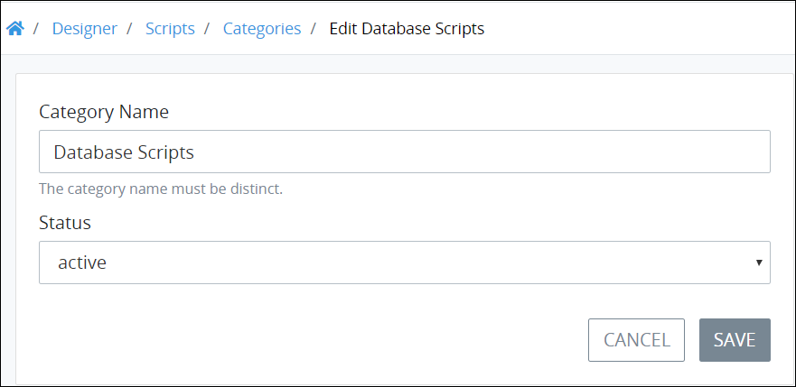

# Edit a Script Category

## Edit a Script Category


Your user account or group membership must have the following permissions to edit a Script Category unless your user account has the **Make this user a Super Admin** setting selected:

* Scripts: Create Script Categories
* Scripts: Edit Script Categories
* Scripts: View Script Categories
* Scripts: View Scripts

See the [Scripts](../../../../processmaker-administration/permission-descriptions-for-users-and-groups.md#scripts) permissions or ask your ProcessMaker Administrator for assistance.


Follow these steps to edit a [Script Category](what-is-a-script-category.md):

1. [View your Script Categories](view-script-categories.md#view-script-categories).
2. Select the **Edit** icon. The **Edit Script Category** page displays.  
3. Edit the following information about the Script Category as necessary:
   * In the **Category Name** setting, edit the name of the Script Category if necessary. The Script Category name must be unique from all other Script Category names in your organization. This is a required setting.
   * From the **Status** drop-down menu, change the status of the Script Category, if necessary, from the following options:

     * **Active:** Active Script Categories can have ProcessMaker Scripts assigned to them.
     * **Inactive:** Inactive Script Categories cannot have ProcessMaker Scripts assigned to them.

     This is a required setting.
4. Click **Save**.

## Related Topics











