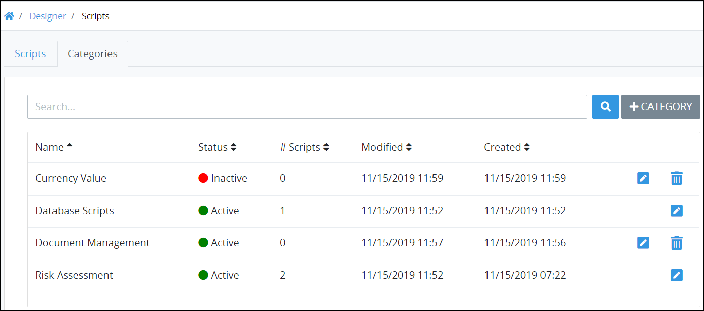

# View Script Categories

## View Script Categories


Your ProcessMaker user account or group membership must have the following permissions to view Script Categories unless your user account has the **Make this user a Super Admin** setting selected:

* Script: View Script Categories
* Script: View Scripts

See the [Scripts](../../../../processmaker-administration/permission-descriptions-for-users-and-groups.md#scripts) permissions or ask your ProcessMaker Administrator for assistance.


Follow these steps to view [Script Categories](what-is-a-script-category.md):

1. [Log on](../../../../using-processmaker/log-in.md#log-in) to ProcessMaker.
2. Click the **Designer** option from the top menu. The **Processes** page displays.
3. Click the **Scripts** icon from the left sidebar. The **Scripts** tab displays all ProcessMaker Scripts in the **Scripts** page.
4. Click the **Categories** tab. The Script Categories display.

The **Categories** tab displays the following information in tabular format about Script Categories:

* **Name:** The **Name** column displays the name of the Script Category.
* **Status:** The **Status** column displays the status of the Script Category. Below is a description of each status:
  * **Active:** Active Script Categories can have ProcessMaker Scripts assigned to them.
  * **Inactive:** Inactive Script Categories cannot have ProcessMaker Scripts assigned to them.
* **Scripts:** The **\# Scripts** column displays how many ProcessMaker Scripts in your organization have been assigned to that Script Category.
* **Modified:** The **Modified** column displays the date and time the Script Category was last modified. The time zone setting to display the time is according to the ProcessMaker instance unless your [user profile's](../../../../using-processmaker/profile-settings.md#change-your-profile-settings) **Time zone** setting is specified.
* **Created:** The **Created** column displays the date and time the Script Category was created. The time zone setting to display the time is according to the ProcessMaker instance unless your [user profile's](../../../../using-processmaker/profile-settings.md#change-your-profile-settings) **Time zone** setting is specified.


### No Script Categories? 

If no Script Categories exist, the following message displays: **No Results**.

### Display Information the Way You Want It 

​[Control how tabular information displays](https://processmaker.gitbook.io/processmaker-4-community/-LPblkrcFWowWJ6HZdhC/~/drafts/-LWD5skTaOptuIWIWk76/primary/using-processmaker/control-how-requests-display-in-a-tab), including how to sort columns or how many items display per page.


## Related Topics











