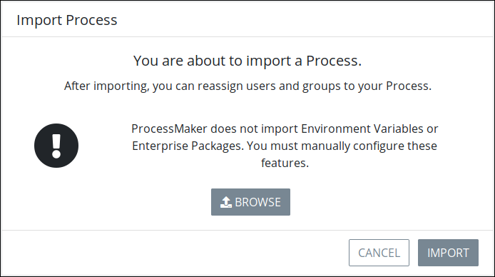
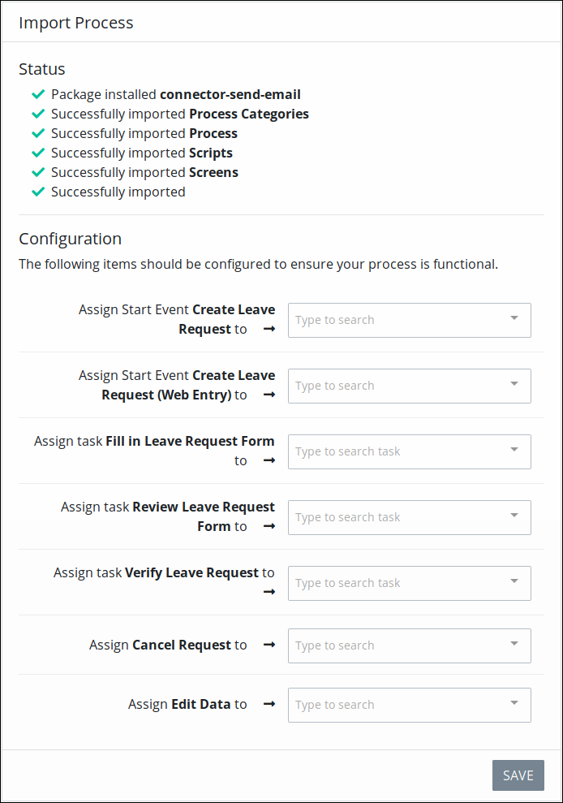

# Import a ProcessMaker Version 4 Process

## Overview

Importing and [exporting](export-a-bpmn-compliant-process.md) Processes in your organization makes it easy for Process designers and business analysts in your organization to share business processes. You may have a respected colleague in another department or office that has designed a Process using ProcessMaker version 4 for her team. If you are also using the same ProcessMaker version, you can import her Process to use in your team.

Import validated ProcessMaker Processes that have been [exported](export-a-bpmn-compliant-process.md) from the same [ProcessMaker version](../../../using-processmaker/application-version-details.md#view-processmaker-version-information). A validated ProcessMaker Process is [BPMN 2.0 compliant](https://www.omg.org/spec/BPMN/2.0/About-BPMN/) and has been [validated in Process Modeler](../../process-design/validate-bpmn-2.0-compliance.md) before that Process was exported. The Process can be imported from the same or different ProcessMaker instance. Exported ProcessMaker Spark Processes have the `.json` file extension.

The following ProcessMaker components are imported from a validated ProcessMaker Process if they are specified in that Process:

* [Process model elements](../../process-design/model-your-process/process-modeling-element-descriptions.md#overview)
* [ProcessMaker Scripts](../../scripts/what-is-a-script.md) configured for [Script Task elements](../../process-design/model-your-process/add-and-configure-script-task-elements.md) as well as their Script configurations
* [ProcessMaker Screens](../../design-forms/what-is-a-form.md) configured for [Task elements](../../process-design/model-your-process/add-and-configure-task-elements.md)
* [ProcessMaker Environment Variables](../../environment-variable-management/what-is-an-environment-variable.md), but not the sensitive data an Environment Variable contained in the original Process

ProcessMaker does not import ProcessMaker [users](../../../processmaker-administration/add-users/what-is-a-user.md) or [groups](../../../processmaker-administration/assign-groups-to-users/what-is-a-group.md) associated with the original Process. Therefore, Task element assignments are not imported. However, as part of the importing procedure, you have an opportunity to assign ProcessMaker users, groups, and Process configuration settings.

## Import a Validated ProcessMaker Version 4 Process


Your ProcessMaker user account or group membership must have the following permissions to import a ProcessMaker version 4 Process unless your user account has the **Make this user a Super Admin** setting selected:

* Processes: View Processes
* Processes: Import Processes

See the ProcessMaker [Processes](../../../processmaker-administration/permission-descriptions-for-users-and-groups.md#processes) permissions or ask your ProcessMaker Administrator for assistance.


Follow these steps to import a validated ProcessMaker version 4 Process:

1. [View your active Processes.](./#view-your-processes) The **Processes** tab displays.
2. Click the **Import** button. The following message displays: **You are about to import a Process. User assignments and sensitive environment variables will not be imported.**  

   

3. Click **Browse** to locate the ProcessMaker version 4 Process to import. ProcessMaker version 4 Processes have the `.json` file extension.
4. Click **Import**. The **Import Process** screen displays the following:

   * **Status:** The **Status** section displays an overview of which Process components imported successfully.
   * **Configuration:** Use the **Configuration** section to assign whom in your organization can participate in your imported Process to make the Process functional.

   Below is an example of an imported Process. 

   

5. From the **Configuration** section, assign whom in your organization can participate in your imported Process. Follow these guidelines:
   * **Assign each** [**Start Event**](../../process-design/model-your-process/process-modeling-element-descriptions.md#start-event) **element to the ProcessMaker user\(s\) and/or group\(s\)**

     Assign which ProcessMaker user\(s\) and/or group\(s\) can start a Request of your imported Process. Type into the **Assign Start Event** field to filter ProcessMaker users and/or groups that display in that field's drop-down menu. To remove a ProcessMaker user or group that is currently selected, click theicon for that selection or press `Enter` when the drop-down is visible.

   * **Assign each** [**Task**](../../process-design/model-your-process/process-modeling-element-descriptions.md#task) **element to the ProcessMaker user and/or groups**

     Assign which ProcessMaker user and/or group is to do each Task in the Process. In doing so, optionally use either of the following special assignments:

     * **Requester:** Use the **Requester** special assignment option to assign that Task to the ProcessMaker user who started the Request.
     * **Previous Task Assignee:** Use the **Previous Task Assignee** option to assign that Task to the ProcessMaker user who did the previous Task in the Process.

   * **Assign which ProcessMaker user\(s\) and/or group\(s\) can cancel Requests**

     Assign which ProcessMaker user\(s\) and/or group\(s\) can [cancel Requests](../../../using-processmaker/requests/delete-a-request.md) for your imported Process. If no users or groups are selected, no one can cancel a Request from this Process. Type into the **Assign Cancel Request** field to filter ProcessMaker users and/or groups that display in that field's drop-down menu. To remove a ProcessMaker user or group that is currently selected, click theicon for that selection or press `Enter` when the drop-down is visible.

   * **Assign which ProcessMaker user\(s\) and/or group\(s\) can edit Request data**

     Assign which ProcessMaker user\(s\) or group\(s\) have permission to [edit Request data](../../../using-processmaker/requests/request-details/summary-for-completed-requests.md#editable-request-data) from this Process. By editing Request data, these users and group members can adjust the data that Request participants have submitted during a Request. If no users or groups are selected, no one can edit Request data from this Process. Type into the **Assign Edit Data** field to filter ProcessMaker users and/or groups that display in that field's drop-down menu. To remove a ProcessMaker user or group that is currently selected, click theicon for that selection or press `Enter` when the drop-down is visible.
6. Click **Save**. The **Processes** page displays the imported Process with the same name as the original ProcessMaker Process except with a number "2" suffix.  

   


If the original ProcessMaker version 4 Process cannot import successfully, the following message displays: **Unable to import the process.** Ensure that the original ProcessMaker Process validates as BPMN 2.0 compliant.


## Related Topics





























