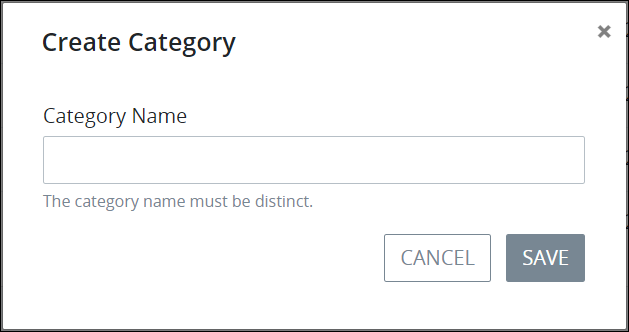

# Create a New Process Category

## Create a New Process Category


Your user account or group membership must have the following permissions to create a new Process Category unless your user account has the **Make this user a Super Admin** setting selected:

* Processes: Create Process Categories
* Processes: View Process Categories
* Processes: View Processes

See the ProcessMaker [Processes](../../../../processmaker-administration/permission-descriptions-for-users-and-groups.md#processes) permissions or ask your ProcessMaker Administrator for assistance.


Follow these steps to create a new [Process Category](what-is-a-process-category.md):

1. [View your Process Categories](view-process-categories.md#view-process-categories).
2. Click the **+Category** button. The **Create Process Category** screen displays.  

   

3. In the **Category Name** setting, enter the name of the new Process Category. The Process Category name must be unique from all other Process Category names in your organization and can only use apostrophe characters \(`'`\) and spaces. This is a required setting.
4. From the **Status** drop-down menu, select one of the following options for the Process Category's status:

   * **Active:** Select **Active** to allow Processes to be assigned to this Process Category. This is the default option.
   * **Inactive:** Select **Inactive** to create this Process Category but not be available to assign Processes to it. Inactive Process Categories cannot have Processes assigned to them. Furthermore, Processes assigned to an inactive Category no longer display in the **New Request** screen even though such Processes may be active.

   This is a required setting.

5. Click **Save**.

## Related Topics











