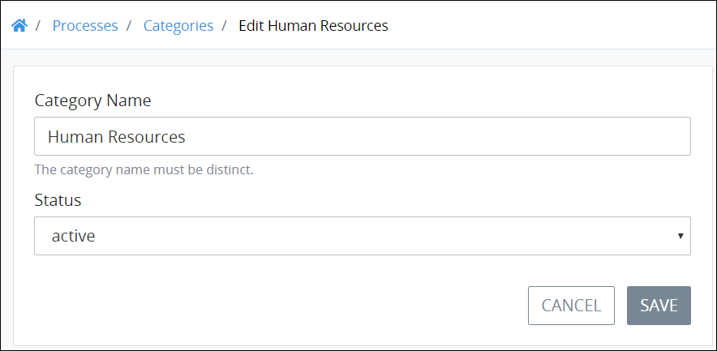

# Edit a Process Category

## Edit a Process Category


Your user account or group membership must have the following permissions to edit a Process Category:

* Categories: View Categories
* Categories: Create Categories
* Categories: Edit Categories

See the Process [Categories](../../../../processmaker-administration/permission-descriptions-for-users-and-groups.md#categories) permissions or ask your ProcessMaker Administrator for assistance.


Follow these steps to edit a [Process Category](what-is-a-process-category.md):

1. [View your Process Categories](view-process-categories.md#view-process-categories).
2. Select the **Edit** icon. The **Edit Process Category** page displays.  

   

3. Edit the following information about the Process Category as necessary:
   * In the **Category Name** field, edit the name of the Category if necessary. The Process Category name must be unique from all other Process Category names in your organization. This is a required field.
   * From the **Status** drop-down menu, change the status of the Process Category, if necessary, from the following options:

     * **Active:** Select **Active** to allow Processes to be assigned to this Process Category.
     * **Inactive:** Select **Inactive** to create this Process Category but not be available to assign Processes to it. Inactive Process Categories cannot have Processes assigned to them. Furthermore, Processes assigned to an inactive Category no longer display in the **New Request** screen even though such Processes may be active.

     This is a required field.
4. Click **Save**.

## Related Topics











