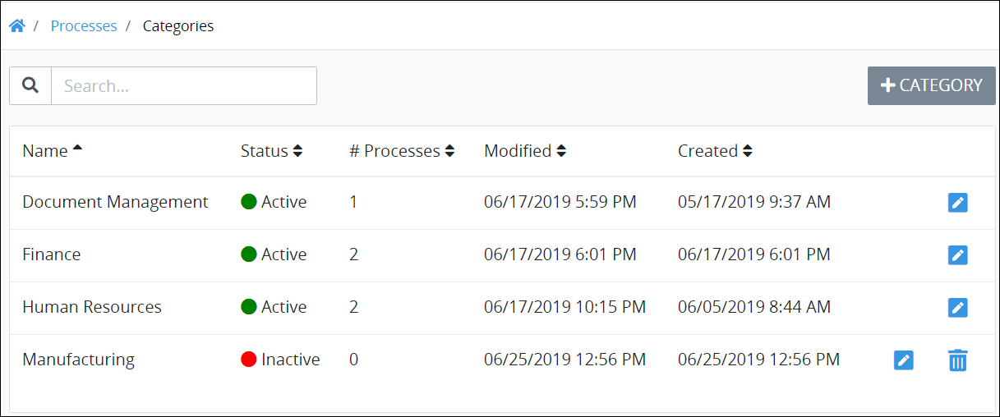

# View Process Categories

## View Process Categories


Your ProcessMaker user account or group membership must have the "Categories: View Categories" permission to view the list of Process Categories unless your user account has the **Make this user a Super Admin** setting selected.

See the Process [Categories](../../../../processmaker-administration/permission-descriptions-for-users-and-groups.md#categories) permissions or ask your ProcessMaker Administrator for assistance.


Follow these steps to view [Process Categories](what-is-a-process-category.md):

1. [Log on](../../../../using-processmaker/log-in.md#log-in) to ProcessMaker.
2. Click the **Processes** option from the top menu. The **Processes** page displays.
3. Click the **Process Categories** icon in the left sidebar. The **Categories** page displays.

The **Categories** page displays the following information in tabular format about Process Categories:

* **Name:** The **Name** column displays the name of the Process Category.
* **Status:** The **Status** column displays the status of the Process Category. Below is a description of each status:
  * **Active:** An active Process Category can have Processes assigned to it.
  * **Inactive:** An inactive Process Category can no longer be selected when [assigning a Process to a Category](../create-a-process.md#create-a-new-process). Furthermore, Processes assigned to an inactive Category [no longer display to Requesters](../../../../using-processmaker/requests/make-a-request.md#start-a-request) even though such Processes may be active.
* **Processes:** The **\# Processes** column displays how many Processes in your organization have been assigned to that Process Category.
* **Modified:** The **Modified** column displays the date and time the Process Category was last modified. The time zone setting to display the time is according to the ProcessMaker Spark server unless your [user profile's](../../../../using-processmaker/profile-settings.md#change-your-profile-settings) **Time zone** setting is specified.
* **Created:** The **Created** column displays the date and time the Process Category was created. The time zone setting to display the time is according to the ProcessMaker Spark server unless your [user profile's](../../../../using-processmaker/profile-settings.md#change-your-profile-settings) **Time zone** setting is specified.


### No Process Categories? 

If no Process Categories exist, the following message displays: **No Results**.

### Display Information the Way You Want It 

​[Control how tabular information displays](https://processmaker.gitbook.io/processmaker-4-community/-LPblkrcFWowWJ6HZdhC/~/drafts/-LWD5skTaOptuIWIWk76/primary/using-processmaker/control-how-requests-display-in-a-tab), including how to sort columns or how many items display per page.


