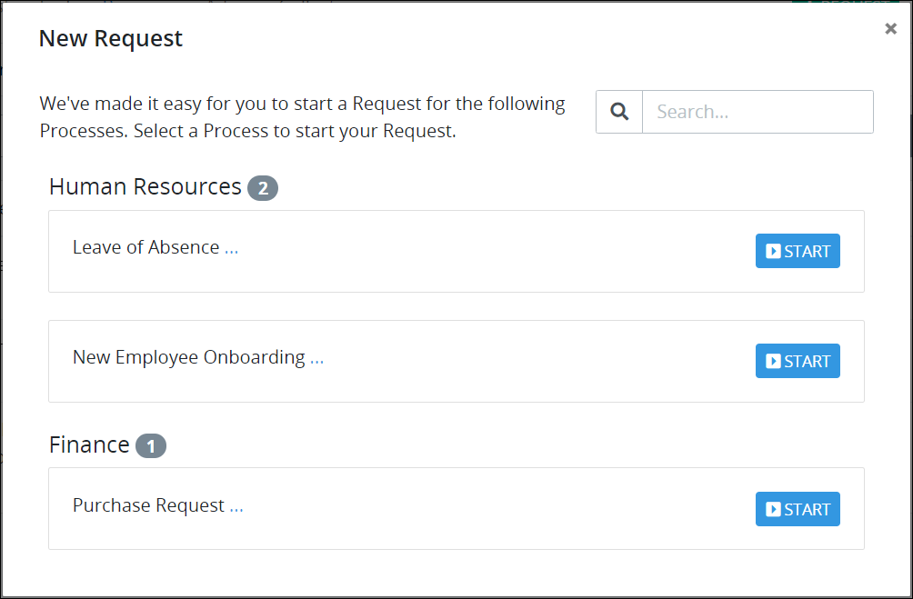

# What is a Process Category?

## Overview

Use Process Categories to organize your Processes. Organizing your Processes into Categories makes it easier to search for a Process based on its assigned Category. Assign multiple Process Categories to a Process if necessary. For example, assign a Process named "Loan Request" to the "Banking" and "Loans" Process Categories.

Assigning your Process to Process Categories also makes it easier for [Request](../../../../using-processmaker/requests/what-is-a-request.md) participants to start a Request of your Process. Processes are organized by Process Categories in the **New Request** screen, which is where [new Requests are started](../../../../using-processmaker/requests/make-a-request.md#start-a-request). In the **New Request** screen, a Process displays in each Process Category to which it is assigned.

Process Categories can be in active or inactive status. Following is a description of each status:

* **Active:** Active Process Categories can have Processes assigned to them.
* **Inactive:** Inactive Process Categories cannot have Processes assigned to them. Furthermore, Processes assigned to an inactive Category no longer display in the **New Request** screen even though such Processes may be active.


ProcessMaker has three Category types for different types of assets. Each Category type is distinct from the others and can only be used for its type of ProcessMaker asset. Following is a description of each Category type:

* Process Categories: Organize your ProcessMaker [Processes](../../what-is-a-process.md).
* [Script Categories](../../../scripts/manage-scripts/manage-script-categories.md): Organize your ProcessMaker [Scripts](../../../scripts/what-is-a-script.md).
* [Screen Categories](../../../design-forms/manage-forms/manage-screen-categories.md): Organize your ProcessMaker [Screens](../../../design-forms/what-is-a-form.md).


