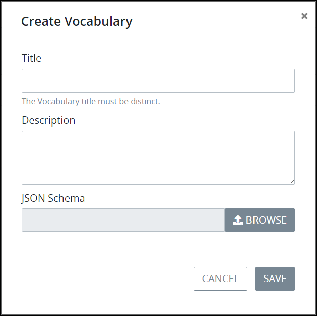

# Create a New Vocabulary

## Create a New ProcessMaker Vocabulary


### ProcessMaker Package Required

The [Vocabularies package](../../../package-development-distribution/package-a-connector/vocabularies.md) must be installed in your ProcessMaker instance. The [Vocabularies](../what-is-a-vocabulary.md) package is not available in the ProcessMaker open-source edition. Contact [ProcessMaker Sales](https://www.processmaker.com/contact/) or ask your ProcessMaker sales representative how the Vocabularies package can be installed in your ProcessMaker instance.

### Permissions Required

Your ProcessMaker user account or group membership must have the following permissions to create a ProcessMaker Vocabulary unless your user account has the **Make this user a Super Admin** setting selected:

* Vocabularies: Create Vocabularies
* Vocabularies: View Vocabularies

See the ProcessMaker [Vocabularies](../../../processmaker-administration/permission-descriptions-for-users-and-groups.md#vocabularies) permissions or ask your ProcessMaker Administrator for assistance.


A ProcessMaker [Vocabulary](../what-is-a-vocabulary.md) is a [JSON schema](https://json-schema.org) designed to validate ProcessMaker assets to which that Vocabulary is applied. Any ProcessMaker asset to which that ProcessMaker Vocabulary is applied must conform to that JSON schema. ProcessMaker Vocabularies are granular, in that one or more Vocabularies can be assigned to specific BPMN 2.0 element types within a Process or the Process model itself to validate the ProcessMaker asset that is referenced from that element.

Follow these steps to create a new ProcessMaker Vocabulary:

1. [View your ProcessMaker Vocabularies](view-all-vocabularies.md#view-all-vocabularies). The **Vocabularies** page displays.
2. Click the **+Vocabulary** button. The **Create Vocabulary** screen displays.  
3. In the **Title** field, enter the name of the ProcessMaker Vocabulary. This name must be unique from all other ProcessMaker Vocabularies. This is a required field.
4. In the **Description** field, enter the description of the ProcessMaker Vocabulary. This is a required field.
5. Click the **Browse** button beside the **JSON Schema** field to locate the JSON schema from which ProcessMaker assets are to be designed. This file must use the `.json` file extension.
6. Click **Save**. The Edit page displays the ProcessMaker Vocabulary. See [Edit a Vocabulary](edit-a-vocabulary.md).

## Related Topics













