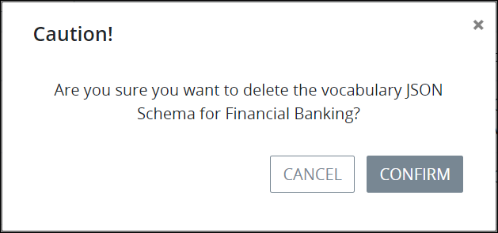

# Delete a Vocabulary

## Delete a ProcessMaker Vocabulary


### ProcessMaker Package Required

The [Vocabularies package](../../../package-development-distribution/package-a-connector/vocabularies.md) must be installed in your ProcessMaker instance. The [Vocabularies](../what-is-a-vocabulary.md) package is not available in the ProcessMaker open-source edition. Contact [ProcessMaker Sales](https://www.processmaker.com/contact/) or ask your ProcessMaker sales representative how the Vocabularies package can be installed in your ProcessMaker instance.

### Permissions Required

Your ProcessMaker user account or group membership must have the following permissions to delete a ProcessMaker Vocabulary unless your user account has the **Make this user a Super Admin** setting selected:

* Vocabularies: Delete Vocabularies
* Vocabularies: View Vocabularies

See the ProcessMaker [Vocabularies](../../../processmaker-administration/permission-descriptions-for-users-and-groups.md#vocabularies) permissions or ask your ProcessMaker Administrator for assistance.



When a ProcessMaker Vocabulary is deleted, ProcessMaker assets that use that ProcessMaker Vocabulary are not affected. However, that ProcessMaker Vocabulary can no longer be used in other ProcessMaker assets to maintain a uniform JSON schema.

Deleting a ProcessMaker Vocabulary from the **Vocabularies** page cannot be undone.


Follow these steps to delete a ProcessMaker [Vocabulary](../what-is-a-vocabulary.md):

1. [View your ProcessMaker Vocabularies](view-all-vocabularies.md#view-all-vocabularies). The **Vocabularies** page displays.
2. Click the **Delete** iconfor your ProcessMaker Vocabulary. The **Caution** screen displays to confirm the deletion of the ProcessMaker Vocabulary.  
3. Click **Confirm**.

## Related Topics













