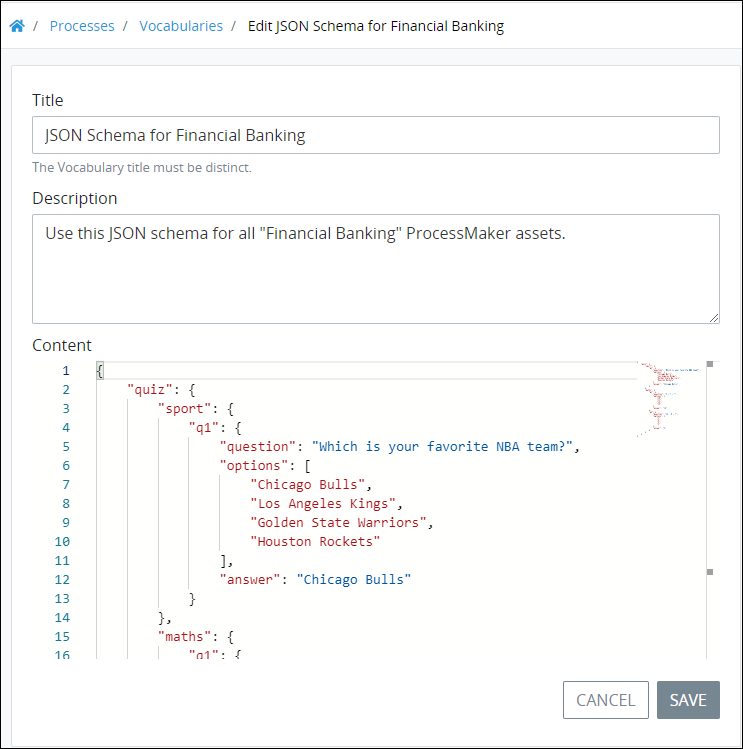

# Edit a Vocabulary

## Edit a ProcessMaker Vocabulary


### ProcessMaker Package Required

The [Vocabularies package](../../../package-development-distribution/package-a-connector/vocabularies.md) must be installed in your ProcessMaker instance. The [Vocabularies](../what-is-a-vocabulary.md) package is not available in the ProcessMaker open-source edition. Contact [ProcessMaker Sales](https://www.processmaker.com/contact/) or ask your ProcessMaker sales representative how the Vocabularies package can be installed in your ProcessMaker instance.

### Permissions Required

Your ProcessMaker user account or group membership must have the following permissions to edit a ProcessMaker Vocabulary unless your user account has the **Make this user a Super Admin** setting selected:

* Vocabularies: Edit Vocabularies
* Vocabularies: View Vocabularies

See the ProcessMaker [Vocabularies](../../../processmaker-administration/permission-descriptions-for-users-and-groups.md#vocabularies) permissions or ask your ProcessMaker Administrator for assistance.


Follow these steps to edit a ProcessMaker [Vocabulary](../what-is-a-vocabulary.md):

1. [View your ProcessMaker Vocabularies](view-all-vocabularies.md#view-all-vocabularies). The **Vocabularies** page displays.
2. Click the **Edit** iconfor your ProcessMaker Vocabulary. The **Edit** page displays.  
3. Edit the following information about the ProcessMaker Vocabulary as necessary:
   * In the **Title** field, edit the ProcessMaker Vocabulary name. This is a required field.
   * In the **Description** field, edit the description of the ProcessMaker Vocabulary. This is a required field.
   * In the **Content** section, edit the JSON schema from which ProcessMaker assets are to be designed. Use the scroll panel to navigate to script not currently displayed. This is useful especially when you are editing a long JSON schema.
4. Click **Save**.

## Related Topics













