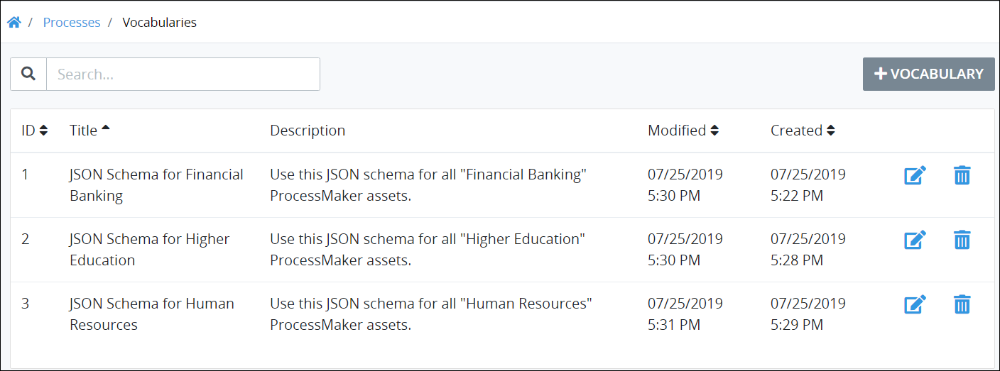

# View Vocabularies

## View All Vocabularies

ProcessMaker displays all ProcessMaker [Vocabularies](../what-is-a-vocabulary.md) in one table. This makes it easy to manage ProcessMaker Vocabularies.


### ProcessMaker Package Required

The [Vocabularies package](../../../package-development-distribution/package-a-connector/vocabularies.md) must be installed in your ProcessMaker instance. The Vocabularies package is not available in the ProcessMaker open-source edition. Contact [ProcessMaker Sales](https://www.processmaker.com/contact/) or ask your ProcessMaker sales representative how the Vocabularies package can be installed in your ProcessMaker instance.

### Permission Required

Your ProcessMaker user account or group membership must have the "Vocabularies: View Vocabularies" permission to view the list of ProcessMaker Vocabularies unless your user account has the **Make this user a Super Admin** setting selected.

See the ProcessMaker [Vocabularies](../../../processmaker-administration/permission-descriptions-for-users-and-groups.md#vocabularies) permissions or ask your ProcessMaker Administrator for assistance.


Follow these steps to view all ProcessMaker Vocabularies in your organization:

1. Ensure that you are [logged on](../../../using-processmaker/log-in.md#log-in) to ProcessMaker.
2. Click the **Designer** option from the top menu. The **Processes** page displays all active Processes.
3. Click the **Vocabularies** icon. The **Vocabularies** page displays all ProcessMaker Vocabularies.

The **Vocabularies** page displays the following information in tabular format about ProcessMaker Vocabularies:

* **ID:** The **ID** column displays the ProcessMaker Vocabulary's ID. ProcessMaker automatically generates the ID value when the Vocabulary is created and represents a sequential number of how many total Vocabularies have been created to that time.
* **Title:** The **Title** column displays the ProcessMaker Vocabulary's name.
* **Description:** The **Description** column displays the ProcessMaker Vocabulary's description.
* **Modified:** The **Modified** column displays the date and time the ProcessMaker Vocabulary was last modified. The time zone setting to display the time is according to the ProcessMaker instance unless your [user profile's](../../../using-processmaker/profile-settings.md#change-your-profile-settings) **Time zone** setting is specified.
* **Created:** The **Created** column displays the date and time the ProcessMaker Vocabulary was created. The time zone setting to display the time is according to the ProcessMaker instance unless your [user profile's](../../../using-processmaker/profile-settings.md#change-your-profile-settings) **Time zone** setting is specified.


### Search for a ProcessMaker Vocabulary

Use the [Search](search-for-a-vocabulary.md) field to filter ProcessMaker Vocabularies that display.

### Create a ProcessMaker Vocabulary

Click the **+Vocabulary** button. See [Create a New Vocabulary](create-a-new-vocabulary.md).

### Edit a ProcessMaker Vocabulary

Click the **Edit** icon. See [Edit a Vocabulary](edit-a-vocabulary.md).

### No ProcessMaker Vocabularies?

If no ProcessMaker Vocabularies exist, the following message displays: **No Data Available**.

### Display Information the Way You Want It

[Control how tabular information displays](../../../using-processmaker/control-how-requests-display-in-a-tab.md), including how to sort columns or how many items display per page.


## Related Topics













