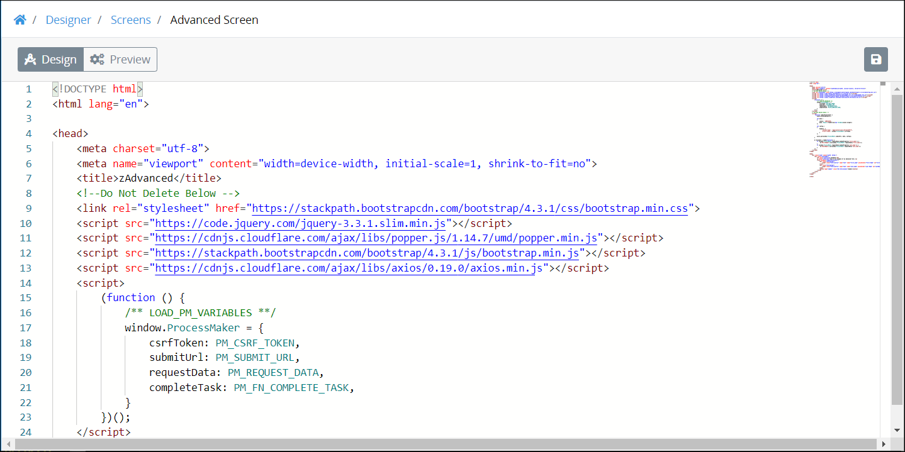
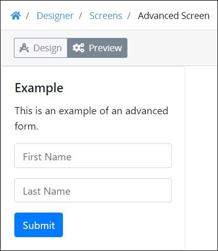

# Advanced Screen Package

## Overview


The Advanced Screen [package](../first-topic.md) is not available in the ProcessMaker open-source edition. Contact [ProcessMaker Sales](mailto:sales@processmaker.com) or ask your ProcessMaker sales representative how the Advanced Screen package can be installed in your ProcessMaker instance.


Use the Advanced Screen package to design your own advanced forms using HTML syntax and JavaScript.

When the Advanced Screen package is installed in your ProcessMaker instance, create a new ProcessMaker Screen using the [Advanced](../../designing-processes/design-forms/screens-builder/types-for-screens.md#advanced) Screen type. Screen Builder displays a template that contains a sample Advanced-type ProcessMaker Screen.

Use this template to study how to design your custom form. Click the **Preview** button to view your custom form in [Preview](../../designing-processes/design-forms/screens-builder/screens-builder-modes.md#preview-mode) mode.

## Related Topics







