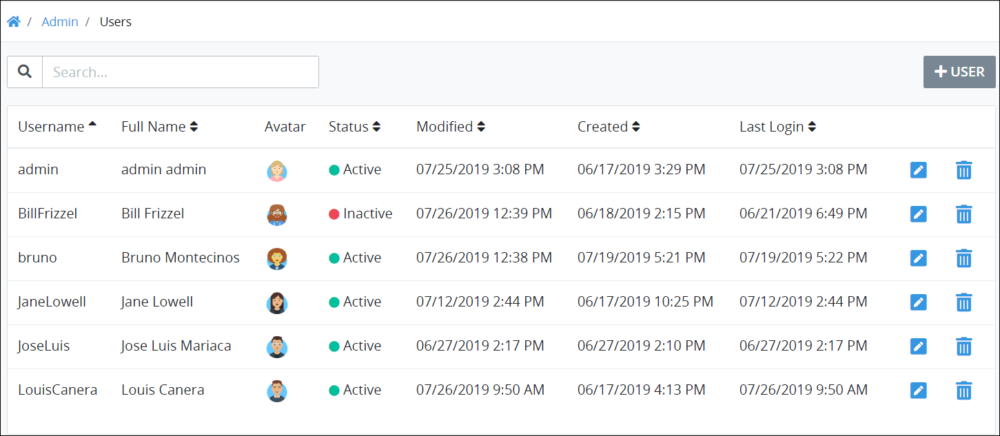

# View Users Accounts

## View All ProcessMaker User Accounts 

ProcessMaker displays all ProcessMaker user accounts in one table that ProcessMaker Administrators throughout your organization have created. This makes it easy to manage ProcessMaker user accounts.


Your ProcessMaker user account or group membership must have the "Users: View Users" permission to view the list of users unless your user account has the **Make this user a Super Admin** setting selected.

See the [Users](../../permission-descriptions-for-users-and-groups.md#users) permissions or ask your ProcessMaker Administrator for assistance.


Follow these steps to view all ProcessMaker user accounts in your organization:

1. [Log on](../../../using-processmaker/log-in.md#log-in) to ProcessMaker.
2. Click the **Admin** option from the top menu. The **Users** page displays all ProcessMaker user accounts.


Click the **Users**  icon to view the **Users** page when you are viewing other administrative-related pages.


The **Users** page displays the following information in tabular format about ProcessMaker user accounts:

* **Username:** The **Username** column displays the username associated with the ProcessMaker user account.
* **Full Name:** The **Full Name** column displays the full name associated with ProcessMaker user account.
* **Avatar:** The **Avatar** column displays avatar image for the ProcessMaker user account. If there is not an avatar image for the ProcessMaker user account, that person's full name initials display. See [Change Your User Avatar](../../../using-processmaker/profile-settings.md#change-your-user-avatar).
* **Status:** The **Status** column displays one of the following statuses for the ProcessMaker user account:
  * **Active:** An Active ProcessMaker user account is one in which a person can use his or her user account to log on to ProcessMaker.
  * **Inactive:** An Inactive ProcessMaker user account is one in which a person cannot use his or her user account to log on to ProcessMaker.
* **Modified:** The **Modified** column displays the date and time the ProcessMaker user account was last modified. The time zone setting to display the time is according to the ProcessMaker instance unless your [user profile's](../../../using-processmaker/profile-settings.md#change-your-processmaker-settings) **Time zone** setting is specified.
* **Created:** The **Created** column displays the date and time the ProcessMaker user account was created. The time zone setting to display the time is according to the ProcessMaker instance unless your [user profile's](../../../using-processmaker/profile-settings.md#change-your-processmaker-settings) **Time zone** setting is specified.
* **Last Login:** The **Last Login** column displays the date and time the ProcessMaker user last logged on to ProcessMaker. If the ProcessMaker user account has not logged on, the following indicator displays: **n/a**. The time zone setting to display the time is according to the ProcessMaker instance unless your [user profile's](../../../using-processmaker/profile-settings.md#change-your-processmaker-settings) **Time zone** setting is specified.


### Search for a ProcessMaker User Account

Use the [Search](search-for-a-user.md#search-for-a-processmaker-user-account) field to filter ProcessMaker user accounts that display.

### Create a ProcessMaker User Account

Click the **+User** button. See [Create a New User Account](create-a-user-account.md#create-a-processmaker-user-account).

### Edit a ProcessMaker User Account

Click the **Edit** icon. See [Edit a User Account](edit-a-user-account.md#edit-a-processmaker-user-account).

### Delete a ProcessMaker User Account

Click the **Delete** icon. See [Delete a User Account](remove-a-user-account.md#delete-a-processmaker-user-account).

### No ProcessMaker User Accounts?

If no ProcessMaker user accounts exist, the following message displays: **No Data Available**.

### Display Information the Way You Want It

[Control how tabular information displays](../../../using-processmaker/control-how-requests-display-in-a-tab.md), including how to sort columns or how many items display per page.


## Related Topics













