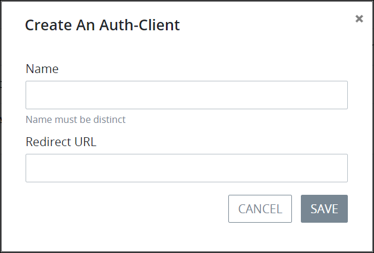

# Create a New Authenticated Client

## Create an Authenticated Client


Your user account or group membership must have the following permissions to create an  authenticated client:

* Auth Clients: View Auth Clients
* Auth Clients: Create Auth Clients

See the [Auth Clients](../../permission-descriptions-for-users-and-groups.md#auth-clients) permissions or ask your ProcessMaker Administrator for assistance.


Follow these steps to create an authenticated client that allows that ProcessMaker user to log on to ProcessMaker Spark via Single Sign On \(SSO\):

1. [View all authenticated clients.](view-all-client-authentication-keys.md#view-all-scripts) The **Auth Clients** page displays.
2. Click the **+Auth Client** button. The **Create Auth Client** screen displays.  

   

3. In the **Name** field, enter to whom the authenticated client is granted. This name must be unique from all other authenticated clients. This is a required field.
4. In the **Redirect URL** field, enter the URL that redirects the authenticated client to your ProcessMaker Spark application server. This is a required field.
5. Click **Save**. The new authenticated client displays in the **Auth Clients** page.

## Related Topics









