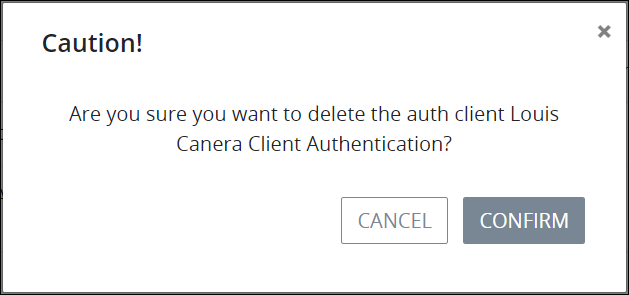

# Delete an Authenticated Client

## Delete an Authenticated Client


Your ProcessMaker user account or group membership must have the following permissions to delete an authenticated client unless your user account has the **Make this user a Super Admin** setting selected:

* Auth Clients: Delete Auth Clients
* Auth Clients: View Auth Clients

See the [Auth Clients](../../permission-descriptions-for-users-and-groups.md#auth-clients) permissions or ask your ProcessMaker Administrator for assistance.



When an authenticated client is deleted, the ProcessMaker user to whom the client authentication applied will no longer be able to access the ProcessMaker REST API in the ProcessMaker instance to which that user is granted.

Deleting an authenticated client from the **Auth Clients** page cannot be undone.


Follow these steps to delete an authenticated client:

1. [View all authenticated clients.](view-all-client-authentication-keys.md#view-all-scripts) The **Auth Clients** page displays.
2. Click the **Delete** iconfor the authenticated client to be deleted. The **Caution** screen displays to confirm the deletion of the authenticated client.  

   

3. Click **Confirm**.

## Related Topics









