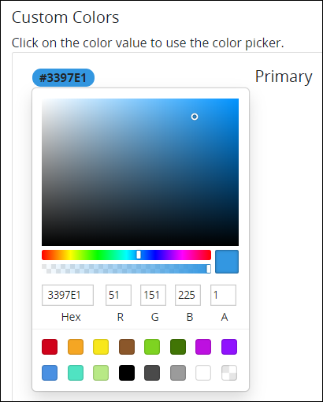
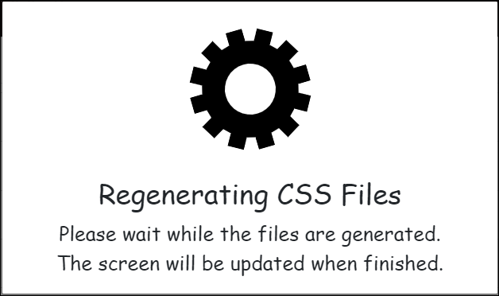

# Customize the ProcessMaker User Interface

## Overview

Customize how the ProcessMaker user interface \(UI\) displays in your ProcessMaker instance. The following aspects of the ProcessMaker application may be changed:

* **Default logo:** Change the logo that displays in the upper-left of all sidebars when the icon in the left sidebar is clicked. By default the ProcessMaker logo displays.  
* **Default icon:** Change the icon that displays in the upper-left of all sidebars. By default the ProcessMaker icon displays.  
* **Default color scheme:** Change any of the colors that comprise a ProcessMaker application color scheme. Below are the default Hex-formatted color settings for each component of a ProcessMaker application color scheme and how each is used in the color scheme:
  * **Primary:** The **Primary** color setting affects in the following components of the ProcessMaker UI:

    * All left sidebars.
    * The selected top menu option.
    * Breadcrumb links that lead to the displayed page.
    * Icons that display to manage ProcessMaker assets, including but not limited to **Edit**, **Configure**, and **Delete** icons.
    * The [**Completed** Request tab](../using-processmaker/requests/view-completed-requests.md#view-completed-requests-in-which-you-participated).
    * The **Completed** icon that represents a Request or Task is completed.
    * Default for the background color, text color, and button color in all [ProcessMaker Screen](../designing-processes/design-forms/what-is-a-form.md) controls.

    Default hex color: \#3397E1.

  * **Secondary:** The **Secondary** color setting affects in the following components of the ProcessMaker UI:

    * Color for all primary action buttons in pages and screens, including but not limited to the **Save** and **Cancel** buttons.
    * Primary action buttons in [Scripts Editor](../designing-processes/scripts/scripts-editor.md) and [Screens Builder](../designing-processes/design-forms/screens-builder/).
    * Default color for the **Secondary** option in the **Variant** setting for ProcessMaker Screen controls.

    Default hex color: \#788793.

  * **Success:** The **Success** color setting affects in the following components of the ProcessMaker UI:

    * The **+Request** button that persistently displays in ProcessMaker.
    * The [**In Progress** Request tab](../using-processmaker/requests/view-in-progress-requests.md#view-in-progress-requests-in-which-you-are-participating).
    * The **In Progress** icon that represents a Request is in-progress.
    * The Success color displays in messages that display when an application action is performed successfully.
    * Default color for the **Success** option in the **Variant** setting for ProcessMaker Screen controls.

    Default hex color: \#00BF9C.

  * **Info:** The **Info** color setting affects in the following components of the ProcessMaker UI:

    * The [**My Requests** tab](../using-processmaker/requests/view-started-requests.md#view-your-requests).
    * Primary action buttons and text for [notifications](../using-processmaker/notifications.md).
    * Default color for the **Info** option in the **Variant** setting for ProcessMaker Screen controls.

    Default hex color: \#17A2B8.

  * **Warning:** The **Warning** color setting affects in the following components of the ProcessMaker UI:

    * The [**All Requests** tab](../using-processmaker/requests/view-all-requests.md#view-all-requests-in-your-organization).
    * Default color for the **Warning** option in the **Variant** setting for ProcessMaker Screen controls.

    Default hex color: \#FBBE02.

  * **Danger:** The **Danger** color setting affects in the following components of the ProcessMaker UI:

    * The **Canceled** icon that represents a Request is canceled.
    * Default color for the **Danger** option in the **Variant** setting for ProcessMaker Screen controls.

    Default hex color: \#ED4757.

  * **Dark:** The **Dark** color setting affects the **Dark** option in the **Variant** setting for ProcessMaker Screen controls. Default hex color: \#000000.
  * **Light:** The **Light** color setting affects in the following components of the ProcessMaker UI:

    * Background color of the top menu.
    * Color of icons in the left sidebar.
    * Default color for the **Light** option in the **Variant** setting for ProcessMaker Screen controls.

    Default hex color: \#FFFFFF.
* **Default font:** Change the default font that displays in your ProcessMaker instance. The following fonts are available in the order they present in the application:
  * Default Font \(the default font\)
  * Mono Type
  * Arial
  * Arial Black
  * Bookman
  * Comic Sans MS
  * Courier New
  * Garamond
  * Georgia
  * Helvetica
  * Impact
  * Times New Roman
  * Verdana
  * Palatino
  * Trebuchet MS

## Customize the ProcessMaker User Interface


Your ProcessMaker user account must have the **Make this user a Super Admin** option selected to customize the ProcessMaker user interface.

See [Edit a User Account](add-users/manage-user-accounts/edit-a-user-account.md#edit-a-processmaker-user-account) or ask your ProcessMaker Administrator for assistance.


Follow these steps to customize the ProcessMaker user interface \(UI\) in your instance:

1. [Log on](../using-processmaker/log-in.md#log-in) to ProcessMaker.
2. Click the **Admin** option from the top menu. The **Users** page displays.
3. Click the **Customize UI** icon. The **Customize UI** page displays.
4. The logo and icon in the ProcessMaker UI work together: the logo represents the complete name, tagline and any other trademarked assets for the brand; the icon represents the stand-alone icon for the brand. In ProcessMaker, the logo displays when the icon is clicked; the icon displays again when the logo is clicked.

   Follow these guidelines to change the default logo and icon, if necessary:

   1. From the **Custom Logo** field, click the **Upload File** button, and then locate the image to display as the brand's logo. Use a transparent PNG image at 150 by 40 pixels for best results.
   2. From the **Custom Icon** field, click the **Upload File** button, and then locate the image to display as the brand's icon. Use a transparent PNG image at 40 by 40 pixels for best results.

5. Follow these guidelines to change any of the colors that comprise a ProcessMaker color scheme \(as described in the [Overview](customize-the-processmaker-user-interface.md) section\), if necessary:
   1. Click the hex color value for the color that you want to change. The color picker palette displays.  
   2. Do one of the following:
      * In the **Hex** field, enter the hex color value for your selected color, and then press **Enter**.
      * Enter the RGBA \(red, green, blue and alpha\) color values for your selected color.
      * Click one of the color swatches \(or the transparency swatch\) to select your color.
      * Click inside the color palette to select your color.
6. From the **Custom Font** drop-down menu, optionally select one of the fonts described in the [Overview](customize-the-processmaker-user-interface.md#overview) section to display all text in ProcessMaker.
7. Click **Save**. ProcessMaker regenerates the UI.  
8. Clear the current web browser session \(**Ctrl+F5** for most web browsers\). Your web browser window refreshes to display your changes to the ProcessMaker UI.

## Related Topics

















