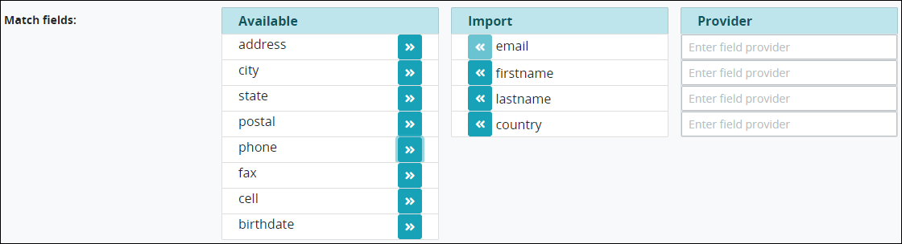

# Configure Single Sign-On \(SSO\) Via SAML

## Configure Single Sign-On \(SSO\) Via SAML


### ProcessMaker Package Required

To configure single sign-on via SAML, the [SAML package](../../package-development-distribution/package-a-connector/saml-package.md) must be installed in your ProcessMaker instance. The SAML package is not available in the ProcessMaker open-source edition. Contact [ProcessMaker Sales](mailto:sales@processmaker.com) or ask your ProcessMaker sales representative how the SAML package can be installed in your ProcessMaker instance.


Follow these steps to configure SAML settings to single sign-on \(SSO\) to your ProcessMaker instance:

1. [Log on](../../using-processmaker/log-in.md#log-in) to ProcessMaker.
2. Click the **Admin** option from the top menu. The **Users** page displays.
3. Click the **Auth SAML** icon. The **SAML Configuration** page displays the settings for the SAML package.  
4. Document the following URLs to provide to your identity provider from which identity provider members will SSO to your ProcessMaker instance:
   * **ACS Url:** The **ACS Url** field displays the Assertive Customer Service \(ACS\) URL. This URL is your ProcessMaker instance that accepts messages or SAML artifacts from the identity provider to establish the SSO session.
   * **Entity ID \(Metadata\):** The **Entity ID \(Metadata\)** field displays the URL to the SAML XML files in your ProcessMaker instance that the identity provider uses to build the authentication response when establishing the SSO session.
5. Select the **Enable SAML Authentication?** checkbox to redirect the identity provider to the ACS URL to establish the SSO session to your ProcessMaker instance. Otherwise, deselect the **Enable SAML Authentication?** checkbox to disable the ProcessMaker SAML package, thereby preventing identity provider members from establishing a SSO session. This checkbox is not selected by default.
6. Select the **Enable automatic user creation?** checkbox to allow identity provider members to log on to ProcessMaker automatically. The identity provider member's information passes to your ProcessMaker instance and is created automatically. Otherwise, deselect the **Enable automatic user creation?** checkbox to require a ProcessMaker user account be created manually before that identity provider member can log on to ProcessMaker. This checkbox is not selected by default.
7. In the **SSO endpoint info of the IdP** field, enter the identity provider URL from which ProcessMaker retrieves the authentication response and validates it when establishing the SSO session. Your identity provider provides this URL. This is a required field.
8. In the **Identifier of the IdP entity \(must be a URI\)** field, enter the URL that references the SAML XML file for your identity provider \(IdP\). Your identity provider provides this URL. This is a required field.
9. In the **Public certificate of the IdP** field, enter the identity provider's certificate fingerprint by pasting it into this field. Your identity provider provides this certificate. Ensure to include the **------BEGIN CERTIFICATE------** header. ProcessMaker retrieves the authentication response and validates it using the identity provider's certificate fingerprint. This is a required field.
10. Use the **Match fields** setting to configure which attribute\(s\) that the identity provider uses to authenticate its members. The attribute\(s\) map to the ProcessMaker SAML package to pass the identity provider member's identity when a member establishes a SSO session with your ProcessMaker instance. During the authentication response, ProcessMaker validates the identity provider member, then allows that member to log on to ProcessMaker. This is a required setting.  
     

    Follow these guidelines to configure which attribute\(s\) the identity provider uses to authenticate its members:

    * **Available:** The **Available** column displays attributes that can be used for authentication but are not configured to do so. Use the right arrowto move a selected attribute from the **Available** column to the **Import** column, thereby using that attribute for identity provider member identification.
    * **Import:** The **Import** column displays attributes to be imported from the identity provider to map, and then pass, an identity provider member's identity when a member attempts a SSO session with your ProcessMaker instance. Your identity provider provides which attributes it uses to identify its members. Use those attributes by moving them into the **Import** column. Use the left arrowto move a selected attribute from the **Import** column to the **Available** column if your identity provider does not use that attribute to identify its members. Note that the email attribute is required for authentication, regardless of the identify provider.
    * **Provider:** In each field in the **Provider** column, enter how your identity provider references each attribute that you have included in the **Import** column. Your identity provider provides how it references each attribute that it uses to identify its members. For example, if your identity provider uses `EmailAddress` as its attribute setting to identify members' email addresses, enter `EmailAddress` into the **Provider** field for the **email** attribute in the **Import** column.

    Below is a description of all possible attributes that an identity provider may use to identify its members. Note that an identity provider may reference these attributes differently than how they are referenced in the **Match fields** setting. The email attribute is required. All other attributes are optional depending on what the identity provider requires to pass member identification to your ProcessMaker instance. Attributes are listed alphabetically as they are referenced in the **Match fields** setting:

    * **address**
    * **birthdate**
    * **cell**
    * **city**
    * **country**
    * **email:** The **email** attribute authenticates using the identity provider member's email address. This attribute is required for authentication. Do not remove it from the **Import** column. Ensure to add how your identity provider references this attribute in the **Provider** column.
    * **fax**
    * **firstname**
    * **lastname**
    * **phone**
    * **postal**
    * **state**

11. Click **Save**.

## Related Topics







