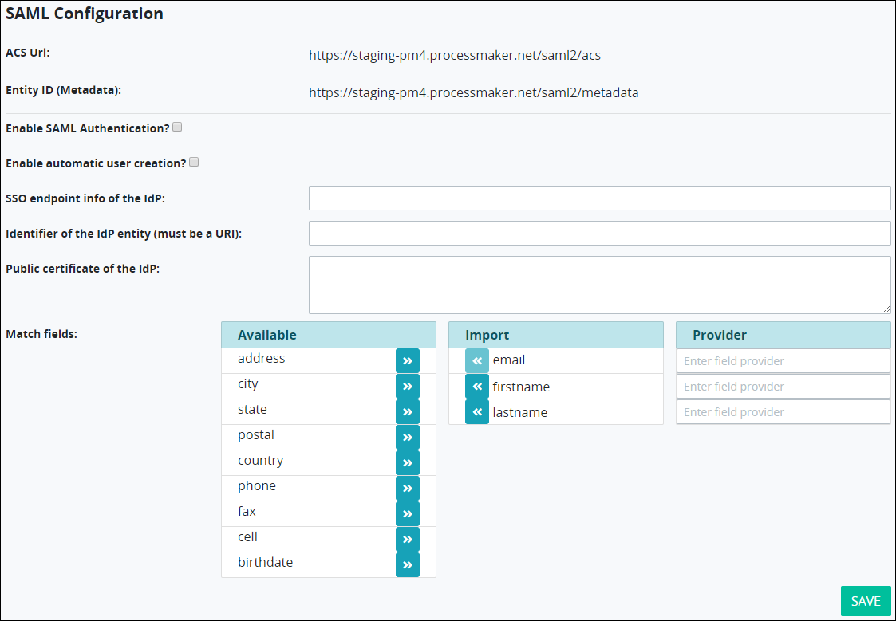

# Configure Single Sign-On \(SSO\) Via SAML

## Configure Single Sign-On \(SSO\) Via SAML


### ProcessMaker Package Required

To configure single sign-on via SAML, the [SAML package](../../package-development-distribution/package-a-connector/saml-package.md) must be installed in your ProcessMaker instance. The SAML package is not available in the ProcessMaker open-source edition. Contact [ProcessMaker Sales](mailto:sales@processmaker.com) or ask your ProcessMaker sales representative how the SAML package can be installed in your ProcessMaker instance.


Follow these steps to configure SAML settings to single sign-on to your ProcessMaker instance:

1. [Log on](../../using-processmaker/log-in.md#log-in) to ProcessMaker.
2. Click the **Admin** option from the top menu. The **Users** page displays.
3. Click the **Auth SAML** icon. The **SAML Configuration** page displays the settings for the SAML package.   
4. Document the following URLs to provide to the identity provider from which you will single sign-on to your ProcessMaker instance:
   * **ACS Url:** The **ACS Url** field displays the Assertive Customer Service \(ACS\) URL. This URL is your ProcessMaker instance that accepts messages or SAML artifacts from the service provider to establish the SSO session.
   * **Entity ID \(Metadata\):** The **Entity ID \(Metadata\)** field displays the URL to the SAML XML files in your ProcessMaker instance that the service provider uses to build the authentication response when establishing the SSO session.
5. Select the **Enable SAML Authentication?** checkbox to redirect the identity provider to the ACS URL to establish the SSO session for ProcessMaker users in your ProcessMaker instance. Otherwise, deselect the **Enable SAML Authentication?** checkbox to disable the ProcessMaker SAML package. This checkbox is not selected by default.
6. Select the **Enable automatic user creation?** checkbox to allow members that are configured in your organization via the identity provider to log on to ProcessMaker automatically. The identity provider's information passes to ProcessMaker and is created automatically. Otherwise, deselect the **Enable automatic user creation?** checkbox to require a ProcessMaker user account be created manually before that person can log on to ProcessMaker. This checkbox is not selected by default.
7. In the **SSO endpoint info of the IdP** field, enter the identity provider URL from which ProcessMaker retrieves the authentication response and validates it when establishing the SSO session. Your identity provider provides you this URL. This is a required field.
8. In the **Identifier of the IdP entity \(must be a URI\)** field, enter the URL that references the SAML XML file for the identity provider \(IdP\). Your identity provider provides you this URL. Example: `https://idp_name.example.com/idp`. This is a required field.
9. In the **Public certificate of the IdP** field, enter the URL that references the identity provider's certificate fingerprint. Your identity provider provides you this URL. ProcessMaker retrieves the authentication response and validates it using the identity provider's certificate fingerprint. This is a required field.
10. Use the **Match fields** section to configure which components ProcessMaker uses in the authentication response when establishing the SSO session. Follow these guidelines:
    * **Available:** Use the right arrowto move a selected component from the **Available** column to the **Import** column.
    * **Import:** Use the left arrowto move a selected component from the **Import** column to the **Available** column.
    * **Provider:** 
11. Click **Save**.

## Related Topics







