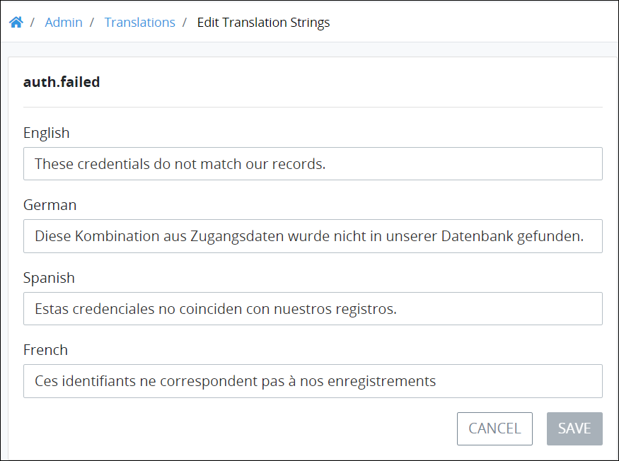

# Edit Text that Displays in the ProcessMaker User Interface

## Edit Text that Displays in the ProcessMaker User Interface


### ProcessMaker Package Required

To edit the text that displays in labels and messages throughout the ProcessMaker user interface, the [Translations package](../../package-development-distribution/package-a-connector/non-english-language-packages.md) must be installed in your ProcessMaker instance. The Translations package is not available in the ProcessMaker open-source edition. Contact [ProcessMaker Sales](mailto:sales@processmaker.com) or ask your ProcessMaker sales representative how the Translations package can be installed in your ProcessMaker instance.

### Permissions Required

Your ProcessMaker user account or group membership must have the following permissions to edit the text that displays throughout the ProcessMaker user interface unless your user account has the **Make this user a Super Admin** setting selected:

* Translations: View Translations
* Translations: Edit Translations

See the ProcessMaker [Translations](../permission-descriptions-for-users-and-groups.md#translations) permissions or ask your ProcessMaker Administrator for assistance.


Follow these steps to edit the text that displays in labels and messages throughout the ProcessMaker user interface:

1. [View the table of English-language ProcessMaker user interface labels and messages](view-english-language-labels-and-messages-from-the-processmaker-user-interface.md#view-english-language-labels-and-messages-from-the-processmaker-user-interface). The **Translations** page displays.
2. [Search for the label\(s\) and/or message\(s\) in which to edit its text](view-english-language-labels-and-messages-from-the-processmaker-user-interface.md#search-for-specific-labels-or-messages).
3. Click the **Edit** iconfor the label or message you want to change its text. The **Edit Translation Strings** page displays the following for the selected label or message:

   * **English:** Displays the English-language text.
   * **German:** Displays the German-language text.
   * **Spanish:** Displays the Spanish-language text.
   * **French:** Displays the French-language text. 

    

4. Edit any of the text as necessary. Note that if you edit any of the original English-language text, you are responsible to change the other non-English language text to match and be accurate.
5. Click **Save**.


If necessary, you may [reset all ProcessMaker user interface labels and messages](reset-all-processmaker-user-interface-labels-and-messages-to-their-defaults.md#reset-all-processmaker-user-interface-labels-and-messages-to-their-defaults) for all ProcessMaker supported languages to their defaults.


## Related Topics











