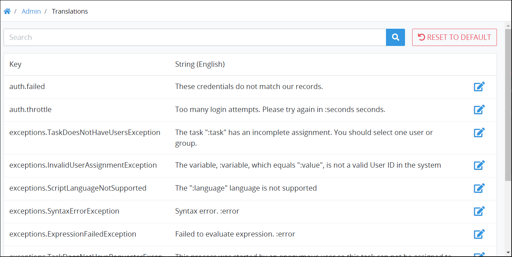
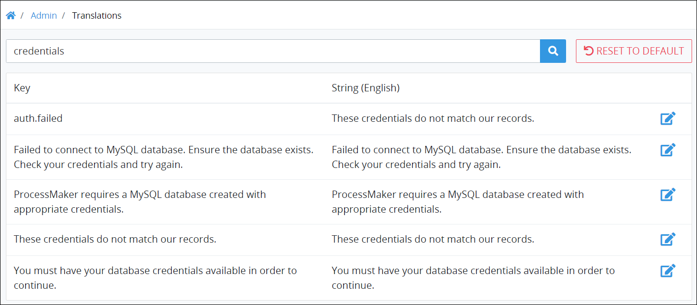

# View English-Language Labels and Messages from the ProcessMaker User Interface

## View English-Language Labels and Messages from the ProcessMaker User Interface


### ProcessMaker Package Required

To view the English-language labels and messages from the ProcessMaker user interface, the [Translations package](../../package-development-distribution/package-a-connector/non-english-language-packages.md) must be installed in your ProcessMaker instance. The Translations package is not available in the ProcessMaker open-source edition. Contact [ProcessMaker Sales](https://www.processmaker.com/contact/) or ask your ProcessMaker sales representative how the Translations package can be installed in your ProcessMaker instance.

### Permissions Required

Your ProcessMaker user account or group membership must have the "Translations: View Translations" permission to view the translations of the ProcessMaker user interface unless your user account has the **Make this user a Super Admin** setting selected.

See the [Translations](../permission-descriptions-for-users-and-groups.md#translations) permissions or ask your ProcessMaker Administrator for assistance.


Follow these steps to view the English-language labels and messages from the ProcessMaker user interface:

1. [Log on](../../using-processmaker/log-in.md#log-in) to ProcessMaker.
2. Click the **Admin** option from the top menu. The **Users** page displays.
3. Click the **Translations** icon. The **Translations** page displays each label and message in the ProcessMaker user interface and its default English-language text.

The **Translations** page displays the following information in tabular format about the English-language labels and messages in the ProcessMaker user interface:

* **Key:** The **Key** column displays the key name referenced from the internal ProcessMaker JSON file that stores all labels and messages throughout the ProcessMaker user interface.
* **String \(English\):** The **String \(English\)** column displays the English-language text that displays in the ProcessMaker user interface. Most text in ProcessMaker user interface messages is plain text except for variable placeholders that display in the text when that message displays. Variable placeholders in these texts use the format `:variable` where `variable` represents the variable placeholder. Example: `The task ":task" has an incomplete assignment. You should select one user or group.`

## Search for Specific Labels or Messages


### ProcessMaker Package Required

To search for labels or messages in the ProcessMaker user interface, the [Translations package](../../package-development-distribution/package-a-connector/non-english-language-packages.md) must be installed in your ProcessMaker instance. The Translations package is not available in the ProcessMaker open-source edition. Contact [ProcessMaker Sales](mailto:sales@processmaker.com) or ask your ProcessMaker sales representative how the Translations package can be installed in your ProcessMaker instance.

### Permissions Required

Your ProcessMaker user account or group membership must have the "Translations: View Translations" permission to view the translations of the ProcessMaker user interface unless your user account has the **Make this user a Super Admin** setting selected.

See the [Translations](../permission-descriptions-for-users-and-groups.md#translations) permissions or ask your ProcessMaker Administrator for assistance.


Follow these steps to search for specific labels or messages in the ProcessMaker user interface:

1. [View the table of English-language ProcessMaker user interface labels and messages](view-english-language-labels-and-messages-from-the-processmaker-user-interface.md#view-english-language-labels-and-messages-from-the-processmaker-user-interface). The **Translations** page displays.
2. In the **Search** field, enter the word or phrase pertaining to the labels and/or messages you want to find, and then click the **Search** button. Labels and messages display that contain that word or phrase in either its internal key name or the text that displays in the ProcessMaker user interface.

## Related Topics











