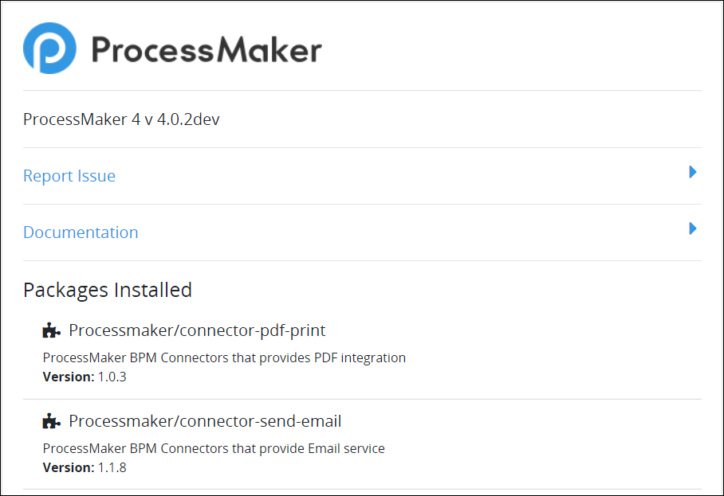

# View ProcessMaker Version Information

## View ProcessMaker and Package Version Information

Follow these steps to view ProcessMaker and [package](../package-development-distribution/first-topic.md) version information:

1. [Log on](log-in.md#log-in) to ProcessMaker.
2. Click your user avatar and then select **About**.  

   

   The **About ProcessMaker** page displays.

The **About ProcessMaker** page displays the following information:

* ProcessMaker version
* Links to [report an issue](https://github.com/ProcessMaker/processmaker/issues/new), [view the **processmaker** GitHub repository](https://github.com/ProcessMaker/bpm), and [read the user documentation](https://processmaker.gitbook.io/processmaker/)
* Name, description, and version for each package installed to your ProcessMaker instance


See [Available Packages from ProcessMaker](../package-development-distribution/package-a-connector/).


## Related Topics













