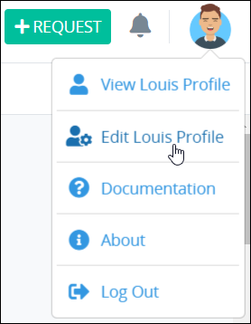
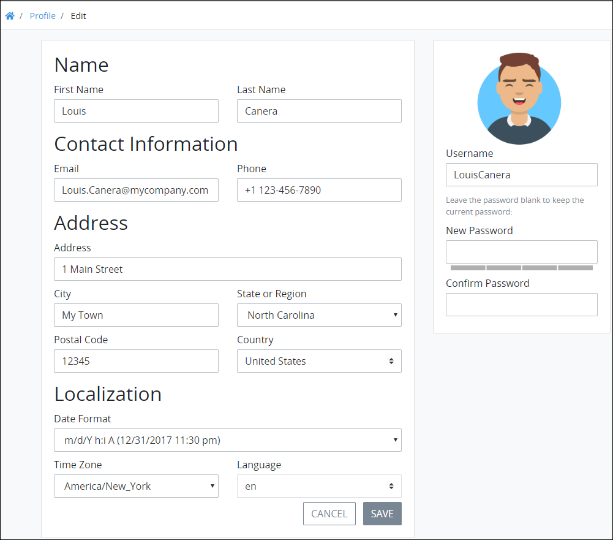
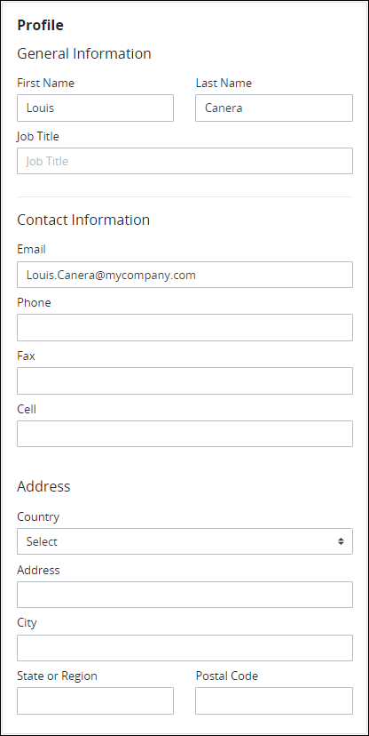
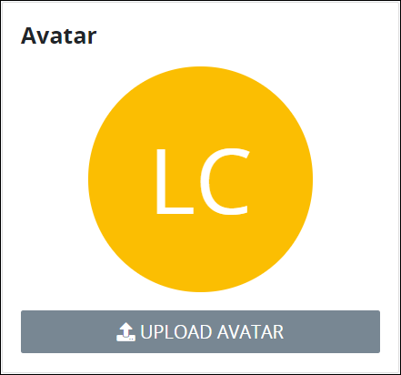
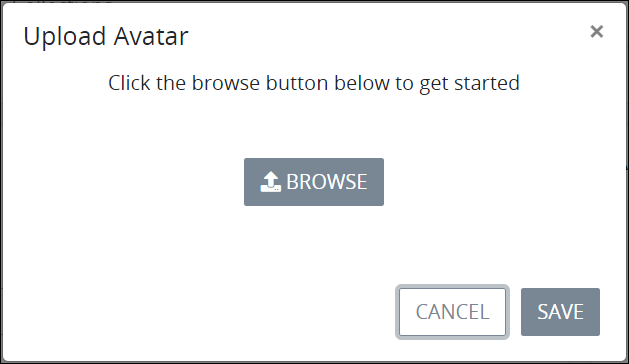
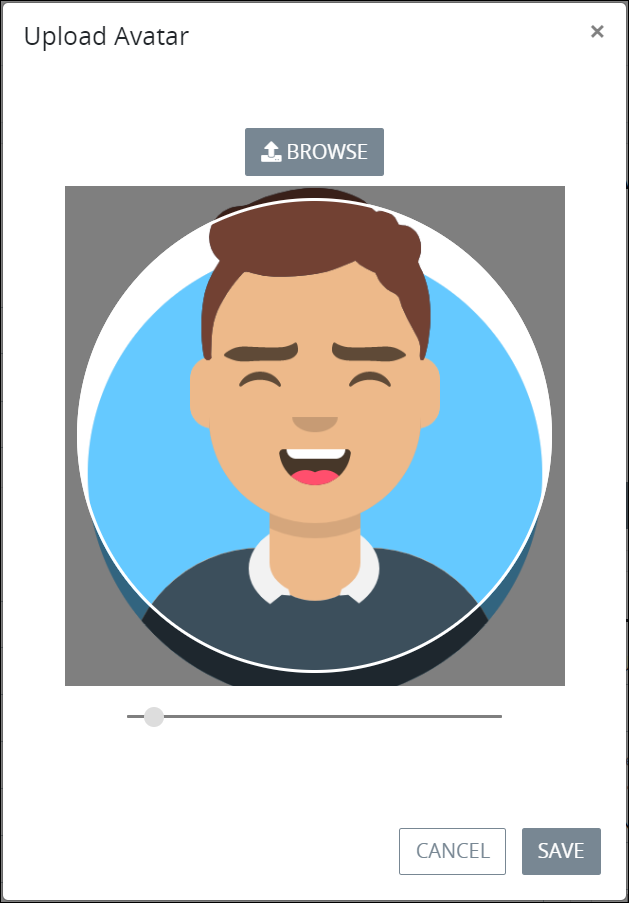
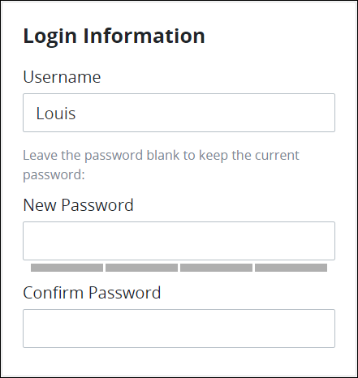
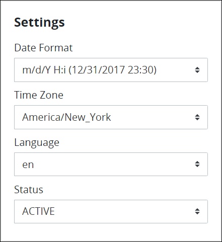
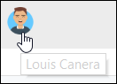
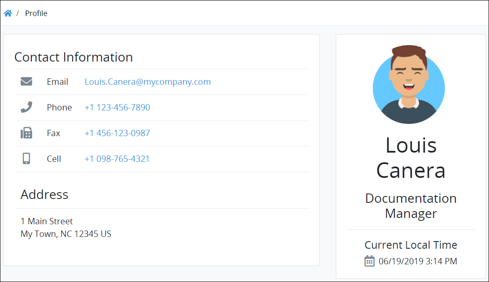

# Profile Settings

## Access Your Profile

Follow these steps to access your profile settings:

1. [Log on](log-in.md#log-in) to ProcessMaker.
2. Click your user avatar. Your user name displays in the **Edit Profile** option.
3. Select **Edit Profile**.

   

   The **Profile** page displays. See [Change Your Profile Settings](profile-settings.md#change-your-profile-settings).  

## Change Your Profile Settings

Your ProcessMaker user profile contains the following sections that determine how your ProcessMaker [user](../processmaker-administration/add-users/what-is-a-user.md) is represented in ProcessMaker:

* [Profile information](profile-settings.md#change-your-profile-information)
* [User avatar](profile-settings.md#change-your-user-avatar)
* [Log on information](profile-settings.md#change-your-log-on-information)
* [ProcessMaker settings](profile-settings.md#change-your-processmaker-settings)

### Change Your Profile Information

Follow these steps to change your profile information:

1. [Access your profile.](profile-settings.md#access-your-profile) The **Profile** page displays.
2. Locate the **Profile** section.  
3. Change the following **General Information** settings as necessary:
   * In the **First Name** setting, enter your first name. Your first name displays to other ProcessMaker users who [view your profile information](profile-settings.md#view-another-users-profile-information). This is a required setting.
   * In the **Last Name** setting, enter your last name. Your last name displays to other ProcessMaker users who view your profile information. This is a required setting.
   * In the **Job Title** setting, enter the job title or description you have in your organization.
4. Change the **Contact Information** settings as necessary:
   * In the **Email** setting, enter your business email address. Your email address displays to other ProcessMaker users who view your profile information. This is a required field.
   * In the **Phone** setting, enter your business telephone number.
   * In the **Fax** setting, enter your fax number.
   * In the **Cell** setting, enter your cell number.
5. Change the **Address** settings as necessary:
   * From the **Country** drop-down menu, select the country for your business address.
   * In the **Address** setting, enter your business address.
   * In the **City** setting, enter the city for your business address.
   * In the **State or Region** setting, enter the state, region, or province for your business address.
   * In the **Postal Code** setting, enter your business postal code.
6. Change your [user avatar](profile-settings.md#change-your-user-avatar), [log on information](profile-settings.md#change-your-log-on-information), and/or [ProcessMaker settings](profile-settings.md#change-your-processmaker-settings) if necessary.
7. Click **Save**. The following message displays: **Your profile was saved**.

### Change Your User Avatar

Your avatar represents you throughout ProcessMaker. Below are a few ways your avatar represents you:

* [Requests](requests/what-is-a-request.md) in which you are a participant
* [Tasks](task-management/what-is-a-task.md) assigned to you and which you have completed
* [Process models you have designed](../designing-processes/process-design/what-is-process-modeling.md)
* [ProcessMaker Screens](../designing-processes/design-forms/what-is-a-form.md) you have designed
* [ProcessMaker Scripts](../designing-processes/scripts/what-is-a-script.md) you have developed

If your ProcessMaker user profile does not have an avatar, such as when a [ProcessMaker user account is created](../processmaker-administration/add-users/manage-user-accounts/create-a-user-account.md), the initials of your full name display.

 Follow these steps to change your user avatar:

1. [Access your profile.](profile-settings.md#access-your-profile) The **Profile** page displays.
2. Locate the **Avatar** section. 
3. Do one of the following depending if your profile has an existing avatar:
   * **Profile does not have an avatar \(default\):**

     Click the **Upload Avatar** button. The **Upload Avatar** screen displays. Continue to Step 4.  
      

   * **Profile has an avatar:**

     Do one of the following:

     * Click the **Change** button to change your current avatar. The **Upload Avatar** screen displays. Continue to Step 4.
     * Click the **Clear** button to remove your current avatar and displays the initials of your full name. Continue to Step 7.
4. From the **Upload Avatar** screen, click the **Browse** button to locate the image to be your avatar.  
5. Locate, then select the image to be your avatar. The image fits into the **Upload Avatar** screen.  
6. Adjust the size of the image using the image size indicatorto fit well inside the circle where your avatar displays, and then click **Save**. Your avatar displays in the **Avatar** section.
7. Change your [profile information](profile-settings.md#change-your-profile-information), [log on information](profile-settings.md#change-your-log-on-information), and/or [ProcessMaker settings](profile-settings.md#change-your-processmaker-settings) if necessary.
8. Click **Save**. The following message displays: **Your profile was saved**.

### Change Your Log On Information


Passwords must adhere to the following protocol:

* Passwords must be at least eight \(8\) characters long.
* [Password special characters](https://www.owasp.org/index.php/Password_special_characters) are recommended.


Follow these steps to change your ProcessMaker log on information:

1. [Access your profile.](profile-settings.md#access-your-profile) The **Profile** page displays.
2. Locate the **Login Information** section.  
3. In the **Username** setting, change your username if necessary. This is a required setting.
4. In the **New Password** setting, enter your new password. Leave the **New Password** setting blank to keep the current password. If you enter a new password, password validation indicates how strong your password is if you enter a new password.
5. In the **Confirm Password** setting, confirm that your new password matches that entered into the **New Password** field if you enter a new password. If you entered a new password, password validation indicates if the **New Password** and **Confirm Password** values do not match.
6. Change your [profile information](profile-settings.md#change-your-profile-information), [user avatar](profile-settings.md#change-your-user-avatar), and/or [ProcessMaker settings](profile-settings.md#change-your-processmaker-settings) if necessary.
7. Click **Save**. The following message displays: **Your profile was saved**.

### Change Your ProcessMaker Settings

Use the **Settings** section of the profile settings to specify how ProcessMaker displays date and time information to you, which natural language to display ProcessMaker settings, and the status of your ProcessMaker user account.

Follow these steps to change your ProcessMaker settings:

1. [Access your profile.](profile-settings.md#access-your-profile) The **Profile** page displays.
2. Locate the **Settings** section.  
3. In the **Date Format** drop-down menu, select the format how dates are displayed from the following options:
   * m/d/Y \(12/31/2017\)
   * m/d/Y h:i A \(12/31/2017 11:30 pm\)
   * m/d/Y H:i \(12/31/2017 23:30\)
   * d/m/Y \(31/12/2017\)
   * d/m/Y \(31/12/2017 23:30\)
   * Y/m/d \(2017/12/31\)
   * Y/m/d H:i \(2017/12/31 23:30\)
4. From the **Time Zone** drop-down menu, select the time zone in which to display times.
5. From the **Language** drop-down menu, select in which language to display ProcessMaker user interface labels and messages. Note that English-language is the default language and the only natural language provided for the ProcessMaker open-source edition. However, if the [Translations package](../package-development-distribution/package-a-connector/non-english-language-packages.md) is installed to your ProcessMaker instance, you may display the ProcessMaker user interface labels and messages to German-, Spanish-, or French-language. Changing this setting only affects your ProcessMaker user account. Contact [ProcessMaker Sales](https://www.processmaker.com/contact/) or ask your ProcessMaker sales representative how the Translations [package](../package-development-distribution/first-topic.md) can be installed in your ProcessMaker instance.

   Optionally, select one of the following non-English languages if the Translations package is installed in your ProcessMaker instance:

   * **German:** Select the **de** option.
   * **Spanish:** Select the **es** option.
   * **French:** Select the **fr** option.

6. From the **Status** drop-down menu, select the status of your ProcessMaker user account. Below is a description of each status:
   * **Active:** An Active ProcessMaker user account is one in which a person can use his or her user account to log on to ProcessMaker.
   * **Inactive:** An Inactive ProcessMaker user account is one in which a person cannot use his or her user account to log on to ProcessMaker.
7. Change your [profile information](profile-settings.md#change-your-profile-information), [user avatar](profile-settings.md#change-your-user-avatar), and/or [log on information](profile-settings.md#change-your-log-on-information) if necessary.
8. Click **Save**. The following message displays: **Your profile was saved**.

## View Another User's Profile Information

To view another user's profile information, click that person's avatar.

After clicking the avatar, that person's profile information displays. Each ProcessMaker user is responsible for profile content.


Hover your cursor over a user's avatar to view that person's full name.


## Related Topics









